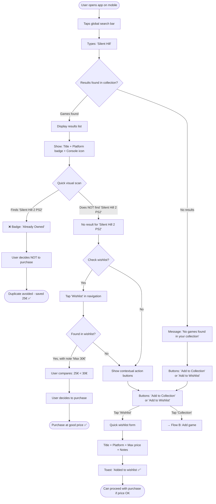
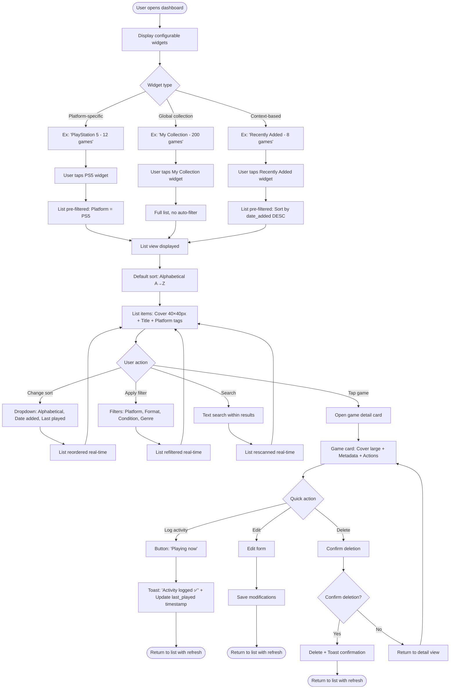
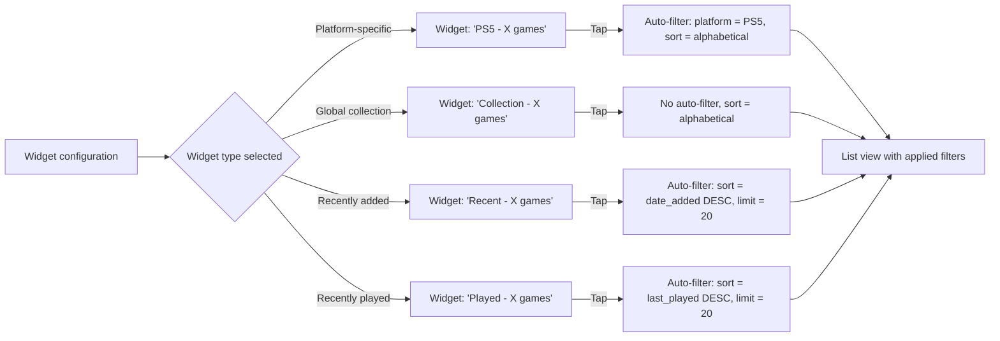
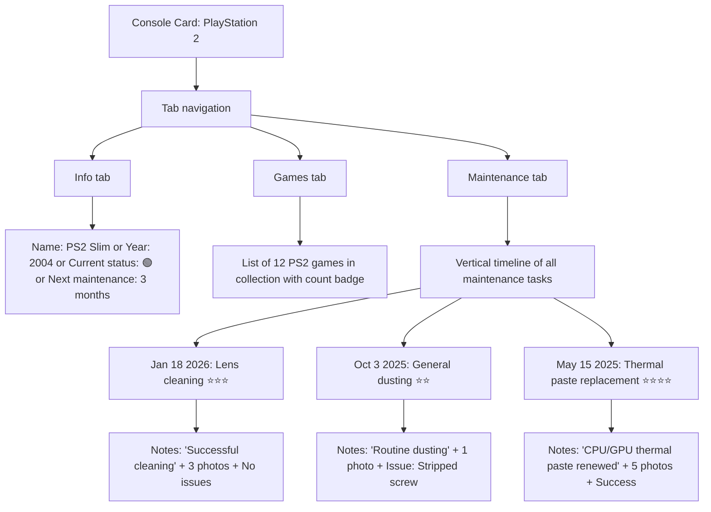

# UX Design Specification - lab-clean-architecture-react

**Author:** Paul
**Date:** 2026-01-17

---

## Executive Summary

### Project Vision

**lab-clean-architecture-react** is an architectural learning laboratory disguised as a Game Collection Manager. The dual objective is to prove (or disprove) the viability of Clean Architecture in React while creating a genuinely useful tool for managing multi-platform video game collections.

**Objective Distribution:**
- 80% Educational: Honest demonstration of Clean Architecture (documenting both successes AND failures)
- 20% Utility: Functional tool for daily personal use

**Key Differentiator:** Radically honest documentation of architectural decisions, failures, and trade-offs - no marketing, only authentic learning.

### Target Users

**Primary User: Paul - The Pragmatic Collector**
- React developer with extensive gaming collection (~200 games across PS1→PS5, Xbox 360, Steam)
- **Primary Pain Point:** Missed opportunities in stores due to lack of quick verification (e.g., missed Gears of War 3)
- **Critical Usage Context:** In second-hand game store, smartphone in hand, needs answer in <15 seconds
- **Current Frustrations:** Excel mobile (horizontal scroll hell), discouraging manual entry, useless statistics
- **Desired "Wow" Moment:** Proactive wishlist alerts (e.g., "Zelda NES complete in box for only €90 available now")

**Secondary User: Alex - The React Developer**
- React dev seeking concrete Clean Architecture examples
- Frustrated by React projects becoming "tangled messes"
- **Need:** Real examples, not simplistic TodoMVC tutorials
- **Usage Context:** Code exploration on desktop, documentation consultation on mobile/tablet
- **Expectations:** Responsive documentation, annotated screenshots, code excerpts

### Key Design Challenges

**Challenge 1: The "Store Moment" - Ultra-Fast Verification**
- **Context:** Standing in store, game in hand, doubt "do I own this?"
- **Time Constraint:** Maximum 10-15 seconds to get answer
- **Technical Constraints:** Mobile, potentially offline (weak signal in store)
- **Risk of Failure:** If too slow or complicated, app won't be used and opportunities will be missed

**Challenge 2: Mobile-First Without Compromise**
- **Identified Problem:** Excel mobile = navigation nightmare (horizontal scroll, unsuitable interface)
- **UX Requirement:** 100% mobile-first design, single vertical column, zero horizontal scroll
- **Primary Context:** Couch + smartphone, thumb-only navigation
- **Success Standard:** Interface as fluid as Netflix or Spotify

**Challenge 3: Minimize Input Friction**
- **Current Problem:** Everything manually entered in Excel = discouraging, leads to abandonment
- **UX Objective:** Add a game in <2 minutes with minimum manual entry
- **Technical Solution:** Auto-completion APIs (IGDB, RAWG), smart forms
- **Trade-off:** API dependency vs. manual entry always available

**Challenge 4: Avoid Feature Bloat**
- **User Insight:** Statistics graphs consulted once a year = useless
- **Design Principle:** If a feature isn't used at least once per month, it doesn't deserve to exist in the MVP
- **Golden Rule:** Daily utility > Impressive statistics

**Challenge 5: App/Lab Duality Without Confusion**
- **Requirement:** App remains pure and independent (no "view code" in the interface)
- **Solution:** Separate lab documentation (GitHub Pages) with screenshots and code excerpts
- **Objective:** App proves Clean Arch works through its fluid UX, not through forced demonstrations

### Design Opportunities

**Opportunity 1: PWA Offline = Store Superpower**
- **Competitive Advantage:** Installed PWA works offline, unlike Excel or classic web apps
- **User Benefit:** Zero latency, works even with weak signal in store
- **UX Impact:** Total reliability in critical context (store verification)

**Opportunity 2: Smart and Desirable Push Notifications**
- **User Vision:** Proactive wishlist alerts (price, availability)
- **Design Challenge:** Make notifications desirable (relevant, not spammy)
- **Concrete Example:** "Zelda NES complete in box for €90 available now" = wow moment

**Opportunity 3: Thumb-Friendly Interface for Couch Browsing**
- **Usage Context:** Smartphone in hand, relaxed, choosing tonight's game
- **UX Inspiration:** Netflix/Spotify-style navigation (infinite scroll, visuals, tap for details)
- **Design Pattern:** Bottom navigation bar, swipe gestures, large touch targets

**Opportunity 4: Exemplary Documentation for Developers**
- **Dual Objective:** Teach Clean Arch + demonstrate mobile-first responsive
- **Format:** Responsive GitHub Pages, annotated screenshots, code excerpts
- **Impact:** Documentation itself proves the UX principles taught in the lab

---

## Core User Experience

### Defining Experience

The core experience of **lab-clean-architecture-react** revolves around two primary user behaviors with distinct frequencies and purposes:

**Primary Active Behavior: Wishlist Tracking**
- Most frequent user action: Consulting the wishlist to monitor price evolution and availability
- Active engagement pattern: Regular check-ins to spot opportunities
- Goal: Never miss a good deal on desired games

**Secondary Passive Behavior: Collection Browsing**
- Second most frequent action: Browsing owned collection to choose what to play
- Passive consumption pattern: Relaxed exploration during downtime
- Goal: Rediscover forgotten games and make informed play decisions

**Foundation Requirement: Complete and Accurate Collection Census**
- Absolute critical requirement: Comprehensive, accurate game inventory
- Without complete census, all other features become unreliable
- The app's value proposition collapses if the collection data is incomplete or inaccurate

### Platform Strategy

**Primary Platform: Progressive Web App (PWA)**
- Mobile-first design with desktop enhancement
- Installable on home screen for native-like experience
- Offline-capable for critical "store moment" usage

**Critical Usage Contexts:**

1. **Store Context** (Critical offline requirement)
   - Standing in second-hand game store
   - Quick verification: "Do I own this game?"
   - Potentially weak or no signal
   - Maximum 10-15 seconds for answer

2. **Couch Context** (Primary engagement)
   - Relaxed smartphone usage
   - Wishlist monitoring and price tracking
   - Collection browsing for play decisions
   - Thumb-only navigation

3. **Desktop Context** (Secondary for developers)
   - Code exploration and documentation
   - Responsive documentation via GitHub Pages
   - Architecture learning and reference

**Platform Capabilities Leveraged:**
- Service Workers for offline functionality
- Push Notifications for maintenance reminders and price alerts
- IndexedDB for local-first data persistence
- Touch gestures and thumb-friendly navigation

### Effortless Interactions

**Critical Effortless Interaction: Adding a Game**
- **Maximum Time Budget:** 30 seconds from intent to completion
- **Rationale:** If adding a game is friction-heavy, users won't maintain complete census, breaking the app's value proposition
- **Design Requirements:**
  - Auto-completion from external APIs (IGDB, RAWG)
  - Smart defaults and minimal required fields
  - One-tap add to wishlist from search results
  - Photo upload for cover art as optional enhancement

**Supporting Effortless Interactions:**
- Instant search results (<500ms response time)
- Swipe gestures for common actions (archive, wishlist toggle)
- Bottom navigation for thumb reachability
- Visual confirmation without redundant confirmations

**Friction Points to Eliminate:**
- No horizontal scrolling (mobile nightmare from Excel experience)
- No multi-step wizards for simple actions
- No mandatory fields beyond title and platform
- No loading states for cached/offline data

### Critical Success Moments

**Success Moment 1: Smart Notification Delivers Value**
- **Scenario:** Maintenance reminder prevents console failure
- **Example:** "Your PS2 is due for maintenance - last cleaned 3 months ago"
- **User Feeling:** "This app is taking care of my collection for me"
- **Design Implication:** Notifications must be timely, relevant, and actionable

**Success Moment 2: Price Alert Captures Opportunity**
- **Scenario:** Wishlist price alert enables good deal capture
- **Example:** "Zelda NES complete in box for only €90 available now (normally €150+)"
- **User Feeling:** "This app just saved me money and found what I've been looking for"
- **Design Implication:** Price tracking must be accurate, alerts must be immediate

**Success Moment 3: Store Verification Prevents Duplicate**
- **Scenario:** Quick check in store prevents accidental repurchase
- **Example:** Search "Gears of War 3" → Result: "Owned (Xbox 360, purchased 2015)"
- **User Feeling:** "Avoided wasting €20 on a duplicate in 10 seconds"
- **Design Implication:** Offline functionality non-negotiable, search must be instant

**Success Moment 4: Rediscovery of Forgotten Games**
- **Scenario:** Browsing collection reveals playable game user forgot about
- **Example:** Scrolling collection, sees game with high rating never played
- **User Feeling:** "I forgot I had this! I'm playing it tonight"
- **Design Implication:** Visual browsing with metadata (ratings, completion status) surfaced

### Experience Principles

The following principles guide all UX decisions for **lab-clean-architecture-react**:

**Principle 1: Wishlist-First Mindset**
- Wishlist is not a secondary feature - it's a primary usage pattern equal to collection management
- Wishlist tracking drives frequent engagement and creates ongoing value
- Design implication: Wishlist must be first-class citizen in navigation and features

**Principle 2: Collection Integrity is Sacred**
- Complete, accurate collection census is the foundation of all app value
- If census is incomplete or inaccurate, all features (alerts, recommendations, stats) become unreliable
- Design implication: Make collection entry effortless and reliable, prioritize data quality over quantity of features

**Principle 3: Add Game in 30 Seconds or Die**
- If adding a game takes more than 30 seconds, users won't maintain complete census
- Friction in core action cascades into app failure
- Design implication: Aggressive optimization of add flow, smart defaults, API auto-completion, minimal required fields

**Principle 4: Smart Notifications are the Killer Feature**
- Automated maintenance reminders and price alerts create differentiated value
- These proactive moments deliver "wow" experiences that passive apps cannot
- Design implication: Notification system must be intelligent (not spammy), timely, and actionable

**Principle 5: Mobile-First for Store + Couch**
- Two critical contexts are both mobile: store verification and couch wishlist browsing
- Desktop is secondary (primarily for developer documentation audience)
- Design implication: Design for thumb navigation, offline-first, zero horizontal scroll

**Principle 6: Avoid Feature Bloat - Daily Utility Wins**
- Features used less than monthly don't deserve to exist in MVP
- Statistics and analytics are vanity metrics if not driving daily decisions
- Design implication: Ruthless prioritization of features that serve daily/weekly use cases

---

## Desired Emotional Response

### Primary Emotional Goals

**Core Emotional State: Serenity + Confidence**
- **Primary Feeling:** "No stress, everything is organized"
- **Secondary Feeling:** "I know exactly what I have and where it is"
- **Design Philosophy:** The app brings peace of mind, not frantic excitement
- **User Quote:** "Calm & Focused" and "Confident & Secure"

This is a **zen collection manager** - it reduces cognitive load and anxiety about collection management, rather than adding complexity or overwhelming the user with features.

**Emotional Differentiation:**
Unlike competitors that may overwhelm with features or statistics, this app creates a calm, controlled environment where users feel masterful over their collection.

### Emotional Journey Mapping

**Stage 1: First Discovery - "Wow, it can do all that?"**
- **Emotion:** Positive surprise, discovery of potential
- **Timing:** First app open, exploring features
- **Design Implication:** Feature discovery should feel delightful, not overwhelming
- **UX Approach:** Progressive disclosure, clear value propositions, visual hierarchy

**Stage 2: Daily Usage - "Hmm, easy, good"**
- **Emotion:** Quiet satisfaction, effortless fluidity
- **Timing:** Adding games, searching collection, browsing wishlist
- **Design Implication:** Core interactions should feel smooth and natural
- **UX Approach:** Minimal friction, smart defaults, micro-animations for feedback

**Stage 3: Smart Notifications - "Oh damn, cool!" or "Ah yes..."**
- **Emotion:** Useful delight, benevolent reminders
- **Timing:** Price alert on wishlist, maintenance reminder
- **Examples:**
  - "Oh damn cool, this game is available!" (excitement + utility)
  - "Ah yes, my PS2 needs a little cleaning" (gentle reminder, no guilt)
- **Design Implication:** Notifications are helpful allies, not spammy interruptions
- **UX Approach:** Timely, relevant, actionable notifications with clear value

**Stage 4: Returning Users - Proof by Working**
- **Emotion:** Trust validated through consistent performance
- **Timing:** After weeks/months of usage
- **User Behavior:** Natural recommendation to other collectors/devs
- **Design Implication:** App earns recommendation through reliability, not marketing

**Stage 5: Error/Failure Scenarios - Graceful Degradation**
- **Emotion to Avoid:** Frustration and anxiety
- **Design Implication:** Errors should be handled gracefully with clear recovery paths
- **UX Approach:** Offline fallbacks, clear error messages, no data loss scenarios

### Micro-Emotions

**Critical Micro-Emotions to Cultivate:**

**Confidence (Trust in Data Reliability)**
- **Context:** User needs to trust that collection data is accurate and up-to-date
- **Design Requirements:**
  - Visual confirmation of successful actions
  - Sync status indicators when online/offline
  - Data integrity checks and validation
- **Failure State to Avoid:** Doubt about whether data was saved or is accurate

**Serenity (Everything Under Control)**
- **Context:** Collection management should reduce anxiety, not create it
- **Design Requirements:**
  - Clean, uncluttered interface
  - Predictable interactions and navigation
  - No overwhelming choices or decision paralysis
- **Failure State to Avoid:** Feeling overwhelmed by complexity or options

**Accomplishment (Productive Action)**
- **Context:** User should feel they've accomplished something useful
- **Design Requirements:**
  - Clear feedback on completed actions
  - Progress indicators where appropriate
  - Visual confirmation (checkmarks, success states)
- **Failure State to Avoid:** Uncertainty about whether action was successful

**Delight (Positive Surprises)**
- **Context:** Occasional moments of "this is clever" or "this helps me"
- **Design Requirements:**
  - Smart notifications that genuinely help
  - Thoughtful defaults and auto-completion
  - Discovering forgotten games or good deals
- **Failure State to Avoid:** Boredom or feeling app is just a database

### Design Implications

**To Create Serenity:**
- **Clean Visual Design:** Minimalist interface, generous whitespace, clear hierarchy
- **Predictable Patterns:** Consistent navigation, standard UI patterns, no surprises
- **Smart Defaults:** Pre-filled fields where possible, intelligent suggestions
- **No Decision Paralysis:** Limit choices to essential options, progressive disclosure for advanced features

**To Build Confidence:**
- **Offline Reliability:** App works without network, no surprises in store context
- **Visual Confirmations:** Clear feedback on all actions (saved, synced, deleted)
- **Data Accuracy:** API auto-completion for metadata, validation on manual entry
- **Transparency:** Show sync status, last update time, data source

**To Enable "Easy Good" Satisfaction:**
- **Frictionless Add Flow:** <30 seconds from intent to completion
- **Instant Search:** <500ms response time, no loading spinners for cached data
- **Micro-Animations:** Subtle feedback animations (not flashy, just satisfying)
- **Thumb-Friendly:** All interactions optimized for single-hand mobile use

**To Avoid Frustration:**
- **No Loading Hell:** Offline-first architecture, instant UI response
- **No Horizontal Scroll:** Mobile-first single column, zero Excel-like navigation nightmares
- **No Complex Wizards:** Simple forms, minimal required fields, smart completion
- **Graceful Errors:** Clear recovery paths, no data loss, helpful error messages

**To Prevent Anxiety:**
- **No Notification Spam:** Only timely, relevant, actionable notifications
- **No Data Loss Fear:** Auto-save, offline persistence, clear sync indicators
- **No Feature Complexity:** Feature discoverability without overwhelming first-time users
- **No Unreliable Data:** Consistent offline/online behavior, validated inputs

### Emotional Design Principles

**Principle 1: Calm is the New Cool**
- Design for serenity and focus, not excitement and distraction
- Visual restraint over flashy animations
- Thoughtful silence over constant notifications
- Implication: Every design choice asks "Does this add calm or chaos?"

**Principle 2: Confidence Through Reliability**
- Offline-first architecture creates trust in critical moments (store context)
- Consistent behavior creates predictability and confidence
- Visual feedback creates certainty about action success
- Implication: Reliability and predictability trump novelty

**Principle 3: Satisfaction Through Effortlessness**
- The best UX is invisible - users accomplish goals without thinking about the tool
- "Easy good" comes from removing friction, not adding features
- Micro-animations provide satisfying feedback without drawing attention
- Implication: Optimize for speed and simplicity, not feature count

**Principle 4: Delight Through Utility**
- Notifications are delightful when they genuinely help, not when they interrupt
- Surprise comes from usefulness ("this saved me money!"), not gimmicks
- Progressive discovery reveals features when needed, not all at once
- Implication: Every "delight moment" must deliver real user value

**Principle 5: Trust Earned Through Performance**
- Users recommend apps that work consistently, not apps with marketing promises
- Proof by working > promotional messaging
- Long-term reliability > initial wow factor
- Implication: Focus on sustainable quality over launch hype

---

## UX Pattern Analysis & Inspiration

### Inspiring Products Analysis

**Primary Inspiration: Apple Health & Fitness Apps**

These iOS apps serve as primary UX inspiration due to their successful balance of information density, personalization, and calm interface design that aligns with the "Serenity + Confidence" emotional goals.

**Apple Health App - Key Strengths:**

1. **Customizable Widget Dashboard**
   - Home screen displays user-selected widgets showing most important health metrics
   - Information hierarchy: Critical info visible at a glance, details available on demand
   - User control over what's surfaced vs. buried in deeper navigation
   - Progressive disclosure pattern: Overview → Section → Metric Details

2. **Intelligent Notification Personalization**
   - Critical alerts enabled by default (e.g., abnormal heart rate detection for hypertension risk)
   - Vanity notifications disabled by default (e.g., "You earned a trophy for 10K steps")
   - Full user control over notification preferences in settings
   - Notifications serve genuine user needs, not app engagement metrics

3. **Dark Mode Support & Visual Design**
   - Native dark mode with automatic system preference detection
   - Clean, uncluttered visual design with generous whitespace
   - Visual clarity prioritized over decorative elements
   - Comfortable for extended use in various lighting conditions

4. **Performance & Reliability**
   - Instant UI response, no loading spinners for locally stored data
   - Offline-first approach for health data persistence
   - Consistent, predictable behavior builds user trust

**Apple Fitness App - Complementary Patterns:**

1. **Activity Rings Visualization**
   - Clear visual progress indicators (three colored rings)
   - Motivating without being pushy or guilt-inducing
   - Gamification implemented tastefully and optionally

2. **Contextual Insights**
   - Data presented with meaningful context and explanations
   - "What this means for you" interpretations, not just raw numbers
   - Educational without being condescending

**Why These Apps Align with Project Goals:**

- **Serenity:** Clean, uncluttered interface reduces cognitive load and stress
- **Confidence:** Reliable offline capability, predictable behavior, accurate data
- **Control:** Extensive user customization of dashboard and notification preferences
- **Progressive Disclosure:** Information revealed progressively based on user interest
- **Mobile-First:** Designed for thumb navigation, quick glances, and one-handed use

### Transferable UX Patterns

**Pattern 1: Responsive Navigation Architecture**

**Mobile Implementation:**
- **Hamburger Menu (☰)** in top-left corner
- Slide-in navigation drawer with main sections
- Standard mobile pattern, familiar and accessible
- Conserves screen space for content

**Desktop Implementation:**
- **Top Navigation Bar** with horizontal links
- Always visible navigation for quick access
- Standard web app pattern
- Utilizes available horizontal space

**Clean Architecture Opportunity:**
- Navigation component is swappable without affecting business logic
- Can experiment with different navigation patterns (hamburger → sidebar → top nav)
- Use Cases remain independent of presentation layer navigation choices
- **Excellent demonstration topic for the lab:** "How Clean Arch enables UI pattern swapping"

**Pattern 2: Widget-Based Dashboard System**

**MVP Phase 1 (Fixed Order):**
- Widgets displayed in predefined optimal order
- No drag-and-drop customization (complexity deferred)
- Users can view and interact with all widgets
- Simple implementation for rapid MVP delivery

**Post-MVP Phase 2 (Customization):**
- Drag-and-drop widget reordering
- Show/hide individual widgets based on user preference
- User configuration persisted in IndexedDB
- Advanced personalization for power users

**Widget Size System:**

**Mobile Grid (2-column layout):**
- **Small Square (1x1):** Two widgets per row
- **Rectangle (2x1):** One widget spanning full width
- **Large Square (2x2):** One widget spanning two rows

**Desktop Grid (4-6 column layout):**
- Widgets adapt to wider grid
- More widgets visible simultaneously
- Flexible layout based on available space

**Initial Widget Types:**

1. **Wishlist Top 3** (Rectangle or Small Square)
   - Displays 3 most wanted games from wishlist
   - Shows current price for each game
   - Visual: Game cover art + title + price
   - **Click Action:** Navigate to full Wishlist page

2. **Next Maintenance** (Small Square)
   - Shows console due for maintenance soonest
   - Displays last maintenance date
   - Visual: Console icon + "Due in X days"
   - **Click Action:** Navigate to Maintenance page

3. **Collection Overview** (Rectangle or Large Square)
   - Quick stats: Total games, breakdown by platform
   - Simple visual chart or numbers
   - Visual: Platform icons with counts
   - **Click Action:** Navigate to full Collection page

4. **Recent Additions** (Rectangle)
   - Shows 3-5 most recently added games
   - Displays cover art and title
   - Visual: Horizontal scrollable list
   - **Click Action:** Navigate to Collection page filtered by "Recent"

5. **Quick Search** (Rectangle - Optional)
   - Inline search bar directly in widget
   - Instant search without navigation
   - Visual: Search input + recent searches
   - **Enter Action:** Navigate to search results page

**Widget Accessibility:**

- **Option A - Full Widget Clickable:** Entire widget is `<button>` or `<a>` with proper `aria-label`
  - Best for: Simple widgets with single primary action
  - Example: "Next Maintenance" widget entirely clickable

- **Option B - Explicit "See More" Link:** Widget contains visible "See more →" link
  - Best for: Complex widgets with multiple interactive elements or information
  - Example: "Wishlist Top 3" with individual game links + "See all wishlist" link

- **Recommendation:** Use Option A for simple informational widgets, Option B for widgets with multiple potential actions

**Pattern 3: Progressive Disclosure Information Architecture**

**Application to Game Collection Manager:**

**Level 1 - Home Dashboard (Widget Overview):**
- Glanceable summary of all major areas
- 4-6 key widgets showing priority information
- No cognitive overload, calm entry point

**Level 2 - Section Pages (Full Lists):**
- Click widget → Navigate to full section
- Complete collection, wishlist, or maintenance list
- Search, filter, sort capabilities
- Breadcrumb trail for navigation clarity

**Level 3 - Detail Pages (Individual Items):**
- Click item → Navigate to full details
- All metadata, images, history for single game/console
- Edit, delete, and action buttons
- Clear back navigation to previous level

**User Benefit:**
- Never overwhelmed by all information at once
- Drill down only when needed
- Supports both quick glances and deep dives

**Pattern 4: Smart Notification Default Strategy**

**Enabled by Default (Critical & Actionable):**

1. **Wishlist Price Alerts**
   - Trigger: Game on wishlist drops below user-defined threshold
   - Value: Time-sensitive, actionable (buy now before price increases)
   - Frequency: Rare (only when price drops meaningfully)

2. **Critical Maintenance Reminders**
   - Trigger: Console overdue for maintenance by >1 month
   - Value: Prevents hardware failure, preserves collection
   - Frequency: Infrequent (quarterly at most per console)

**Disabled by Default (Vanity Metrics):**

1. **Collection Statistics Updates**
   - Example: "You now have 200 games!"
   - Reason: Not actionable, not urgent, user can check anytime
   - User can enable if they find it motivating

2. **Achievement/Trophy Unlocks**
   - Example: "You've added games from 5 different platforms!"
   - Reason: Gamification noise, conflicts with "Serenity" goal
   - User can enable if they enjoy gamification

**User Control:**
- Settings panel with granular notification preferences
- Toggle each notification type independently
- Notification preview/testing capability
- Time-of-day preferences (e.g., no alerts after 10 PM)

**Pattern 5: Native Dark Mode Support**

**Implementation Strategy:**
- **System Preference Detection:** Automatically match device's light/dark mode setting
- **Manual Override:** User can force light or dark mode in settings regardless of system
- **Design Consistency:** All UI elements (widgets, buttons, inputs, modals) adapt to mode
- **WCAG Compliance:** Maintain AA contrast ratios in both modes

**User Benefit:**
- Visual comfort in different lighting contexts
  - Store context (daytime): Light mode comfortable
  - Couch context (evening/night): Dark mode reduces eye strain
- Respects user preferences and system settings
- Supports long-term usability and accessibility

### Anti-Patterns to Avoid

**Anti-Pattern 1: Interface Overload**

**Problem Description:**
- Too much information displayed simultaneously on a single screen
- Cluttered layouts with excessive visual noise
- User quote: "Interface too overloaded with info"

**User Impact:**
- Cognitive overload and analysis paralysis
- Stress and anxiety instead of serenity
- Difficulty finding relevant information quickly
- Abandonment due to complexity

**Avoidance Strategy:**
- **Customizable Widgets:** User chooses what to see on home dashboard
- **Progressive Disclosure:** Show overview first, details on demand
- **Generous Whitespace:** Visual breathing room between elements
- **Information Density Limits:** Maximum X items per widget, Y widgets per screen

**Success Metric:** User can find key information in <5 seconds without scrolling or searching

**Anti-Pattern 2: Slow Performance / Loading Hell**

**Problem Description:**
- Loading spinners and delayed UI responses
- Laggy interactions and slow transitions
- Waiting for data to load before interaction possible
- User quote: "App too slow"

**User Impact:**
- Frustration and impatience
- Broken trust in critical moments (store verification context)
- App abandonment in favor of faster alternatives
- Anxiety about whether actions completed successfully

**Avoidance Strategy:**
- **Offline-First Architecture:** IndexedDB as source of truth, instant local data access
- **Optimistic UI Updates:** Show change immediately, sync in background
- **Instant UI Response:** <500ms for all local data operations
- **Background Sync:** API calls don't block user interaction

**Success Metric:** Zero loading spinners for cached/offline data, <500ms response time for local operations

**Anti-Pattern 3: Confusing Navigation**

**Problem Description:**
- Multiple paths leading to same destination
- Unclear information architecture and hierarchy
- Inconsistent navigation patterns across sections
- User quote: "3 links leading to the same place = confusing"

**User Impact:**
- Mental friction and wasted cognitive effort
- Time wasted exploring navigation instead of accomplishing goals
- Feeling lost or disoriented in the app
- Reduced confidence and trust in the app

**Avoidance Strategy:**
- **Single Clear Path:** Only one obvious route to each destination
- **Consistent Navigation:** Same pattern across all sections (hamburger/top nav)
- **Breadcrumb Trails:** Show current location and path taken (where appropriate)
- **Clear Visual Hierarchy:** Primary actions prominent, secondary actions subtle

**Success Metric:** User can reach any major section in ≤2 taps/clicks from home dashboard

**Anti-Pattern 4: Notification Spam**

**Problem Description:**
- Too many notifications, especially for non-critical events
- Vanity metric notifications (achievements, stats updates)
- Poorly timed notifications (night, during work hours)
- User explicitly disables "You earned a trophy" style notifications in Health app

**User Impact:**
- Notification fatigue leading to disabling all notifications
- Anxiety instead of delight from alerts
- App deletion due to annoyance
- Missing critical notifications buried in spam

**Avoidance Strategy:**
- **Default to Minimal:** Only critical notifications enabled by default
- **Full User Control:** Granular settings for each notification type
- **Batching:** Group non-urgent notifications instead of individual alerts
- **Time-of-Day Awareness:** Respect quiet hours, no alerts at night

**Success Metric:** User keeps notifications enabled because they deliver genuine value (not disabled due to spam)

**Anti-Pattern 5: Poor Dark Mode Implementation**

**Problem Description:**
- Dark mode as retrofitted afterthought
- Poor contrast ratios causing eye strain
- Inconsistent element adaptation (some elements don't change)
- Harsh pure black backgrounds (#000) instead of soft dark grays

**User Impact:**
- Eye strain defeating the purpose of dark mode
- Poor readability of text and UI elements
- User abandons dark mode, returns to light mode
- Accessibility failures (WCAG violations)

**Avoidance Strategy:**
- **Design for Dark Mode from Start:** Not a retrofit, integral to design system
- **Proper Contrast Ratios:** WCAG AA minimum (4.5:1 text, 3:1 UI elements)
- **Consistent Adaptation:** All UI elements (widgets, buttons, inputs, modals) adapt
- **Soft Dark Colors:** Dark grays (#1a1a1a) instead of pure black for reduced eye strain
- **Continuous Testing:** Test in both modes throughout development

**Success Metric:** User can comfortably use app in both light and dark modes for extended periods

### Design Inspiration Strategy

**What to Adopt Directly:**

1. **Customizable Widget Dashboard (Apple Health Pattern)**
   - **Reason:** Perfectly aligns with "one-glance access" requirement for store and couch contexts
   - **Implementation:** Home screen with grid-based widget layout (fixed order in MVP, customizable post-MVP)
   - **Priority:** High - core differentiator and primary navigation/information paradigm

2. **Responsive Navigation (Hamburger + Top Nav)**
   - **Reason:** Mobile-first with graceful desktop enhancement, standard patterns users know
   - **Implementation:** Hamburger menu (mobile), top navigation bar (desktop)
   - **Priority:** High - fundamental navigation structure
   - **Clean Arch Bonus:** Swappable navigation components demonstrate separation of concerns

3. **System Dark Mode Support (Apple Standard)**
   - **Reason:** Essential for couch usage at night, modern user expectation
   - **Implementation:** CSS variables + `prefers-color-scheme` media query + manual override
   - **Priority:** High - impacts all visual design, accessibility requirement

**What to Adapt for Game Collection Context:**

1. **Progressive Disclosure Depth**
   - **Apple Health:** Dashboard → Category → Metric Details (3 levels)
   - **Adaptation:** Home Dashboard → Collection/Wishlist/Maintenance → Game/Console Details (3 levels)
   - **Reason:** Similar information hierarchy, different domain but same pattern

2. **Notification Philosophy**
   - **Apple Health:** Health-critical alerts only (abnormal heart rate)
   - **Adaptation:** Collection-critical alerts only (price drops, maintenance due)
   - **Reason:** Same "benevolent assistant" approach, different urgency triggers

3. **Activity Rings Concept (Optional)**
   - **Apple Fitness:** Visual progress rings for daily goals
   - **Adaptation:** Could adapt for "Collection Completion by Platform" or "Wishlist Progress"
   - **Priority:** Low - consider for post-MVP only if truly useful
   - **Caution:** Only implement if it adds real value, not just visual decoration

**What to Explicitly Avoid:**

1. **Gamification for Engagement**
   - **Apple Fitness Has This:** Trophy notifications, streak tracking, competition
   - **User Explicitly Disables It:** Vanity notifications turned off
   - **Reason:** Conflicts with "Serenity" emotional goal and "Avoid Feature Bloat" principle
   - **Implication:** No "You added 10 games! Achievement unlocked!" spam notifications

2. **Social Sharing Features**
   - **Health/Fitness Apps Have This:** Share workouts, compete with friends
   - **Reason:** Not relevant to personal game collection management, adds unnecessary complexity
   - **Implication:** No social features in MVP (maybe post-MVP if validated user need)

3. **Subscription Upsells / Premium Tiers**
   - **Fitness+ Example:** Constant upsells to premium subscription
   - **Reason:** This is a learning lab and personal tool, not a business
   - **Implication:** No monetization, no paywalls, no feature gating, completely free

**Implementation Priorities:**

**Phase 1 - MVP (Must Have):**
- Responsive navigation (hamburger + top nav)
- Basic home dashboard with fixed widget layout
- Widget types: Wishlist Top 3, Next Maintenance, Collection Overview, Recent Additions
- Native dark mode support (light/dark with system preference detection)
- Smart notification defaults (price alerts + maintenance reminders only)

**Phase 2 - Post-MVP (Should Have):**
- Customizable widget layout (drag-and-drop reordering)
- Show/hide individual widgets based on preference
- Additional widget types based on usage patterns
- Advanced notification personalization (time-of-day, frequency settings)

**Phase 3 - Future (Could Have):**
- Widget size customization (small, medium, large variants)
- Custom widget creation (user-defined queries/filters)
- Progressive web app adaptive insights (contextual suggestions based on behavior)
- Advanced personalization options

**Validation Approach:**

- **Build MVP with fixed dashboard first:** Validate whether customization is needed through actual usage
- **Measure engagement:** Track which widgets are clicked most frequently
- **User feedback:** Ask "What would you change about the dashboard?" after 1 month of use
- **Complexity decision:** Only add customization if validated pain point exists
- **Remember principle:** "Avoid Feature Bloat" - customization adds complexity, must justify value

---

## Design System Foundation

### Design System Choice

**Selected Design System: shelter-ui (Custom Internal Design System)**

**Repository:** https://github.com/pplancq/shelter-ui

**Approach:** Fully custom design system built without heavy framework dependencies (no Tailwind, no Material Design libraries). Components created as needed with full control over implementation and styling.

**Built-in Features:**
- Native light and dark theme support included by default
- CSS Modules for scoped styling (no CSS-in-JS)
- Built with Sass, outputs standard CSS
- Modular component architecture

### Rationale for Selection

**1. Complete Control and Transparency**
- Full ownership of every component's implementation
- No "black box" third-party library abstractions
- Perfect alignment with lab's educational goals - can explain every design decision
- Demonstrates how to build and integrate a custom design system within Clean Architecture

**2. Zero Framework Lock-In**
- No dependency on Tailwind, Material UI, or other opinionated frameworks
- Lightweight bundle size without unnecessary framework overhead
- Clean Architecture principle: Presentation layer remains swappable
- Could theoretically replace shelter-ui with another system without touching business logic

**3. Incremental Component Development**
- Components built as specific needs arise (e.g., widget card when dashboard needed)
- Avoids over-engineering unused components upfront
- Aligns with "Avoid Feature Bloat" principle
- Lab documentation can track: "Week X: Added Y component because Z need emerged"

**4. Existing Momentum and Familiarity**
- Design system already initiated, foundational components available
- Developer already familiar with codebase and patterns
- No learning curve for new framework/library
- Focus remains on Clean Architecture experimentation, not learning new tools

**5. Unique Lab Differentiation**
- Dual learning opportunity: Custom design system creation + Clean Architecture integration
- Conference presentation angle: "Building a custom DS while maintaining Clean Arch principles"
- Few developers create their own design systems - this is differentiating content
- Demonstrates end-to-end control: business logic, architecture, and UI design

**6. Native Dark Mode Support**
- Light and dark themes included by default in shelter-ui
- Eliminates need for third-party theming libraries
- Aligns perfectly with project requirement for dark mode support
- System preference detection already handled

### Implementation Approach

**Current State:**
- Core components and design rules already established in shelter-ui
- Foundational elements (buttons, inputs, typography, etc.) available
- Light and dark themes built-in and ready to use
- Ready for project-specific component extension

**Development Strategy:**
1. **Leverage Existing Components:** Use shelter-ui's current component library for standard UI elements
2. **Extend As Needed:** Add project-specific components (widget cards, game collection cards, maintenance task cards) when requirements become clear
3. **Document Component Decisions:** Track why each component was added and design choices made
4. **Clean Architecture Integration:** Ensure shelter-ui components remain in Presentation layer, never leak into Domain/Use Case layers

**Component Additions Planned:**

**MVP Phase 1 - Essential Components:**
- **Widget Card Component:** Container for dashboard widgets with different sizes (small square, rectangle, large square)
- **Game Collection Card:** Display game information with cover art, platform badge, metadata
- **Wishlist Item Card:** Game card variant showing price and wishlist-specific info
- **Maintenance Task Card:** Console maintenance task display with status indicators

**Post-MVP - As Validated Needs Arise:**
- Additional layout components based on actual usage patterns
- Interactive components as features expand
- Specialized cards for different content types

### Customization Strategy

**Design Tokens and Theming:**

**Light/Dark Mode Implementation:**
- shelter-ui provides default light and dark themes out-of-the-box
- Theme switching via CSS variables and theme context
- System preference detection using `prefers-color-scheme` media query
- Manual theme override capability for user preference
- All components automatically adapt to active theme

**Styling Architecture:**
- **CSS Modules:** Scoped styling for component isolation
- **No CSS-in-JS:** Avoids runtime styling overhead and complexity
- **Sass Build Process:** Components authored in Sass for powerful styling features
- **CSS Output:** shelter-ui builds to standard CSS for consumption
- **Benefits:** Better performance (no runtime), familiar tooling, clean separation

**Responsive Breakpoints:**
- Mobile-first breakpoints for different screen sizes
- Defined in Sass variables for consistency
- Standard breakpoints: mobile (default), tablet (768px), desktop (1024px)

**Typography Scale:**
- Consistent type hierarchy across components
- Sass variables for font sizes, weights, line heights
- Adapts to light/dark themes for optimal readability

**Spacing System:**
- Predictable spacing units for layout consistency
- Sass spacing scale (4px base unit: 4, 8, 12, 16, 24, 32, 48, 64)
- Applied consistently across all components

**Color Palette:**
- Calm, serene colors aligning with "Serenity + Confidence" emotional design goals
- Separate palettes for light and dark themes
- WCAG AA contrast ratios validated for accessibility
- Neutral grays for backgrounds, accent colors for interactive elements

**Accessibility Integration:**
- WCAG AA compliance built into all components from start
- Semantic HTML foundation for all UI elements
- Keyboard navigation support for all interactive components
- ARIA attributes where semantic HTML insufficient
- Screen reader testing for critical user flows
- Focus indicators visible and clear in both light and dark modes

**Clean Architecture Boundaries:**
- shelter-ui components = Presentation layer only
- No business logic embedded in UI components
- Props/data passed from Use Cases through Presenters/ViewModels
- Components remain "dumb" - they display data, don't make decisions
- Swappability maintained: could replace shelter-ui with Material UI theoretically without touching business logic

**Performance Considerations:**
- Lightweight components without framework bloat
- Tree-shakeable exports (import only components used)
- CSS Modules for scoped styling without runtime overhead
- Sass compilation to optimized CSS at build time
- No CSS-in-JS runtime performance penalty
- Optimized for bundle size (critical for PWA performance)
- No unnecessary dependencies

**Documentation Approach:**
- Component usage documented as added to project
- Design decisions logged in DECISIONS.md
- Component API examples for future reference
- Accessibility features documented per component
- Dark mode implementation notes
- Sass variable usage and customization guide

### Lab Learning Opportunities

**This custom design system choice creates unique learning content:**

1. **Design System Creation:** How to build a custom DS from scratch with Sass and CSS Modules
2. **Clean Arch Integration:** How to integrate UI components while maintaining architectural boundaries
3. **Incremental Development:** Adding components as needs emerge vs. upfront over-engineering
4. **Performance Optimization:** Lightweight custom components vs. heavy frameworks, CSS Modules vs. CSS-in-JS
5. **Swappability Demonstration:** Could document theoretical shelter-ui → Material UI migration
6. **Theming Strategy:** Building default light/dark themes without third-party theming libraries

**Conference Presentation Angles:**
- "Building a Custom Design System with Clean Architecture Principles"
- "Zero Framework Lock-In: Custom UI Components in React"
- "Incremental Design System Development: Build What You Need"
- "Clean Architecture in Practice: From Design System to Business Logic"
- "CSS Modules vs CSS-in-JS: Performance and Architecture Trade-offs"
- "Native Dark Mode Support Without External Dependencies"

---

## Core User Experience Definition

### Defining Experience

**Core Experience Statement:**
"Managing my entire multi-platform game collection in one unified place with instant access to important information"

**Nature of Experience:**
Unlike interaction-focused products (e.g., Tinder's swipe, Snapchat's photo capture), this app's defining experience is a **permanent state of clarity** rather than a single repeated action.

**User Success Feeling:**
"I know exactly where I stand with my collection at all times"

This is less about performing a specific action and more about maintaining a continuous emotional state of control, organization, and confidence over one's collection data.

**Experience Metaphor:**
The app functions as a **control tower** for the collection - always providing clear visibility, never allowing the user to feel lost or uncertain about their collection state.

### User Mental Model

**Primary Taxonomy: Platform-First Organization**
- User thinks in terms of "My PS5 games," "My Xbox 360 games," "My Steam library"
- Platform is the primary mental category, not genre, play desire, or acquisition date
- Collection is mentally segmented by hardware ecosystem

**Information Access Expectation:**
- Important information should be **immediately visible without searching**
- No treasure hunt for basic collection data
- Dashboard widgets provide direct access to key metrics
- Progressive disclosure when deeper exploration needed

**Critical Frustration Point:**
- Absolute frustration scenario: **"Not knowing where I stand with my collection"**
- User must always have clear visibility into collection state
- Ambiguity or data uncertainty breaks the core value proposition

**Current Solution Pain Points:**
- Excel: Information scattered across cells, horizontal scrolling nightmare on mobile
- No unified view: Different platforms tracked in different places
- Manual effort: No auto-completion, manual entry for everything
- Lost visibility: Easy to forget what you own or where it is

### Success Criteria

The core experience succeeds when it delivers on **four simultaneous pillars:**

**1. Speed**
- Response time <500ms for all local data operations
- Dashboard loads instantly (no loading spinners)
- Search returns results <1 second
- Widget interactions feel immediate

**2. Simplicity**
- Maximum 2 taps/clicks to reach any major section
- No tutorials or onboarding required to understand app
- Intuitive patterns (borrowed from Apple Health, familiar UX)
- Zero cognitive overhead - "it just makes sense"

**3. Reliability**
- Works offline without degradation (store context critical)
- Data always accurate and up-to-date
- Sync status clear when online/offline
- No data loss scenarios

**4. Feedback**
- Visual confirmation on all actions (saved, deleted, updated)
- Clear indicators of collection state (widgets showing counts, status)
- Progress indicators where appropriate
- Never leave user wondering "did that work?"

**Success Statement:**
User can answer any collection question in <10 seconds without uncertainty:
- "Do I own this game?" → Instant search
- "How many PS5 games do I have?" → Glance at dashboard widget
- "What's my wishlist status?" → Wishlist widget shows top priorities
- "Which console needs maintenance?" → Maintenance widget shows next due

### UX Pattern Strategy

**Approach: Established Patterns with Refinement**

**Not Novel/Innovative:**
- This product does NOT require users to learn new interaction paradigms
- Success comes from **executing familiar patterns excellently**, not inventing new ones
- User should feel immediately comfortable, not challenged to learn

**Established Patterns Adopted:**

1. **Widget Dashboard (Apple Health/Fitness)**
   - Users already understand customizable dashboard concept
   - No explanation needed for how widgets work
   - Familiarity breeds confidence and adoption

2. **Progressive Disclosure (Standard Information Architecture)**
   - Overview → Section → Details
   - Users instinctively know to tap for more information
   - Standard web/app navigation pattern

3. **Search-First Access (Google, Spotify)**
   - Users expect search bar for quick access
   - Familiar instant search behavior
   - No training needed

4. **Platform-Based Organization (Gaming Ecosystem Standard)**
   - Gamers already think in platform categories
   - Mirrors existing mental model (PSN app, Xbox app structure)
   - Intuitive categorization

**Refinement over Innovation:**
- Take proven patterns and execute them **perfectly** for this domain
- Optimize for speed, clarity, reliability within familiar structures
- Innovation is in **combination and execution quality**, not novel interactions

**Why This Approach:**
- Supports "Intuitive without tutorials" requirement
- Reduces cognitive load (familiarity = comfort)
- Faster development (proven patterns, less experimentation)
- Lower risk of user confusion or abandonment

### Experience Mechanics

**Core Experience Flow: Dashboard → Insight → Action**

**1. Initiation - Opening the App:**

**Trigger:**
- User opens PWA (from home screen icon or browser)
- Immediate context: Need to check collection status, verify ownership, or monitor wishlist

**First Impression:**
- Dashboard loads instantly (offline-first, no loading spinner)
- Widget grid displays immediately with key information visible

**User Feeling:**
- "I can see everything important at a glance"
- Calm, organized, in control

**2. Interaction - Scanning and Exploring:**

**Primary Interaction Loop:**

**Quick Scan (80% of usage):**
- User visually scans dashboard widgets
- Glances at collection stats, wishlist priorities, maintenance reminders
- **No clicks needed** - information visible immediately
- Duration: 5-10 seconds

**Deep Dive (20% of usage):**
- User taps widget to explore section (Collection, Wishlist, Maintenance)
- Navigates to full list view with search/filter/sort
- Taps individual item for full details
- Duration: 1-3 minutes

**Search Shortcut (Occasional):**
- User opens search (available from dashboard or any page)
- Types game title (auto-complete assists)
- Views instant results
- Duration: 10-30 seconds

**Platform-Filtered View:**
- User selects platform filter (PS5, Xbox 360, etc.)
- Views collection subset for that platform
- Mental model alignment: "Show me my PS5 games"
- Duration: 30 seconds - 2 minutes

**3. Feedback - Continuous Clarity:**

**Visual Feedback Mechanisms:**

**Dashboard Level:**
- Widget counts update in real-time (e.g., "152 games" increments when game added)
- Color indicators for status (🟢 healthy, 🟡 attention needed, 🔴 action required)
- Visual progress for goals/tracking (optional, post-MVP)

**Action Level:**
- Add game → Immediate visual confirmation (checkmark, success animation)
- Delete game → Confirm dialog, then removal with undo option
- Edit game → Changes reflect instantly in all views

**State Indicators:**
- Sync status visible (online/offline, last synced timestamp)
- Search results count ("Showing 5 of 152 games")
- Filter/sort active indicators ("Filtered by PS5")

**4. Completion - Maintaining Clarity:**

**Continuous State, Not Discrete Completion:**
- Unlike task-based apps, this experience has no "done" state
- User closes app when information need satisfied
- Dashboard always ready for next interaction

**Successful Exit Scenarios:**

**Scenario A - Store Verification:**
- User verified ownership in <15 seconds
- Closes app confident in purchase decision
- Feeling: "Glad I checked, avoided duplicate"

**Scenario B - Wishlist Check:**
- User scanned wishlist widget
- Noted price changes or new availability
- Closes app with mental note or immediate purchase action
- Feeling: "I'm on top of my wishlist"

**Scenario C - Maintenance Awareness:**
- User saw maintenance reminder widget
- Made mental note or scheduled maintenance task
- Closes app knowing consoles are tracked
- Feeling: "My collection is being cared for"

**Post-Interaction State:**
- User retains confidence in collection knowledge
- No lingering uncertainty or unfinished business
- Ready to return whenever next information need arises

---

## Visual Design Foundation

### Color System

**Existing Brand Guidelines: shelter-ui Design System**

The Game Collection Manager inherits a complete, accessibility-first color system from the shelter-ui design system. The palette is built on semantic tokens that automatically adapt to light and dark themes.

**Color Architecture:**

**Primitive Foundation (Base Hues):**
- Blue (225° hue, 50-950 variations) - Primary brand color
- Purple (262° hue, 50-950 variations) - Secondary accents
- Red (0° hue, 50-950 variations) - Critical/Error states
- Cyan (188° hue, 50-950 variations) - Informational signals
- Green (134° hue, 50-950 variations) - Success states
- Orange (46° hue, 50-950 variations) - Warning signals
- Gray (224° hue, 50-950 variations) - Neutral/structural colors

**Semantic Token Mapping:**

**Primary Color Tokens (Blue-based):**
- Light Theme:
  - `--color-primary-main-light`: #204CCF (blue-500)
  - `--color-primary-main-medium`: #163591 (blue-650)
  - `--color-primary-main-strong`: #0D1E53 (blue-800)
  - `--color-primary-main-on`: #FFFFFF (neutral-00)
  - `--color-primary-alt-base`: #E9EDFA (blue-50)

- Dark Theme:
  - `--color-primary-main-light`: #132E7C (blue-700)
  - `--color-primary-main-medium`: #163591 (blue-650)
  - `--color-primary-main-strong`: #1A3DA6 (blue-600)
  - `--color-primary-main-on`: #E9EDFA (blue-50)

**Secondary Color Tokens (Purple-based):**
- Light Theme:
  - `--color-secondary-main-light`: #673AB7 (purple-500)
  - `--color-secondary-main-medium`: #482980 (purple-650)
  - `--color-secondary-main-strong`: #291749 (purple-800)

- Dark Theme:
  - `--color-secondary-main-light`: #482980 (purple-650)
  - `--color-secondary-main-medium`: #3F2270 (purple-600)

**Tertiary Color Tokens (Red-based - Critical States):**
- Light Theme:
  - `--color-tertiary-main-light`: #B30000 (red-500)
  - `--color-tertiary-main-medium`: #7D0000 (red-650)
  - `--color-tertiary-main-strong`: #480000 (red-800)

- Dark Theme:
  - `--color-tertiary-main-light`: #6B0000 (red-700)

**Signal Color Tokens:**
- Info: Cyan-based (`--color-signal-info-background`, `--color-signal-info-foreground`)
- Warning: Orange-based (`--color-signal-warning-background`, `--color-signal-warning-foreground`)
- Success: Green-based (`--color-signal-success-background`, `--color-signal-success-foreground`)
- Critical: Red-based (`--color-signal-critical-background`, `--color-signal-critical-foreground`)

**Background Color Tokens:**
- Light Theme:
  - `--color-background-body`: #F0F1F3 (gray-50)
  - `--color-background-surface`: #E1E2E6 (gray-100)
  - `--color-background-alt`: #D2D4DB (gray-150)
  - `--color-background-overlay`: rgba(108, 114, 131, 0.2) (gray-A20)

- Dark Theme:
  - `--color-background-body`: #202228 (gray-850)
  - `--color-background-surface`: #2B2E35 (gray-800)
  - `--color-background-alt`: #363942 (gray-750)

**Text Color Tokens:**
- Light Theme:
  - `--color-text-primary`: #15161A (gray-900)
  - `--color-text-secondary`: #525252 (gray-700)
  - `--color-text-hint`: #7A7A7A (gray-550)
  - `--color-text-disabled`: #949494 (gray-450)

- Dark Theme:
  - `--color-text-primary`: #F0F1F3 (gray-50)
  - `--color-text-secondary`: #C4C6CE (gray-200)
  - `--color-text-hint`: #888E9E (gray-400)
  - `--color-text-disabled`: #E1E2E6 (gray-100)

**Disabled State Tokens:**
- Light Theme:
  - `--color-disabled-foreground`: #949494 (gray-450)
  - `--color-disabled-background`: #E1E2E6 (gray-100)

- Dark Theme:
  - `--color-disabled-foreground`: #E1E2E6 (gray-100)
  - `--color-disabled-background`: #797F91 (gray-450)

**Application-Specific Color Strategy for Game Collection Manager:**

**Platform Widget Color Coding:**
- PlayStation platforms: Primary blue tokens for consistency
- Xbox platforms: Secondary green-tinted tokens (via custom CSS variables extending shelter-ui)
- Nintendo platforms: Red accents (tertiary tokens)
- PC platforms: Gray/neutral tokens for understated professionalism

**Widget State Visualization:**
- Default state: `background-surface` with subtle `background-alt` borders
- Hover state: `primary-alt-base` background with `primary-main-light` accent
- Active/Selected state: `primary-main-light` background with `primary-main-on` text
- Disabled/Empty state: `disabled-background` with `disabled-foreground` text

**Emotional Response Alignment:**
- **Serenity (Primary Goal):** Neutral gray backgrounds (50-150 range) create calm canvas
- **Confidence (Primary Goal):** Strong blue primary color signals trustworthiness and control
- **Clarity (Critical Need):** High contrast text tokens (WCAG AA compliant) ensure instant readability
- **Benevolent Notifications:** Info signals use soft cyan, warnings use gentle orange (not alarming red)

**Accessibility Compliance:**
- All text/background pairings meet WCAG AA minimum contrast ratio (4.5:1 for normal text, 3:1 for large text)
- Interactive element contrast meets WCAG AAA where possible
- Color is never the sole indicator of state (always paired with icons, text, or structural changes)
- Semantic tokens ensure automatic theme adaptation (light/dark) without manual overrides

**Technical Implementation Notes:**
- Colors defined as CSS custom properties in Sass build
- Primitive colors (`$color-blue-500`) never used directly in components
- Only semantic tokens (`--color-primary-main-light`) used in application code
- Theme switching handled via CSS class (`.light-theme`, `.dark-theme`) or media query (`prefers-color-scheme`)

---

### Typography System

**Existing Typography Foundation: shelter-ui Design System**

The Game Collection Manager leverages a comprehensive, responsive typography system from shelter-ui with five semantic variants, each with distinct roles and font families.

**Typography Variants:**

**1. Display Variant (Raleway - Semi-bold 600 / Bold 700)**
- **Purpose:** High-impact titles, hero sections, major page headings
- **Font Family:** `--font-family-display: 'Raleway', sans-serif`
- **Sizes:** D1-D6 (largest to smallest)
- **Responsive Scaling:**
  - D1: Mobile 48px → Desktop 80px
  - D2: Mobile 36px → Desktop 60px
  - D3: Mobile 24px → Desktop 48px
  - D4: Mobile 20px → Desktop 36px
  - D5: Mobile 18px → Desktop 24px
  - D6: Mobile 16px → Desktop 20px
- **Usage in App:** Page-level headings ("My Game Collection"), major section dividers

**2. Heading Variant (Raleway - Semi-bold 600 / Bold 700)**
- **Purpose:** Hierarchical content structure (H1-H6 equivalents)
- **Font Family:** `--font-family-heading: 'Raleway', sans-serif`
- **Sizes:** H1-H6
- **Responsive Scaling:**
  - H1: Mobile 24px → Desktop 30px
  - H2: Mobile 20px → Desktop 24px
  - H3: Mobile 18px → Desktop 20px
  - H4: Mobile 16px → Desktop 18px
  - H5: Mobile 14px → Desktop 16px
  - H6: Mobile 12px → Desktop 14px
- **Usage in App:** Widget titles, game list section headers, platform group headings

**3. Text Variant (Nunito - Regular 400 / Bold 700)**
- **Purpose:** Main content, body copy, paragraphs
- **Font Family:** `--font-family-content: 'Nunito', sans-serif`
- **Sizes:** Smallest, Smaller, Small, Medium, Large
  - Large: 18px (line-height 28px)
  - Medium: 16px (line-height 24px)
  - Small: 14px (line-height 20px)
  - Smaller: 12px (line-height 16px)
  - Smallest: 10px (line-height 13px)
- **Bold Modifier:** Available for all sizes to add emphasis
- **Usage in App:** Game titles, descriptions, metadata (release dates, genres), user notes

**4. Label Variant (Oswald - Semi-bold 600)**
- **Purpose:** Form labels, categorical identifiers, UI element labeling
- **Font Family:** `--font-family-label: 'Oswald', sans-serif`
- **Sizes:** Small (14px), Medium (16px), Large (18px)
- **Letter Spacing:** 0.5px (--letter-spacing-low) for improved legibility
- **Usage in App:** Platform badges (PS5, Xbox 360), status labels (Physical, Digital), filter category headers

**5. Code Variant (JetBrains Mono - Medium 500)**
- **Purpose:** Technical identifiers, version numbers, system codes
- **Font Family:** `--font-family-code: 'JetBrains Mono', monospace`
- **Sizes:** Small (14px), Medium (16px), Large (18px)
- **Usage in App:** Game IDs, API response debugging (developer mode), technical metadata

**Typography Color Tokens:**
- Primary Text: `--color-text-primary` (default for all body content)
- Secondary Text: `--color-text-secondary` (metadata, less important info)
- Hint Text: `--color-text-hint` (placeholder text, subtle guidance)
- Disabled Text: `--color-text-disabled` (unavailable actions, inactive states)

**Application-Specific Typography Strategy:**

**Dashboard Widgets (Information Density):**
- Widget Title: Heading H3 (18px mobile / 20px desktop)
- Game Count: Text Medium Bold (16px)
- Game Titles in List: Text Small (14px)
- Metadata (Platform, Status): Label Small (14px) with `color-text-secondary`
- Quick Stats: Text Smaller (12px) with `color-text-hint`

**Game Detail View (Rich Content):**
- Page Title: Display D3 (24px mobile / 48px desktop)
- Section Headers: Heading H2 (20px mobile / 24px desktop)
- Game Description: Text Medium (16px) regular
- Key Information: Text Medium Bold (16px) for emphasis
- Technical Details: Text Small (14px)
- Platform/Status Badges: Label Medium (16px)

**Navigation & UI Elements:**
- Top Nav Links (Desktop): Text Medium (16px)
- Hamburger Menu Items (Mobile): Text Large (18px) for easy tap targets
- Button Labels: Text Medium Bold (16px)
- Form Inputs: Text Medium (16px)
- Helper Text: Text Smaller (12px) with `color-text-hint`

**Responsive Typography Behavior:**
- Mobile-first approach: base sizes optimized for 320px+ screens
- Tablet (668px+): Minor scaling adjustments for Headings and Display
- Desktop (1024px+): Full responsive scaling for optimal readability at distance
- No manual font-size overrides - all scaling handled by shelter-ui mixins

**Tone Alignment with "Modern + Minimalist" Aesthetic:**
- **Raleway (Display/Heading):** Geometric sans-serif with elegant proportions - conveys modern professionalism without coldness
- **Nunito (Text):** Rounded, friendly sans-serif - balances technical precision with approachability
- **Oswald (Labels):** Condensed, impactful - creates visual distinction for categorical information
- **JetBrains Mono (Code):** Monospace clarity - signals technical accuracy when needed

**Readability & Accessibility:**
- Line heights optimized for each size (1.4-1.75 ratio for body text)
- Minimum body text size: 14px (Text Small) on mobile, 16px preferred for primary content
- Sufficient contrast maintained via semantic color tokens
- No justified text alignment (left-aligned for optimal readability)
- Letter spacing adjusted per font (Oswald gets +0.5px for legibility)

**Technical Implementation:**
- All typography applied via CSS classes (`.typography.h2`, `.typography.text-medium`)
- Sass mixins handle responsive breakpoints automatically
- Font files loaded via `@fontsource` for reliable self-hosting
- Typography variant props in React components: `<Typography variant="heading" size={2}>`

---

### Spacing & Layout Foundation

**Existing Spacing System: shelter-ui 8px Grid**

The Game Collection Manager inherits a rigorous 8px-based spacing system from shelter-ui, ensuring visual rhythm and predictable spatial relationships across all interface elements.

**8px Grid Philosophy:**
- **Base Unit:** 8px (0.5rem)
- **All spacing values are multiples of 8px** (4px, 8px, 16px, 24px, 32px, 40px, 48px, etc.)
- **Visual Consistency:** Creates harmonious, structured layouts that are easy to scan
- **Design-Development Handoff:** Eliminates ambiguity - designers and developers speak same language
- **Scalability:** Works across all screen sizes without fractional pixel issues

**Spacing Token Categories:**

**1. Margin Tokens (`--margin-X`)**
- **Range:** `--margin-0` (0px) to `--margin-15` (120px)
- **Additional Half-Steps:** `--margin-0-5` (4px), `--margin-2-5` (20px), `--margin-3-5` (28px)
- **Horizontal Margin Rule:** Maximum 48px (`--margin-6`) unless exceptional need
- **Vertical Margin Rule:** Up to 120px (`--margin-15`) allowed for major section breaks
- **Usage:** External spacing between components, page margins, section separation

**2. Padding Tokens (`--padding-X`)**
- **Range:** `--padding-0` (0px) to `--padding-4` (32px)
- **Additional Half-Steps:** `--padding-0-5` (4px), `--padding-2-5` (20px), `--padding-3-5` (28px)
- **Maximum:** 32px (`--padding-4`) for internal element spacing
- **Usage:** Internal spacing within cards, buttons, input fields, widget containers

**3. Gap Tokens (`--gap-X`)**
- **Range:** `--gap-0` (0px) to `--gap-4` (32px)
- **Additional Half-Steps:** `--gap-0-5` (4px), `--gap-2-5` (20px), `--gap-3-5` (28px)
- **Maximum:** 32px (`--gap-4`) for grid/flexbox child spacing
- **Usage:** Space between grid items, flexbox children, list elements

**Spacing Strategy for Game Collection Manager (Airy, Apple Music-inspired):**

**Dashboard Layout Spacing:**
- **Widget Grid Gap:** `--gap-3` (24px) mobile, `--gap-4` (32px) desktop
  - Generous breathing room between widgets
  - Prevents visual crowding on dashboard
  - Aligns with "airy" aesthetic goal

- **Widget Internal Padding:** `--padding-3` (24px) on all sides
  - Creates comfortable content boundaries
  - Prevents text from touching edges
  - Enhances touch target sizes on mobile

- **Widget Title Margin:** `--margin-2` (16px) bottom margin
  - Separates title from content list
  - Maintains visual hierarchy without excessive space

- **List Item Gap:** `--gap-2` (16px) between game entries in widget
  - Prevents list from feeling cramped
  - Allows easy visual scanning of individual games
  - Aligns with Apple Music track list spacing

**Page-Level Spacing:**
- **Top Navigation Height:** 64px (8 × 8px) for comfortable click/tap targets
- **Page Content Margin (Mobile):** `--margin-2` (16px) horizontal
- **Page Content Margin (Tablet):** `--margin-4` (32px) horizontal
- **Page Content Margin (Desktop S):** `--margin-8` (64px) horizontal
- **Page Content Margin (Desktop M/L):** `--margin-10` (80px) horizontal (max), then auto-center

- **Section Vertical Spacing:** `--margin-6` (48px) between major sections
  - Creates clear visual breaks
  - Prevents page from feeling like single overwhelming block
  - Enhances scrolling rhythm

**Component-Specific Spacing:**

**Buttons:**
- Padding: `--padding-1` (8px) vertical, `--padding-2` (16px) horizontal
- Gap (icon + text): `--gap-1` (8px)
- Minimum touch target: 44px height (meets accessibility standards)

**Input Fields:**
- Padding: `--padding-1` (8px) vertical, `--padding-2` (16px) horizontal
- Gap (label to input): `--gap-0-5` (4px)
- Helper text margin: `--margin-0-5` (4px) top

**Cards/Widgets:**
- Padding: `--padding-3` (24px) all sides (desktop), `--padding-2` (16px) mobile
- Header to content gap: `--gap-2` (16px)
- Footer margin: `--margin-2` (16px) top

**Lists (Game Collections):**
- List item padding: `--padding-2` (16px) vertical, `--padding-2` (16px) horizontal
- Gap between items: `--gap-2` (16px) or `--gap-1` (8px) for dense mode
- Nested list indent: `--margin-4` (32px)

**Grid System:**

**Responsive Grid Configuration:**
| Breakpoint | Columns | Gap | Horizontal Margin | Max Width |
|------------|---------|-----|-------------------|-----------|
| Mobile (0-667px) | 4 | 16px (`--gap-2`) | 16px (`--margin-2`) | - |
| Tablet (668-1023px) | 8 | 24px (`--gap-3`) | 32px (`--margin-4`) | - |
| Desktop Small (1024-1279px) | 12 | 32px (`--gap-4`) | 64px (`--margin-8`) | - |
| Desktop Medium (1280-1439px) | 12 | 32px (`--gap-4`) | 80px (`--margin-10`) | - |
| Desktop Large (1440px+) | 12 | 32px (`--gap-4`) | auto | 1440px |

**Widget Grid Layouts:**

**Mobile (4-column):**
- Small Widget (1×1): `colSpan={4}` (full width - single column)
- Rectangle Widget (2×1): `colSpan={4}` (full width - stacks vertically)
- Large Widget (2×2): `colSpan={4}` (full width - stacks vertically)

**Tablet (8-column):**
- Small Widget (1×1): `colSpan={4}` (half width - 2 widgets per row)
- Rectangle Widget (2×1): `colSpan={8}` (full width)
- Large Widget (2×2): `colSpan={4}` (half width - 2 widgets per row)

**Desktop (12-column):**
- Small Widget (1×1): `colSpan={3}` (4 widgets per row)
- Rectangle Widget (2×1): `colSpan={6}` (2 widgets per row)
- Large Widget (2×2): `colSpan={4}` (3 widgets per row)

**Layout Principles for "Airy" Aesthetic:**

1. **Generous Whitespace:** Default to larger spacing values when in doubt
   - Use `--gap-3` or `--gap-4` instead of `--gap-1` or `--gap-2` for major component spacing
   - Prefer `--padding-3` (24px) over `--padding-2` (16px) for widget interiors
   - Allow content to "breathe" rather than maximizing information density

2. **Consistent Vertical Rhythm:** Maintain predictable spacing patterns
   - Section breaks always use `--margin-6` (48px) or `--margin-8` (64px)
   - Widget internal elements use consistent `--gap-2` (16px) rhythm
   - Avoid random spacing values - stick to defined tokens

3. **Progressive Density:** Adapt spacing based on screen size
   - Mobile: Prioritize content over whitespace (tighter spacing acceptable)
   - Tablet: Balanced approach (moderate spacing)
   - Desktop: Embrace generosity (maximum breathing room)

4. **Touch-Friendly Targets:** Ensure minimum 44px interaction areas
   - Button height minimum: 44px
   - List item tap area: 56px minimum
   - Clickable cards: Entire card surface, not just text

5. **Visual Hierarchy Through Space:** Use spacing to establish importance
   - Primary actions: Isolated with `--margin-4` (32px) margin
   - Secondary actions: Grouped with `--gap-2` (16px) gap
   - Tertiary actions: Compact with `--gap-1` (8px) gap

**Accessibility Considerations:**
- Minimum spacing between interactive elements: 8px (`--gap-1`)
- Sufficient padding for dyslexic users: 16px (`--padding-2`) minimum in text-heavy areas
- Clear visual separation between sections: 48px (`--margin-6`) prevents cognitive overload
- Consistent spacing reduces cognitive load for users with attention difficulties

**Technical Implementation:**
- Spacing applied via Sass mixins: `@include spacing.init-gap('widget-gap', 3)`
- Component-level CSS custom properties: `--widget-gap: var(--gap-3)`
- Grid system uses CSS Grid with `subgrid` support for nested layouts
- Responsive spacing handled via media queries in Sass mixins

---

### Accessibility Considerations

**WCAG Compliance Foundation:**

The Game Collection Manager is built on shelter-ui's accessibility-first design philosophy, ensuring compliance with WCAG 2.1 Level AA standards as baseline, with AAA standards pursued where feasible.

**Color Contrast:**
- **Text on Backgrounds:**
  - Normal text (< 18px): Minimum 4.5:1 contrast ratio (WCAG AA)
  - Large text (≥ 18px or ≥ 14px bold): Minimum 3:1 contrast ratio (WCAG AA)
  - All primary UI text achieves 7:1 contrast ratio where possible (WCAG AAA)

- **Interactive Elements:**
  - Buttons, links, form controls: Minimum 3:1 contrast with surrounding content
  - Focus indicators: 3:1 contrast against background
  - Disabled states clearly distinguishable via `--color-disabled-foreground` tokens

- **Pre-Validated Token Pairings:**
  - `--color-text-primary` on `--color-background-body` → 7:1 (AAA)
  - `--color-primary-main-light` on `--color-neutral-light` → 4.5:1 (AA)
  - `--color-tertiary-main-light` on `--color-tertiary-alt-base` → 4.8:1 (AA)

**Typography Accessibility:**
- **Minimum Font Sizes:**
  - Body text: 14px minimum (`text-small`), 16px preferred (`text-medium`)
  - Interactive elements: 16px minimum for labels and buttons
  - Mobile touch targets: 18px (`text-large`) for primary navigation

- **Line Height:**
  - Body text: 1.5 minimum (shelter-ui defaults to 1.5-1.75)
  - Headings: 1.2-1.4 for optimal readability without excessive space

- **Letter Spacing:**
  - Label variant (+0.5px) improves readability for condensed fonts
  - Default spacing (0px) for content fonts already optimized

- **Font Weight:**
  - Regular (400) default for body text to avoid fatigue
  - Bold (700) used sparingly for emphasis only
  - Semi-bold (600) for headings balances impact with readability

**Spacing & Touch Targets:**
- **Minimum Touch Target Size:** 44px × 44px (Apple HIG / WCAG AAA)
  - All buttons, links, and interactive list items meet this standard
  - Widget titles clickable across full card width (not just text)

- **Interactive Element Spacing:**
  - Minimum 8px gap between adjacent interactive elements
  - Prevents accidental activation of wrong target
  - Especially critical for mobile users with motor impairments

**Keyboard Navigation:**
- **Focus Indicators:**
  - Visible focus outline: 2px solid `--color-primary-main-light`
  - Offset: 2px to prevent overlap with element borders
  - Never hidden via `outline: none` without accessible alternative

- **Tab Order:**
  - Logical, sequential tab flow (left-to-right, top-to-bottom)
  - Skip-to-content link for bypassing navigation
  - Hamburger menu fully keyboard-navigable when expanded

**Screen Reader Support:**
- **Semantic HTML:**
  - Proper heading hierarchy (H1 → H2 → H3, never skip levels)
  - `<nav>`, `<main>`, `<article>`, `<section>` landmarks
  - `<button>` for actions, `<a>` for navigation

- **ARIA Labels:**
  - Widget titles include `aria-label` when visual title differs from semantic meaning
  - Icon buttons always have `aria-label` (e.g., "Open menu" for hamburger)
  - Platform badges include `aria-label="Platform: PlayStation 5"`

- **Live Regions:**
  - Search results use `aria-live="polite"` for dynamic updates
  - Error messages use `aria-live="assertive"` for immediate attention
  - Success notifications use `aria-live="polite"`

**Motion & Animation:**
- **Respect `prefers-reduced-motion`:**
  - All animations/transitions disabled when user preference set
  - Instant state changes instead of smooth transitions
  - Critical for users with vestibular disorders

- **Animation Duration:**
  - Micro-interactions: 150-200ms (fast enough to not feel laggy)
  - Panel transitions: 300ms maximum (prevents nausea)
  - No auto-playing animations (user must initiate)

**Color Independence:**
- **Never Color Alone:**
  - Platform badges use icon + color (not just color)
  - Status indicators use icon/text + color (e.g., "✓ Owned" not just green dot)
  - Error states use icon + red color + descriptive text

- **Pattern/Texture Support:**
  - Disabled states use opacity reduction + `--color-disabled-background` (not just gray)
  - Selected items use background color + checkmark icon

**Content Accessibility:**
- **Clear Language:**
  - Avoid jargon (or provide tooltips when necessary)
  - Concise, scannable text (no walls of text)
  - Actionable button labels ("Add to Wishlist" not "Submit")

- **Error Recovery:**
  - Clear error messages explaining what went wrong and how to fix
  - Inline validation for forms (not just on submit)
  - Undo capability for destructive actions (e.g., delete game)

**Responsive Accessibility:**
- **Mobile Considerations:**
  - Larger touch targets (56px minimum on mobile vs. 44px desktop)
  - Simplified navigation (hamburger menu reduces cognitive load)
  - Pinch-to-zoom enabled (no `user-scalable=no`)

- **Desktop Considerations:**
  - Keyboard shortcuts documented and discoverable
  - Hover states provide visual feedback (not relied upon for critical info)
  - Focus management when modals open/close

**Testing & Validation:**
- **Automated Testing:**
  - Lighthouse accessibility audits (target 95+ score)
  - axe DevTools integration in development
  - ESLint jsx-a11y plugin enforcing accessible patterns

- **Manual Testing:**
  - Keyboard-only navigation testing
  - Screen reader testing (VoiceOver on macOS/iOS, NVDA on Windows)
  - Color blindness simulation (Chromatic, Stark tools)
  - Zoom testing (200% zoom, 400% zoom for WCAG AAA)

**Compliance Summary:**
- **WCAG 2.1 Level AA:** Full compliance via shelter-ui token system and semantic HTML
- **WCAG 2.1 Level AAA:** Achieved for color contrast (7:1 text), touch targets (44px+), and motion reduction
- **Section 508:** Compliant via keyboard navigation and screen reader support
- **Apple HIG / Material Design:** Touch target sizes and spacing meet or exceed guidelines

---

## Design Direction Decision

### Design Directions Explored

To determine the optimal visual approach for the Game Collection Manager, eight distinct design direction variations were created and presented in an interactive HTML showcase (`ux-design-directions.html`). Each direction explored different aspects of visual design, layout philosophy, and interaction patterns while adhering to the established visual foundation from Step 8.

**Eight Directions Created:**

1. **Minimal Airy Dashboard:** Apple Music-inspired spaciousness with maximum breathing room (32px gaps, subtle borders, minimal shadows, hover transforms). Best for users who value calm aesthetics over information density.

2. **Information Dense:** Maximized visible information with compact spacing (16px gaps, reduced padding, smaller fonts). Best for power users managing large collections (200+ games) who need to see everything at a glance.

3. **Card-Heavy with Depth:** Material Design-inspired elevation with distinct shadows, pronounced hover lift animations, no borders, clear depth hierarchy. Best for users who appreciate tactile, interactive modern app interfaces.

4. **Flat Modern:** Pure flat design with no shadows or depth illusions, bold 2px borders, sharp 4px corners, hover border color changes. Best for minimalist users preferring distraction-free interfaces.

5. **Platform-Centric Colors:** Bold brand colors with 4px left border color accents per platform (PS=blue, Xbox=green, Nintendo=red, PC=gray), colored titles. Best for users who organize by platform first and appreciate strong visual brand recognition.

6. **Neutral Professional:** Conservative gray-dominated palette with muted backgrounds (#FAFAFA), minimal accent colors, business-like aesthetic. Best for users wanting understated, work-appropriate interfaces.

7. **Split View Dashboard:** Dual-pane layout with widgets on left (2fr) and persistent quick-access list on right (1fr). Best for desktop power users and multi-monitor setups needing overview alongside quick reference.

8. **Grid Gallery View:** Visual-first approach with game covers taking center stage in auto-fill grid layout with 3:4 aspect ratio cards. Best for users with strong visual memory who browse like a physical shelf.

**Evaluation Criteria Applied:**
- Layout intuitiveness and information hierarchy alignment with user priorities
- Interaction style fit with "control tower" core experience metaphor
- Visual weight and density appropriateness for brand personality
- Navigation pattern alignment with user expectations
- Component usage support for key user journeys
- Brand alignment with emotional goals (serenity + confidence)

**Interactive Exploration:**
User explored all eight directions via interactive HTML mockups with hover states, responsive behavior demonstrations, and side-by-side comparison capabilities. Each mockup showed complete UI examples with realistic game collection content.

### Chosen Direction

**Hybrid Approach: "Elevated Cards with Platform Identity"**

The selected design direction is a thoughtful combination of the best elements from multiple explorations, creating a unique visual language tailored specifically to the Game Collection Manager's needs.

**Core Foundation - Direction 3 (Card-Heavy with Depth):**
- Widget cards with medium shadows (`--shadow-medium`)
- Hover effect: `translateY(-4px)` with `--shadow-large`
- Modern, tactile interface feel
- Clear depth hierarchy between surface levels
- Smooth transitions (300ms) for all interactive states

**Color Accent Layer - Direction 5 (Platform-Centric Colors - Adapted):**
- Discrete 4px left border on widget cards colored by platform
- Platform color mapping:
  - PlayStation platforms: Blue (#006FCD)
  - Xbox platforms: Green (#107C10)
  - Nintendo platforms: Red (#E60012)
  - PC platforms: Gray (#888888)
- Subtitle recognition through color without visual noise
- Maintains clean aesthetic while providing instant platform identification

**Visual Enhancement - Direction 8 (Grid Gallery - Adapted for Context):**
- **NOT used for dashboard/homepage** (cover art takes too much space)
- **Applied selectively in detail views:**
  - 40×40px square cover art positioned left of game title
  - Apple Music-inspired album art treatment
  - Reasonable size maintains information density
  - Provides visual reference without dominating layout
- Game list items optionally include cover thumbnail

**Smart Tag System - New Innovation (User Request):**
- **One Tag = One Information Principle:**
  - "PS5 Digital" split into two separate tags: ["PS5"] + ["Digital"]
  - Platform tag + Format tag as distinct badge components
  - Enables independent filtering and clearer information architecture

- **Responsive Icon Behavior:**
  - Full tag: Icon + text label (e.g., 🎮 PS5)
  - Collapsed tag (when space constrained): Icon only (🎮)
  - Breakpoint-aware: Auto-collapse at <600px viewport or when multiple tags exceed container width
  - Tooltips on icon-only tags for accessibility

- **Tag Component Structure:**
  ```
  Tag Badge:
  - Small rounded rectangle (4px border-radius)
  - Platform/category-specific icon (16px)
  - Optional text label (Oswald font, 12px)
  - Background: --color-background-surface
  - Border: 1px solid --color-background-alt
  - Padding: 4px 8px (with icon+text), 6px (icon-only for visual balance)
  ```

**Combined Visual Language:**
- Widget cards float with subtle depth (shadow-medium) creating modern app feel
- Platform identity immediately recognizable via discrete left border accent
- Game covers provide visual memory aid without cluttering dashboard
- Smart tag system optimizes space while maintaining clarity
- Hover interactions provide satisfying tactile feedback
- Overall aesthetic: Modern, clean, informative, confidence-inspiring

### Design Rationale

**Why This Hybrid Approach Works:**

**1. Card Depth Supports Emotional Goals:**
- **Serenity:** Floating cards create visual separation, preventing overwhelm
- **Confidence:** Depth hierarchy establishes clear interactive affordances
- **Modern Feel:** Shadows and elevation align with contemporary app design expectations
- **Tactile Feedback:** Hover lift animations provide satisfying micro-interactions reinforcing "control tower" metaphor

**2. Platform Colors Enable Instant Recognition:**
- **Cognitive Efficiency:** User instantly knows "blue border = PlayStation games" without reading
- **Discrete Implementation:** 4px left border provides color cue without visual noise
- **Brand Familiarity:** Leverages existing platform brand recognition (PS blue, Xbox green, Nintendo red)
- **Scalability:** System extends naturally to new platforms (Steam, Epic, GOG with custom colors)

**3. Cover Art Enhances Visual Memory:**
- **Selective Application:** Used in detail views only (not dashboard) prevents space waste
- **Apple Music Inspiration:** Familiar pattern from music app translates well to game collections
- **40×40px Size:** Large enough to recognize, small enough to not dominate
- **Optional Implementation:** Can be toggled per view (list view vs. compact view)

**4. Smart Tag System Solves Information Architecture:**
- **Clarity:** Separating "PS5 Digital" into ["PS5"] + ["Digital"] enables precise filtering
- **Flexibility:** User can filter "all PS5 games" OR "all digital games" independently
- **Space Optimization:** Icon-only collapse prevents tag overflow on mobile
- **Accessibility:** Icons have semantic meaning + tooltips (not decorative)
- **Consistency:** Oswald font for labels matches established label variant from typography system

**5. Alignment with Core Experience:**
- **Control Tower Metaphor:** Depth and elevation reinforce "overview from above" mental model
- **Platform-First Mental Model:** Platform color coding directly supports user's primary organizational taxonomy
- **Speed Criterion (<500ms visual feedback):** Hover animations provide instant state confirmation
- **Simplicity Criterion (≤2 taps):** Card-based interaction reduces navigation depth
- **Reliability (Offline):** Visual design independent of network state
- **Feedback (Visual confirmation):** Depth changes, color accents, tag states all provide clear feedback

**Why Rejected Alternatives Don't Fit:**

- **Minimal Airy (Direction 1):** Too much whitespace sacrifices information density for collection size (~200 games)
- **Information Dense (Direction 2):** Cramped spacing contradicts "serenity" emotional goal
- **Flat Modern (Direction 4):** Lack of depth feels less modern, misses tactile interaction opportunity
- **Neutral Professional (Direction 6):** Gray-heavy palette feels corporate, not gaming-appropriate
- **Split View (Direction 7):** Desktop-only solution doesn't prioritize PWA mobile-first requirement
- **Grid Gallery (Direction 8 as primary):** Cover art dominance wastes space on dashboard, better for browse mode

**Technical Implementation Advantages:**
- **shelter-ui Compatible:** All design decisions extend existing token system cleanly
- **Performance:** Moderate shadow usage balances visual appeal with render performance
- **Responsive:** Card grid naturally reflows across breakpoints (4/8/12 columns)
- **Component Modularity:** Card, tag, and cover thumbnail are independent composable units
- **Swappable (Clean Architecture):** Platform colors defined as CSS variables, easily switchable via adapter pattern

### Implementation Approach

**Widget Card Component:**

```css
.widget-card {
  background: var(--color-background-surface);
  border-radius: var(--border-radius-medium); /* 8px */
  padding: var(--padding-3); /* 24px */
  box-shadow: var(--shadow-medium); /* 0px 4px 8px rgba(0,0,0,0.12) */
  border-left: 4px solid var(--platform-color); /* Dynamic per platform */
  transition: all 0.3s ease;
}

.widget-card:hover {
  transform: translateY(-4px);
  box-shadow: var(--shadow-large); /* 0px 8px 16px rgba(0,0,0,0.15) */
}

/* Platform-specific color variables */
.widget-card.platform-ps { --platform-color: #006FCD; }
.widget-card.platform-xbox { --platform-color: #107C10; }
.widget-card.platform-nintendo { --platform-color: #E60012; }
.widget-card.platform-pc { --platform-color: #888888; }
```

**Game List Item with Optional Cover:**

```jsx
// React component structure
<GameListItem>
  {showCovers && <GameCover src={coverUrl} size={40} />}
  <GameInfo>
    <GameTitle variant="text" size="small">{title}</GameTitle>
    <TagGroup>
      <PlatformTag platform="PS5" icon={PlayStation5Icon} />
      <FormatTag format="Digital" icon={DigitalIcon} />
    </TagGroup>
  </GameInfo>
</GameListItem>
```

**Smart Tag Component:**

```jsx
// Tag component with responsive icon behavior
<Tag
  icon={PlatformIcon}
  label="PS5"
  collapseToIconAt={600} // viewport width breakpoint
  tooltip="PlayStation 5"
  variant="platform" // or "format", "status", etc.
/>

// CSS implementation
.tag {
  display: inline-flex;
  align-items: center;
  gap: 4px;
  padding: 4px 8px;
  background: var(--color-background-surface);
  border: 1px solid var(--color-background-alt);
  border-radius: var(--border-radius-small); /* 4px */
  font-family: var(--font-family-label); /* Oswald */
  font-size: 12px;
}

.tag__icon {
  width: 16px;
  height: 16px;
}

.tag__label {
  display: inline; /* visible by default */
}

/* Collapse to icon-only on mobile or when space constrained */
@media (max-width: 600px) {
  .tag__label { display: none; }
  .tag { padding: 6px; } /* Adjust padding for visual balance */
}

/* Container query alternative for component-level responsiveness */
@container (max-width: 400px) {
  .tag__label { display: none; }
  .tag { padding: 6px; }
}
```

**Dashboard Grid Layout:**

```css
.dashboard-grid {
  display: grid;
  grid-template-columns: repeat(auto-fit, minmax(300px, 1fr));
  gap: var(--gap-4); /* 32px - generous spacing */
  padding: var(--margin-4); /* 32px */
  max-width: 1400px;
  margin: 0 auto;
}

/* Responsive adjustments */
@media (max-width: 668px) {
  .dashboard-grid {
    gap: var(--gap-3); /* 24px on mobile */
    padding: var(--margin-2); /* 16px on mobile */
  }
}
```

**Platform Color Token Extension:**

```scss
// Extend shelter-ui tokens in project-specific stylesheet
:root {
  // Platform identity colors (beyond shelter-ui base tokens)
  --color-platform-playstation: #006FCD;
  --color-platform-xbox: #107C10;
  --color-platform-nintendo: #E60012;
  --color-platform-pc: #888888;
  --color-platform-steam: #1B2838;
  --color-platform-epic: #0078F2;
}
```

**Cover Art Component:**

```jsx
// React component for game cover thumbnail
<GameCover
  src={coverImageUrl}
  alt={`${gameTitle} cover art`}
  size={40} // 40×40px for list items
  fallback={<PlatformIcon />} // Show platform icon if cover fails to load
  lazy={true} // Lazy load for performance
/>

// CSS
.game-cover {
  width: 40px;
  height: 40px;
  border-radius: var(--border-radius-small); /* 4px */
  object-fit: cover;
  flex-shrink: 0; /* Prevent cover from shrinking */
  background: var(--color-background-alt); /* Fallback while loading */
}
```

**Interaction States:**

```css
/* Focus state for keyboard navigation */
.widget-card:focus-within {
  outline: 2px solid var(--color-primary-main-light);
  outline-offset: 2px;
}

/* Active/pressed state */
.widget-card:active {
  transform: translateY(-2px); /* Less lift than hover */
  box-shadow: var(--shadow-small);
}

/* Loading state */
.widget-card.loading {
  opacity: 0.6;
  pointer-events: none;
}

/* Disabled/empty state */
.widget-card.empty {
  border-left-color: var(--color-disabled-foreground);
  opacity: 0.5;
}
```

**Animation & Transition Standards:**

```css
/* Standard transition for all interactive elements */
.widget-card,
.tag,
.game-list-item {
  transition: all 0.3s cubic-bezier(0.4, 0, 0.2, 1); /* Material easing */
}

/* Respect reduced motion preference */
@media (prefers-reduced-motion: reduce) {
  .widget-card,
  .tag,
  .game-list-item {
    transition: none;
  }

  .widget-card:hover {
    transform: none; /* No lift animation */
  }
}
```

**Implementation Priorities:**

1. **Phase 1 - Core Card System:**
   - Widget card component with shadow and hover states
   - Platform color left border implementation
   - Basic tag system (icon + text, no collapse yet)

2. **Phase 2 - Smart Tag Responsiveness:**
   - Container query or viewport breakpoint for icon collapse
   - Tooltip implementation for icon-only tags
   - Tag overflow handling (show N tags + "+X more" pattern)

3. **Phase 3 - Cover Art Integration:**
   - Cover thumbnail component with lazy loading
   - Fallback icon system if cover unavailable
   - Toggle preference (show/hide covers per view)

4. **Phase 4 - Polish & Optimization:**
   - Animation performance tuning (GPU acceleration)
   - Accessibility audit (keyboard nav, screen readers)
   - Dark theme adaptation (shadow intensity adjustments)

**Testing & Validation:**
- Visual regression testing for card hover states
- Responsive testing across breakpoint spectrum (320px → 1440px+)
- Tag collapse behavior verification at various viewport widths
- Cover art loading performance (lazy load validation)
- Accessibility testing (keyboard focus, screen reader announcements)
- Platform color contrast verification (4px border against surface backgrounds)

---

## User Journey Flows

This section designs detailed interaction flows for the four critical user journeys identified in the PRD. These flows translate high-level user stories into concrete UI sequences, decision points, and feedback mechanisms.

**Foundation from PRD User Journeys:**
- **Journey 1:** Paul - La Découverte de la Pépite (verify ownership before purchase)
- **Journey 2:** Paul - L'Entretien de la Console Vintage (console maintenance system)
- **Journey 3:** Alex - Le Développeur React (open-source exploration)

**Critical UX Flows Designed:**
1. **Flux A:** Verify game ownership before purchase (avoid duplicates)
2. **Flux B:** Add new game to collection (post-purchase quick entry)
3. **Flux C:** Browse collection by platform (platform-first mental model)
4. **Flux D:** Create and complete console maintenance tasks (preservation workflow)

### Flux A: Verify Game Ownership Before Purchase

**User Context:** Paul finds "Silent Hill 2 PS2" on Leboncoin for 25€ and needs to verify if he already owns it before making the purchase decision. This is the **highest-value use case** - preventing accidental duplicate purchases (real pain point from PRD: "Gears of War 3 re-purchased by mistake").

**User Goal:** Determine ownership status in <10 seconds with visual clarity (no ambiguity).

**Entry Point:** Global search bar (accessible from all screens, persistent in top navigation).

**Flow Diagram:**



**Key Design Decisions:**

- **Search Scope:** Collection only (no external API results) → Avoids confusion between owned vs. available games
- **Visual Recognition Optimization:**
  - Platform badges with brand colors (PS=blue #006FCD, Xbox=green #107C10, Nintendo=red #E60012, PC=gray #888888)
  - Console icon (PS2, PS3, PS4, etc.) for quick platform identification
  - Large tap targets (44px minimum) per Apple HIG guidelines
- **Zero-Result State:** Actionable empty state with immediate "Add to Wishlist" or "Add to Collection" buttons instead of dead-end message
- **Wishlist Integration:** Seamless workflow for "game of interest but not now" scenario

**Success Criteria:**
- ✅ Verification time: <10 seconds (search → visual scan → decision)
- ✅ Decision clarity: "Already Owned" badge or "Not Found" without ambiguity
- ✅ Quick action: 1 tap to add to wishlist if game not owned

**Error Prevention:**
- Search typo tolerance: Fuzzy matching on game titles (e.g., "Silent Hil" matches "Silent Hill")
- Platform disambiguation: If multiple results for "Silent Hill" across platforms, all displayed with distinct platform badges

---

### Flux B: Add New Game to Collection

**User Context:** Paul purchased "Silent Hill 2 PS2" for 23€ and wants to add it to his collection immediately. He's at home, box in hand, motivated to document the acquisition while the excitement is fresh.

**User Goal:** Add game with minimal friction (<2 minutes) while capturing essential metadata. Optional enrichment can happen later when he has more time.

**Entry Point:**
- Primary: "Add to Collection" button (persistent in navigation + floating action button on dashboard)
- Secondary: From search empty state or wishlist item

**Flow Diagram:**



```mermaid
flowchart TD
    Start([User taps 'Add to Collection']) --> Form[Single-page form displayed]
    Form --> Required[Required fields: Title*, Platform*, Format*]

    Required --> FillTitle[Enters: 'Silent Hill 2']
    FillTitle --> FillPlatform[Selects: 'PS2' from dropdown]
    FillPlatform --> FillFormat[Selects: 'Physical' radio button]

    FillFormat --> Optional{Enrich now or later?}
    Optional -->|Enrich now| OptionalFields[Enters: Price 23€, Condition Excellent, Purchase date, Notes]
    Optional -->|Enrich later| SkipOptional[Skips optional fields]

    OptionalFields --> Photo{Add box photo?}
    SkipOptional --> Photo

    Photo -->|Yes| TakePhoto[Upload photo via camera/gallery]
    Photo -->|No| NoPhoto[Skip photo upload]

    TakePhoto --> Submit[Tap 'Add to Collection']
    NoPhoto --> Submit

    Submit --> APICheck{API available IGDB/RAWG?}
    APICheck -->|Yes| AutoEnrich[Auto-enrichment: Cover art, Summary, Genre, Developer, Release year]
    APICheck -->|No| ManualEnrich[Manual enrichment available later]

    AutoEnrich --> Save[Save to IndexedDB]
    ManualEnrich --> Save

    Save --> RemoveWishlist{Was in wishlist?}
    RemoveWishlist -->|Yes| Remove[Auto-remove from wishlist]
    RemoveWishlist -->|No| ToastSuccess

    Remove --> ToastSuccess[Toast: 'Silent Hill 2 added to collection ✅']
    ToastSuccess --> Navigate[Return to dashboard home]

    Navigate --> ToastTimer{User taps toast?}
    ToastTimer -->|Tap within 5 sec| OpenCard[Open game detail card]
    ToastTimer -->|No tap| AutoDismiss[Toast auto-dismisses after 5 sec]

    OpenCard --> ViewDetails[Display: Cover art, metadata, platform tags, quick actions]
    ViewDetails --> End1([Game added and reviewed ✅])

    AutoDismiss --> DashboardUpdate[Dashboard refresh: PS2 widget +1 game]
    DashboardUpdate --> End2([Game added in background ✅])
```

**Form Field Specifications:**

**Required Fields (3):**
1. **Title** (Text input, autocomplete from API if available)
   - Placeholder: "Enter game title..."
   - Validation: Min 1 character, max 150 characters
   - Helper text: "Example: Silent Hill 2"

2. **Platform** (Dropdown select)
   - Options: PS1, PS2, PS3, PS4, PS5, Xbox, Xbox 360, Xbox One, Xbox Series, Switch, Wii U, Wii, GameCube, N64, PC, Other
   - Grouped by manufacturer: PlayStation | Xbox | Nintendo | PC
   - Default: None (user must select)

3. **Format** (Radio buttons)
   - Options: Physical | Digital
   - Default: Physical (most common for retro games)
   - Icons: 💿 Physical | 💻 Digital

**Optional Fields (Progressive Disclosure):**
- **Purchase Price** (Number input, currency auto-formatted to €)
- **Purchase Date** (Date picker, default: today)
- **Condition** (Dropdown: Sealed, Excellent, Good, Fair, Poor)
- **Acquisition Source** (Text input: "Leboncoin", "Amazon", "GameStop", etc.)
- **Personal Notes** (Textarea, max 500 characters)
- **Box Photo** (File upload, image only, max 5MB)

**API Enrichment Logic:**
```
IF (API available):
  - Query IGDB/RAWG with title + platform
  - Auto-populate: Cover art, developer, publisher, release year, genre, summary
  - Display "Enriched from IGDB ✅" badge
  - User can override any auto-populated field
ELSE:
  - Display "Manual entry mode" message
  - All fields remain user-editable
  - "Enrich later" button available in game detail view
```

**Key Design Decisions:**

- **Single-Page Form:** Avoids multi-step wizard friction (cognitive load reduction)
- **Required Fields Minimal:** Only 3 essential fields → <1 minute entry possible
- **Progressive Enrichment:**
  - API auto-enrichment if available (no user effort)
  - Manual enrichment optional at creation OR deferred to later edit
- **Photo Optional:** Upload immediately possible but never blocking
- **Interactive Toast Navigation:**
  - Success confirmation (immediate feedback)
  - Tap toast → detail view (if user wants to verify)
  - Auto-dismiss 5 sec → non-intrusive if user wants to continue adding more games
- **Wishlist Intelligence:** Auto-removal prevents manual cleanup

**Success Criteria:**
- ✅ Fast entry: <2 minutes for required fields + submit
- ✅ Immediate feedback: Toast confirmation within 300ms
- ✅ Flexibility: Enrich now OR later based on available time

**Error Handling:**
- **Duplicate Detection:** Before save, check if title + platform already exists → Show confirmation dialog "Game already in collection. Add anyway?"
- **API Failure:** If enrichment API fails, gracefully fall back to manual entry with error toast "Auto-enrichment unavailable. You can add details manually."
- **Photo Upload Failure:** Non-blocking error toast "Photo upload failed. You can add it later in game details."

---

### Flux C: Browse Collection by Platform

**User Context:** Paul wants to browse his PS5 games to decide what to play tonight, or check how many Xbox 360 games he owns. His mental model is **platform-first** (organizes by console, not genre or alphabetical).

**User Goal:** Access filtered collection view quickly, scan games visually, and take actions (play, edit, view details).

**Entry Points:**
- **Primary:** Dashboard widget tap (e.g., "PlayStation 5 - 12 games")
- **Secondary:** Navigation menu "Browse Collection" → Platform filter
- **Tertiary:** Search results → "View all PS5 games" link

**Flow Diagram:**



**Widget Configuration Logic:**



**List Item Component Structure:**

```
┌─────────────────────────────────────────────┐
│ [Cover 40×40px] Silent Hill 2               │
│                 [PS2] [Physical] [Excellent]│
│                 Last played: 2 days ago     │
└─────────────────────────────────────────────┘
```

**Component Breakdown:**
- **Cover Art:** 40×40px square, rounded corners 4px, lazy-loaded
- **Title:** Nunito Text Medium (16px), truncate if >30 characters with ellipsis
- **Tags:** Platform badge (colored border), Format icon, Condition label
- **Metadata:** Last played timestamp (relative: "2 days ago", "Never played")
- **Tap Target:** Entire row (minimum 60px height per Material Design)

**Key Design Decisions:**

- **Widget-Driven Navigation:**
  - Platform-specific widget (e.g., "PS5 - 12 games") → Auto-filter applied
  - Global widget (e.g., "My Collection - 200 games") → No filter, full list
  - Context widget (e.g., "Recently Added - 8 games") → Auto-sort by date_added DESC
- **Default Sort:** Alphabetical (predictable, easy to scan for specific title)
- **List Display:** Cover 40×40px + title + tags (balance visual recognition + info density)
- **Real-Time Filters:** Sort/filter changes apply instantly without "Apply" button (immediate feedback <100ms)
- **Quick Actions from Detail:** "Playing now" button logs activity timestamp (usage tracking for "Recently Played" widget)

**Success Criteria:**
- ✅ Quick access: 1 tap from dashboard widget → filtered list
- ✅ Visual scanning: Cover art + alphabetical sort enables fast game finding
- ✅ Real-time responsiveness: Filter/sort changes apply <100ms

**Responsive Behavior:**

**Mobile (< 668px):**
- Single column list
- Cover 40×40px left-aligned
- Tags collapse to icon-only (logos, no text) when width < 320px
- Swipe left on list item → Quick actions menu (Play, Edit, Delete)

**Tablet (668px - 1024px):**
- Two-column grid layout
- Cover 60×60px
- Full tag labels visible

**Desktop (> 1024px):**
- Three-column grid layout
- Cover 80×80px
- Hover state: Card lift (translateY -2px) + shadow increase
- Keyboard navigation: Arrow keys to navigate, Enter to open detail

---

### Flux D: Console Maintenance System

**User Context:** Paul's PS2 is struggling to read discs (lens dirty), and he needs to plan a cleaning task, execute it with documentation (photos), and maintain a historical record to preserve this 20-year-old console.

**User Goal:** Plan maintenance tasks proactively, document interventions with photos and notes, track maintenance history to prevent hardware degradation.

**Entry Points:**
- **Primary:** Dashboard "Maintenance" widget showing upcoming tasks
- **Secondary:** Console detail card → "Maintenance History" tab
- **Tertiary:** Console list view → Console status indicator (🟢🟡🔴)

**Flow Diagram:**



```mermaid
flowchart TD
    Start([User notices: PS2 struggling to read discs]) --> CheckWidget[Opens dashboard, checks 'Maintenance' widget]

    CheckWidget --> WidgetDisplay[Widget shows: Upcoming maintenance tasks]
    WidgetDisplay --> ConsoleStatus[PS2: 🟡 Maintenance recommended 3 months since last]

    ConsoleStatus --> Navigate[Tap on PS2 in widget]
    Navigate --> ConsoleCard[Open PS2 console detail card]

    ConsoleCard --> CardSections[Tabs: Info or Games 12 or Maintenance]
    CardSections --> CreateTask[Tap '+ New Maintenance Task']

    CreateTask --> TaskForm[Maintenance task form]
    TaskForm --> FieldType[Type: Dropdown or free text input]

    FieldType --> TypeCheck{Type exists in list?}
    TypeCheck -->|Yes| SelectExisting[Select: 'Lens cleaning']
    TypeCheck -->|No| CreateNew[Enter new: 'Replace clock battery']

    SelectExisting --> AddToList[Type automatically added to dropdown for future tasks]
    CreateNew --> AddToList

    AddToList --> OtherFields[Complexity: ⭐⭐⭐, Scheduled date: Jan 18, Notes, YouTube tutorial link]
    OtherFields --> SaveTask[Tap 'Create Task']

    SaveTask --> StatusUpdate[PS2 status: 🔴 Urgent maintenance pending]
    StatusUpdate --> WidgetRefresh[Maintenance widget refresh: PS2 task at top]
    WidgetRefresh --> End1([Task scheduled ✅])

    End1 --> TimePass[⏳ Saturday morning arrives]
    TimePass --> DoMaintenance[User starts PS2 maintenance]

    DoMaintenance --> OpenTask[Opens task from widget or console card]
    OpenTask --> FollowTutorial[Watches linked YouTube tutorial]
    FollowTutorial --> Work[Disassembles console, cleans lens, reassembles]

    Work --> CompleteForm[Task completion form]
    CompleteForm --> ReportFields[Completed date auto-filled, Notes textarea]

    ReportFields --> ProblemCheck{Issues encountered?}
    ProblemCheck -->|Yes| ReportIssue[Enters: 'Stripped screw, struggled with reassembly']
    ProblemCheck -->|No| ReportSuccess[Enters: 'Lens cleaning successful, disc reading perfect now']

    ReportIssue --> Photos{Add photos?}
    ReportSuccess --> Photos

    Photos -->|Yes| UploadPhotos[Upload: Before dirty lens, During cleaning, After reassembly optional]
    Photos -->|No| SkipPhotos[Skip photos]

    UploadPhotos --> PhotosAdded[3 photos attached to task]
    SkipPhotos --> NoPhotos[0 photos]

    PhotosAdded --> Complete[Tap 'Mark as Complete']
    NoPhotos --> Complete

    Complete --> UpdateStatus[PS2 status: 🟢 Good condition - recently maintained]
    UpdateStatus --> NextReminder[Auto-reminder: 2-3 months from now]
    NextReminder --> AddHistory[Add to maintenance timeline]

    AddHistory --> Timeline[Timeline entry: Jan 18 2026 + Type + 3 photos + Notes]
    Timeline --> End2([Maintenance documented ✅])

    End2 --> FutureCheck[🔮 In 3 months: Widget shows reminder for next maintenance]
    FutureCheck --> Loop[Cycle repeats for regular upkeep]
```

**Console Detail Card Architecture:**



**Maintenance Task Form Fields:**

**Required Fields:**
1. **Type** (Combobox: Dropdown + Free Text)
   - Predefined types: Lens cleaning, Dusting, Thermal paste, Battery replacement, Capacitor replacement
   - User can type new type → Auto-adds to dropdown for future use
   - Placeholder: "Select or enter maintenance type..."

2. **Scheduled Date** (Date picker)
   - Default: Today
   - Helper text: "When do you plan to do this maintenance?"

3. **Complexity** (Star rating 1-5)
   - ⭐ = Very easy (dusting)
   - ⭐⭐ = Easy (lens cleaning)
   - ⭐⭐⭐ = Medium (disassembly required)
   - ⭐⭐⭐⭐ = Hard (thermal paste, soldering)
   - ⭐⭐⭐⭐⭐ = Expert (component replacement, advanced repair)

**Optional Fields:**
- **Notes** (Textarea, max 500 characters)
- **Tutorial Link** (URL input, YouTube/guide link)
- **Required Parts** (Text input: "Isopropyl alcohol, microfiber cloth")

**Completion Report Form Fields:**

**Auto-Filled:**
- **Completed Date** (Auto: Today, user can override)

**Required:**
- **Completion Notes** (Textarea, what was done, any observations)

**Optional:**
- **Issues Encountered?** (Radio: Yes | No)
  - If Yes → Show textarea "Describe issue..."
- **Photos** (File upload, multiple images, max 5MB each)
  - Before photo
  - During photo
  - After photo

**Key Design Decisions:**

- **Console Detail Card Required:** Maintenance system needs dedicated console entity (not just game records)
- **Widget Purpose:** Display upcoming tasks (proactive alerts), NOT task creation (creation happens in console card)
- **Dynamic Maintenance Types:**
  - Dropdown of common types (lens cleaning, dusting, thermal paste)
  - Free text input → Auto-adds new type to list (system learns from user)
  - Prevents rigid predefined list that might not match user's needs
- **Photos Optional:** Encouraged but never blocking (enrichment, not requirement)
- **Structured Problem Reporting:**
  - "Issues encountered?" Yes/No → Tracks success rate
  - Notes field for detailed description
  - Helps user learn from past challenges
- **Timeline History:** Vertical chronological display (most recent first) with photos inline
- **Auto-Reminders:** 2-3 months after completion → Proactive maintenance scheduling

**Success Criteria:**
- ✅ Quick scheduling: <5 minutes to create maintenance task
- ✅ Complete documentation: Photos + notes + issue tracking
- ✅ Historical traceability: Full maintenance timeline per console
- ✅ Proactive reminders: Auto-alerts prevent forgotten upkeep

**Status Indicator Logic:**

```
🟢 Good Condition:
- Last maintenance < 2 months ago
- No pending urgent tasks

🟡 Maintenance Recommended:
- Last maintenance 2-4 months ago
- Reminder to schedule soon

🔴 Urgent Maintenance Pending:
- Last maintenance > 4 months ago OR
- Task scheduled but not completed OR
- Previous maintenance reported issues
```

**Integration with Game Collection:**

- Console card "Games" tab shows all games for that platform (e.g., all PS2 games)
- Console deletion protection: Cannot delete console if games exist for that platform
- Console status displayed in platform filter view (e.g., "PS2 🟡" in dropdown)

---

### Journey Patterns

Across the four critical user flows (Verify Ownership, Add Game, Browse Collection, Console Maintenance), several **reusable UX patterns** emerge that ensure consistency and reduce cognitive load.

#### Navigation Patterns

**1. Widget-to-Detail Navigation**

**Pattern:** Dashboard widget (summary) → Tap → Detailed view (with context-aware filtering)

**Examples:**
- "PlayStation 5 - 12 games" widget → List view pre-filtered to PS5 platform
- "Recently Added - 8 games" widget → List view sorted by date_added DESC
- "Maintenance - 3 pending" widget → Maintenance task list filtered to pending status

**Rule:** Widget title explicitly communicates what tapping will reveal. Specific widgets apply auto-filters; global widgets show full unfiltered views.

**Implementation:**
```typescript
interface Widget {
  type: 'platform' | 'global' | 'recent' | 'activity' | 'maintenance';
  autoFilter?: FilterConfig; // Applied when widget tapped
  title: string; // Descriptive label shown to user
}
```

---

**2. Search-to-Action Navigation**

**Pattern:** Search query → Results list → Contextual actions based on result state

**Examples:**
- Search finds games → Display list → Tap game for details
- Search finds nothing → Display "Add to Wishlist" or "Add to Collection" buttons

**Rule:** Never show a dead-end empty state. Always provide actionable next steps.

**Empty State Template:**
```
[Icon: Magnifying glass with X]
No games found in your collection

[Button: Add to Collection]  [Button: Add to Wishlist]
```

---

**3. Toast-to-Detail Navigation**

**Pattern:** Action completed → Toast notification (success confirmation) → Optional tap toast → Detail view

**Examples:**
- Add game → Toast "Game added ✅" → Tap toast → Game detail card
- Complete maintenance → Toast "Maintenance logged ✅" → Tap toast → Console detail with updated timeline

**Rule:** Toast serves dual purpose: (1) immediate feedback, (2) navigation shortcut. Auto-dismiss after 5 seconds if not interacted with.

**Toast Component Spec:**
```typescript
interface ToastNotification {
  message: string; // "Silent Hill 2 added ✅"
  duration: number; // 5000ms default
  action?: {
    label: string; // "View"
    onTap: () => void; // Navigate to detail view
  };
}
```

---

#### Decision Patterns

**4. Progressive Disclosure**

**Pattern:** Minimize required fields/steps initially, allow optional enrichment now or later

**Examples:**
- Add game form: Only 3 required fields (Title, Platform, Format) → Optional: Price, Date, Condition, Notes, Photo
- Maintenance task: Only Type + Date required → Optional: Notes, Tutorial link, Parts needed

**Rule:** Reduce friction to core action. Enable power users to add details if desired, but never block casual users.

**Form Field Structure:**
```markdown
## Required (Above fold, clear visual priority)
- Field 1*
- Field 2*
- Field 3*

[Expandable section: "Add more details (optional)"]
## Optional (Collapsed by default, expandable)
- Field 4
- Field 5
- Field 6
```

---

**5. Smart Defaults with Override**

**Pattern:** System predicts likely user intent and applies default, but user can always change

**Examples:**
- List sort default: Alphabetical (predictable)
- Widget filter default: Auto-filter based on widget type (PS5 widget → PS5 games)
- Form date default: Today (for purchase date, maintenance completion)
- Format default: Physical (for retro games, most common)

**Rule:** Defaults accelerate common use cases but must never lock users into system assumptions. Override must be 1 tap/click away.

---

**6. Dynamic List Creation**

**Pattern:** System learns from user input and auto-expands option lists

**Examples:**
- Maintenance type: User enters "Replace clock battery" → Auto-adds to type dropdown for future tasks
- Acquisition source: User enters "Leboncoin" → Auto-adds to source suggestions

**Rule:** Avoid rigid predefined lists. System should adapt to user's unique workflows and vocabulary.

**Implementation:**
```typescript
interface DynamicDropdown {
  predefinedOptions: string[]; // Common defaults
  userAddedOptions: string[]; // Learned from history
  allowFreeText: boolean; // true for combobox behavior
  onNewEntry: (value: string) => void; // Add to userAddedOptions
}
```

---

#### Feedback Patterns

**7. Real-Time List Updates**

**Pattern:** User changes filter/sort → List updates instantly without "Apply" button

**Examples:**
- Change sort from "Alphabetical" to "Date added" → List reorders in <100ms
- Apply filter "Format: Physical" → List refilters immediately
- Type in search bar → Results update with each keystroke (debounced 300ms)

**Rule:** Immediate visual feedback (<100ms) for all list manipulations. No confirmation/apply step required.

**Performance Optimization:**
- Debounce text search: Wait 300ms after last keystroke before filtering
- Virtual scrolling: Only render visible list items (for collections >100 games)
- Memoization: Cache filter/sort results to avoid redundant computation

---

**8. Status Indicators with Color Coding**

**Pattern:** Use color + icon + text label to communicate state (accessibility: redundant encoding)

**Examples:**
- Console maintenance status: 🟢 Good | 🟡 Recommended | 🔴 Urgent
- Platform badges: Blue border = PlayStation, Green = Xbox, Red = Nintendo, Gray = PC
- Game condition: Badge color coding (Excellent = green, Fair = yellow, Poor = red)

**Rule:** Color is primary recognition cue (fast visual scan), but icon/text ensures accessibility for color-blind users.

**Color Palette (from shelter-ui):**
```scss
$status-success: var(--color-signal-success); // Green #059669
$status-warning: var(--color-signal-warning); // Orange #D97706
$status-critical: var(--color-signal-critical); // Red #DC2626
$status-info: var(--color-signal-info); // Blue #0284C7
```

---

**9. Multi-Level Success Confirmation**

**Pattern:** Feedback at multiple timescales: immediate (toast) → persistent (widget refresh) → historical (timeline)

**Examples:**
- Add game:
  - Immediate: Toast notification "Game added ✅" (5 sec)
  - Persistent: Dashboard widget count increments "PS2 - 13 games" (was 12)
  - Historical: Game appears in collection list, sorted/filtered appropriately
- Complete maintenance:
  - Immediate: Toast "Maintenance logged ✅"
  - Persistent: Console status changes 🔴 → 🟢
  - Historical: Timeline entry added with photos + notes

**Rule:** Layered feedback ensures user confidence at all timescales (instant → session → long-term).

---

#### Error Recovery Patterns

**10. Optional Media Upload**

**Pattern:** Encourage photo/media upload but never make it blocking

**Examples:**
- Add game: Photo upload available but "Skip" button present
- Maintenance completion: Photos encouraged but form submits without them

**Rule:** Visual enrichment is a bonus, not a requirement. Users in hurry must be able to complete core actions without media.

**UI Pattern:**
```
[📷 Add Photo] [Skip]

Helper text: "Photos help you remember the condition and box art. You can add them later."
```

---

**11. Problem Reporting in Maintenance**

**Pattern:** Anticipate potential failures and provide structured issue tracking

**Examples:**
- Maintenance completion form: "Issues encountered?" Yes/No
  - If Yes → Textarea "Describe the problem..."
  - Stores issue flag in maintenance record

**Rule:** System expects and accommodates failure. Issue reporting helps user learn from past challenges and plan better next time.

**Data Model:**
```typescript
interface MaintenanceTask {
  id: string;
  type: string;
  completed: boolean;
  completionDate?: Date;
  notes: string;
  issuesEncountered: boolean; // Flag for quick filtering
  issueDescription?: string;
  photos: string[]; // URLs or base64
}
```

---

**12. Wishlist Auto-Removal**

**Pattern:** System automatically cleans up redundant data when state changes

**Examples:**
- Add game to collection → Auto-remove from wishlist (if present)
- Mark maintenance complete → Remove from "Pending tasks" widget

**Rule:** Minimize manual housekeeping. System should handle state transitions intelligently.

**Implementation:**
```typescript
async function addGameToCollection(game: Game) {
  await db.collection.add(game);

  // Auto-cleanup: Remove from wishlist if present
  const wishlistItem = await db.wishlist.findByTitle(game.title);
  if (wishlistItem) {
    await db.wishlist.delete(wishlistItem.id);
    console.log(`Auto-removed "${game.title}" from wishlist`);
  }
}
```

---

### Flow Optimization Principles

**Minimize Steps to Value**

**1. <3 Actions Rule**

Every critical user action must be accessible in ≤3 taps/clicks/inputs.

**Examples:**
- **Verify game ownership:**
  1. Open app → 2. Tap search → 3. Type game title → See results
- **Add game:**
  1. Tap "Add to Collection" → 2. Enter Title + Platform + Format → 3. Submit
- **Browse PS5 games:**
  1. Open dashboard → 2. Tap "PS5 - 12 games" widget → 3. View filtered list

**Rationale:** Every additional step increases abandonment risk. Mobile users especially demand efficiency.

---

**2. Single-Page Forms over Wizards**

Avoid multi-step wizards for simple data entry. Present all fields on one screen (with progressive disclosure for optional fields).

**Anti-Pattern (Wizard):**
```
Step 1: Enter title → Next
Step 2: Select platform → Next
Step 3: Choose format → Next
Step 4: Optional details → Submit
```
Result: 4 screens, high cognitive load

**Preferred Pattern (Single Page):**
```
Title*: [          ]
Platform*: [       ]
Format*: ○ Physical ○ Digital

[Expandable: "Add details (optional)"]
Price: [    ]
Date: [    ]
Notes: [    ]

[Submit]
```
Result: 1 screen, clear overview

**Exception:** Only use wizards for truly complex multi-phase workflows (e.g., initial app setup with multiple configuration steps).

---

**3. Contextual Actions**

Surface relevant actions based on current context instead of forcing users to navigate menus.

**Examples:**
- Search empty state → "Add to Wishlist" / "Add to Collection" buttons
- Game detail view → "Playing now" button (logs activity)
- Maintenance task overdue → Red "Complete Now" button in widget

**Rule:** Actions appear when/where users need them, not buried in navigation hierarchy.

---

**Reduce Cognitive Load**

**4. Minimal Required Fields**

Only mark fields as required if they are **absolutely essential** for core functionality.

**Game Addition Example:**
- **Required:** Title, Platform, Format (3 fields)
  - Why: Minimal data needed to identify unique game
- **Optional:** Price, Date, Condition, Notes, Photo (5 fields)
  - Why: Enrichment data, valuable but not blocking

**Maintenance Task Example:**
- **Required:** Type, Scheduled Date (2 fields)
- **Optional:** Complexity, Notes, Tutorial Link, Parts (4 fields)

**Guideline:** If < 50% of users would fill a field, make it optional.

---

**5. Deferred Enrichment**

Allow users to save incomplete records and enrich later.

**Implementation:**
- Add game with just Title + Platform + Format → Save immediately
- "Enrich later" button in game detail view → Opens edit form pre-populated
- API enrichment runs in background → Updates record when data fetched

**User Benefit:** Can quickly capture game while motivated (just purchased), add details later when has more time.

---

**6. Smart Defaults**

Pre-fill fields with likely values to reduce input burden.

**Examples:**
- **Purchase Date:** Default to today
- **Format:** Default to "Physical" (for retro game collector persona)
- **Condition:** Default to "Good" (most common)
- **Maintenance Scheduled Date:** Default to today
- **Sort Order:** Default to alphabetical (predictable, easy to scan)

**Rule:** Defaults accelerate common cases but must be easily overridden.

---

**Create Moments of Delight**

**7. Interactive Toast Notifications**

Toast is not just confirmation, it's a **navigation shortcut**.

**Standard Toast (Boring):**
```
✅ Game added to collection
[Auto-dismiss after 3 seconds]
```

**Interactive Toast (Delightful):**
```
✅ Silent Hill 2 added to collection
[Tap to view game details]
[Auto-dismiss after 5 seconds if not tapped]
```

**User Benefit:** Fast path to verification ("Did it save correctly? Let me check") without navigating back through menus.

---

**8. Visual Feedback**

Use micro-interactions to confirm state changes and provide tactile satisfaction.

**Examples:**
- **Card hover:** Subtle lift (translateY -4px) + shadow increase (shadow-large)
- **Button press:** Scale down (0.98) + shadow decrease
- **List reorder:** Smooth FLIP animation (First, Last, Invert, Play) when sort changes
- **Status change:** Color transition animation (🔴 → 🟢 over 300ms)

**Rule:** Animations should feel natural and quick (<300ms). Use CSS transitions for performance.

```css
.widget-card {
  transition: all 0.3s cubic-bezier(0.4, 0, 0.2, 1);
}

.widget-card:hover {
  transform: translateY(-4px);
  box-shadow: var(--shadow-large);
}
```

---

**9. Progress Tracking**

Show users their collection growth and maintenance diligence over time.

**Examples:**
- **Dashboard widgets:** "PS5 - 12 games" (count badge = achievement)
- **Maintenance timeline:** Vertical history with photos = pride in upkeep
- **Statistics widget (future):** "Collection worth: €3,450" | "Games added this month: 8"

**Emotional Goal:** Satisfaction of growing collection + confidence in organization.

---

**Error Handling and Edge Cases**

**10. Actionable Empty States**

Never show a dead-end empty state. Always provide next steps.

**Anti-Pattern:**
```
❌ No games found.
[Nothing else]
```

**Preferred Pattern:**
```
🔍 No games found in your collection

Suggestions:
- Check your spelling
- Try searching by platform (e.g., "PS2")

[Add to Collection]  [Add to Wishlist]
```

---

**11. Structured Issue Reporting**

Anticipate failures and provide explicit fields for problem documentation.

**Maintenance Completion Form:**
```
Completion Notes*: [                    ]

Issues encountered?
○ No, everything went smoothly
○ Yes, I had some problems

[If Yes selected]
Describe the issue: [                    ]
(e.g., "Stripped screw on back panel, needed to drill out")
```

**Benefit:** Future maintenance planning ("Last time I stripped a screw, this time I'll be more careful") + historical learning.

---

**12. Graceful API Failure**

External APIs (IGDB, RAWG) may be unavailable. System must handle failure elegantly.

**API Enrichment Logic:**
```typescript
async function enrichGameMetadata(game: Game) {
  try {
    const metadata = await igdbAPI.fetchMetadata(game.title, game.platform);
    game.coverArt = metadata.cover;
    game.developer = metadata.developer;
    game.releaseYear = metadata.year;
    game.genre = metadata.genre;
    game.summary = metadata.summary;

    // Show success feedback
    toast.success("Enriched with IGDB data ✅");
  } catch (error) {
    // Graceful fallback: Manual entry still possible
    toast.warning("Auto-enrichment unavailable. You can add details manually.");
    console.error("IGDB API failed:", error);
  }
}
```

**User Experience:** API failure is invisible to user. They can still add games manually without disruption.

---

**13. Duplicate Detection**

Before saving a new game, check if it already exists (Title + Platform match).

**Duplicate Detection Flow:**
```typescript
async function addGame(game: Game) {
  const existing = await db.collection.findByTitleAndPlatform(
    game.title,
    game.platform
  );

  if (existing) {
    const confirmed = await showConfirmDialog(
      "Duplicate Detected",
      `"${game.title}" (${game.platform}) is already in your collection. Add anyway?`,
      ["Cancel", "Add Anyway"]
    );

    if (!confirmed) return; // User cancelled
  }

  await db.collection.add(game);
  toast.success(`${game.title} added to collection ✅`);
}
```

**User Benefit:** Prevents accidental duplicates (addresses core pain point from PRD: "Gears of War 3 re-purchased by mistake").

---

**14. Photo Upload Error Handling**

Photo upload may fail due to file size, network, or format issues. Handle gracefully without blocking form submission.

**Error Handling:**
```typescript
async function uploadPhoto(file: File) {
  // Validate file size (max 5MB)
  if (file.size > 5 * 1024 * 1024) {
    toast.error("Photo too large (max 5MB). Try compressing it.");
    return null;
  }

  // Validate file type
  if (!file.type.startsWith('image/')) {
    toast.error("Only image files are supported (JPG, PNG, WEBP).");
    return null;
  }

  try {
    const base64 = await fileToBase64(file);
    return base64;
  } catch (error) {
    toast.error("Photo upload failed. You can add it later in game details.");
    console.error("Photo upload error:", error);
    return null; // Allow form submission without photo
  }
}
```

**Rule:** Photo upload is **never blocking**. Form can submit even if photo fails.

---

This completes the detailed user journey flows for the Game Collection Manager. All 4 critical flows (Verify Ownership, Add Game, Browse Collection, Console Maintenance) are now fully designed with Mermaid diagrams, decision trees, and implementation details.

---

## Component Strategy

This section defines the component library approach, identifying which components are available from **shelter-ui** design system versus which custom components need to be created for the Game Collection Manager's unique requirements.

### Design System Component Inventory

**Available Components from shelter-ui (React Package):**

Based on analysis of the shelter-ui GitHub repository (`@pplancq/shelter-ui-react`), the following components are available:

**Foundation & Layout:**
- `Grid` - Responsive grid system (4/8/12 columns avec breakpoints)
- `Typography` - Typography variants (Display, Heading, Text, Label, Code)
- `Title` - Title component with semantic heading levels

**Interactive Elements:**
- `Button` - Polymorphic button component
  - Variants: `default`, `reverse`, `ghost`
  - Colors: `primary`, `secondary`, `danger`
  - Sizes: `small`, `medium`, `large`
  - Features: Circle variant, start/end icons, polymorphic `as` prop
- `Icon` - SVG icon component with size variants

**Form Controls:**
- `Input` - Base input field with start/end adornments
- `InputField` - Complete input with label, helper text, and error message
  - Layouts: `stacked` (vertical), `inline` (horizontal)
- `Label` - Form label component
- `HelperText` - Helper/error text for form fields
- `CheckboxInput` - Base checkbox (with indeterminate state support)
- `CheckboxField` - Checkbox with label and helper text
- `CheckboxGroup` - Grouped checkboxes with validation
- `RadioInput` - Base radio button
- `RadioOption` - Radio with label
- `RadioGroup` - Grouped radio buttons with validation

**Feedback:**
- `Alert` - Static alert/message component

**Polymorphic Component System:**
- All interactive components support `as` prop for rendering as different HTML elements
- Type-safe with TypeScript `PolymorphicComponent` utility type

---

**Components NOT Available in shelter-ui (Must Create Custom):**

1. **Textarea** - Multi-line text input
2. **Select/Dropdown** - Option selection
3. **Card** - Content container with borders/shadows
4. **Badge/Tag** - Colored labels with icons
5. **Toast/Notification** - Temporary notification system
6. **Tabs** - Tabbed navigation
7. **Modal/Dialog** - Modal overlays
8. **Image** - Image component with lazy loading
9. **FileUpload** - File upload with preview

---

### Custom Components Specifications

Based on the user journey flows and design direction, the following custom components are required for the Game Collection Manager.

#### 1. Widget Card (Dashboard)

**Purpose:** Display summary statistics and provide navigation to filtered collection views on the dashboard.

**Usage:** Dashboard homepage to show platform-specific game counts, recent activity, maintenance alerts.

**Anatomy:**
```
┌────────────────────────────────────────┐
│ [Icon]  PlayStation 5                  │  ← Title
│         12 games                       │  ← Counter
│                                        │
│ [Recent: Silent Hill 2 added]         │  ← Optional recent activity
└────────────────────────────────────────┘
```

**Component Structure:**
```tsx
<WidgetCard
  type="platform"
  title="PlayStation 5"
  count={12}
  icon={<PS5Icon />}
  platformColor="#006FCD" // Blue for PS
  onClick={() => navigateToList({ platform: 'PS5' })}
  recentActivity="Silent Hill 2 added"
/>
```

**States:**
- **Default:** Shadow medium (--shadow-medium), platform-colored left border 4px
- **Hover:** Shadow large (--shadow-large), translateY(-4px) lift
- **Active/Pressed:** Shadow small, translateY(-2px)
- **Loading:** Opacity 0.6, shimmer animation on counter

**Variants:**
- **Platform Widget:** Icon + platform name + game count + platform color
- **Global Widget:** Generic icon + "My Collection" + total count + neutral color
- **Maintenance Widget:** Tool icon + "Maintenance" + pending tasks count + warning color if urgent

**Accessibility:**
- ARIA role: `button` (clickable card)
- ARIA label: `"{title} widget - {count} games - click to view full list"`
- Keyboard: Focusable with tab, activatable with Enter/Space
- Screen reader: Announce count and recent activity

**Content Guidelines:**
- **Title:** Max 20 characters, truncate with ellipsis
- **Count:** Display number with unit (e.g., "12 games", "3 tasks")
- **Recent Activity:** Max 1 line, 40 characters, fade out with ellipsis

**Interaction Behavior:**
- **Click:** Navigate to filtered list view with context from widget type
- **Hover:** Visual feedback (lift + shadow) within 100ms
- **Drag & Drop (Future):** Reorder dashboard widgets in edit mode

**Implementation Notes:**
- Build using shelter-ui tokens (shadows, spacing, typography)
- Platform color passed as CSS variable `--widget-platform-color`
- Responsive: Full width mobile, grid item desktop (min 280px, max 400px)

---

#### 2. Platform Badge/Tag

**Purpose:** Visually identify game platform with brand color and icon, optimizing for space on mobile.

**Usage:** Game list items, game detail cards, filters, anywhere platform identification is needed.

**Anatomy:**
```
Desktop: [🎮 PS5]
Mobile:  [🎮]  (label hidden if space constrained)
```

**Component Structure:**
```tsx
<PlatformBadge
  platform="PS5"
  icon={<PlayStation5Icon />}
  color="#006FCD" // PS blue
  size="small" // or "medium"
  collapseAt={320} // viewport width to hide label
/>
```

**States:**
- **Default:** Icon + label visible, colored border 1px
- **Collapsed:** Icon only, label hidden (when container < collapseAt width)
- **Hover:** Tooltip shows full platform name if collapsed
- **Disabled:** Opacity 0.5, no interactions

**Variants:**
- **Small:** 12px font, 16px icon, 4px padding
- **Medium:** 14px font, 20px icon, 6px padding

**Platform Colors (from Step 9 Design Direction):**
```tsx
const PLATFORM_COLORS = {
  PS: '#006FCD', // Blue
  PS1: '#006FCD',
  PS2: '#006FCD',
  PS3: '#006FCD',
  PS4: '#006FCD',
  PS5: '#006FCD',
  Xbox: '#107C10', // Green
  Xbox360: '#107C10',
  XboxOne: '#107C10',
  XboxSeries: '#107C10',
  Nintendo: '#E60012', // Red
  Switch: '#E60012',
  WiiU: '#E60012',
  Wii: '#E60012',
  GameCube: '#E60012',
  N64: '#E60012',
  PC: '#888888', // Gray
  Steam: '#888888',
  Epic: '#888888',
};
```

**Accessibility:**
- ARIA role: `img` when icon-only (decorative with tooltip)
- ARIA label: Full platform name when collapsed
- Tooltip: Show on hover/focus when label hidden
- Color alone not sole indicator (icon provides redundant cue)

**Content Guidelines:**
- **Label:** Platform abbreviation (max 6 characters: "PS5", "Xbox", "Switch")
- **Icon:** 16×16px minimum, SVG with currentColor for theming
- **Tooltip:** Full platform name (e.g., "PlayStation 5")

**Interaction Behavior:**
- **Static:** No click interaction by default (pure visual indicator)
- **Optional Filter:** Can wrap in button for clickable filter action
- **Responsive Collapse:** Container query or viewport breakpoint hides label at 320px

**Implementation Notes:**
```css
.platform-badge {
  display: inline-flex;
  align-items: center;
  gap: 4px;
  padding: 4px 8px;
  border-radius: var(--border-radius-small); /* 4px */
  border: 1px solid var(--platform-color);
  background: var(--color-background-surface);
  font-family: var(--font-family-label); /* Oswald */
  font-size: 12px;
  color: var(--color-text-primary);
}

.platform-badge__icon {
  width: 16px;
  height: 16px;
  color: var(--platform-color);
}

.platform-badge__label {
  display: inline; /* Visible by default */
}

/* Collapse to icon-only on small viewports */
@media (max-width: 320px) {
  .platform-badge__label {
    display: none;
  }
  .platform-badge {
    padding: 6px; /* Adjust for visual balance */
  }
}

/* Container query variant for component-level responsiveness */
@container (max-width: 280px) {
  .platform-badge__label {
    display: none;
  }
  .platform-badge {
    padding: 6px;
  }
}
```

---

#### 3. Game List Item

**Purpose:** Display individual game in collection list with cover art, title, platform tags, and metadata.

**Usage:** Collection browse view, search results, platform-filtered lists.

**Anatomy:**
```
┌──────────────────────────────────────────────────┐
│ [Cover]  Silent Hill 2                           │
│  40×40    [PS2] [Physical] [Excellent]          │
│           Last played: 2 days ago                │
└──────────────────────────────────────────────────┘
```

**Component Structure:**
```tsx
<GameListItem
  game={{
    id: '123',
    title: 'Silent Hill 2',
    platform: 'PS2',
    format: 'Physical',
    condition: 'Excellent',
    coverUrl: '/covers/silent-hill-2.jpg',
    lastPlayed: new Date('2026-01-18'),
  }}
  showCover={true}
  onClick={() => navigateToGameDetail('123')}
/>
```

**States:**
- **Default:** No background, normal typography
- **Hover:** Background alt color, cover slight zoom (1.05), cursor pointer
- **Active:** Background pressed state
- **Selected:** Left border accent (platform color, 4px)

**Variants:**
- **With Cover:** Cover 40×40px left-aligned
- **Compact:** Cover hidden, text only, smaller padding
- **Detail View:** Larger cover (80×80px), more metadata

**Accessibility:**
- ARIA role: `button` or `article` depending on clickability
- ARIA label: `"{title} - {platform} - {format} - {condition} - Last played {lastPlayed}"`
- Keyboard: Tab to focus, Enter to open detail
- Touch target: Minimum 60px height per Material Design

**Content Guidelines:**
- **Title:** Max 40 characters on mobile, 60 on desktop, ellipsis truncation
- **Tags:** Max 4 visible, collapse to icon-only on mobile < 400px
- **Metadata:** One line, relative time format ("2 days ago", "Never played")

**Interaction Behavior:**
- **Tap/Click:** Navigate to game detail card
- **Swipe Left (Mobile):** Quick actions menu (Play, Edit, Delete)
- **Long Press:** Context menu with actions

**Implementation Notes:**
```tsx
const GameListItem = ({ game, showCover, onClick }: GameListItemProps) => {
  return (
    <article
      className="game-list-item"
      onClick={onClick}
      role="button"
      tabIndex={0}
      aria-label={`${game.title} - ${game.platform} - ${game.format}`}
    >
      {showCover && (
        <CoverThumbnail
          src={game.coverUrl}
          alt={`${game.title} cover art`}
          size={40}
          fallback={<PlatformIcon platform={game.platform} />}
        />
      )}
      <div className="game-list-item__content">
        <Typography variant="text" size="medium" className="game-list-item__title">
          {game.title}
        </Typography>
        <div className="game-list-item__tags">
          <PlatformBadge platform={game.platform} size="small" />
          <FormatBadge format={game.format} size="small" />
          {game.condition && <ConditionBadge condition={game.condition} size="small" />}
        </div>
        {game.lastPlayed && (
          <Typography variant="text" size="smallest" className="game-list-item__meta">
            Last played: {formatRelativeTime(game.lastPlayed)}
          </Typography>
        )}
      </div>
    </article>
  );
};
```

**Responsive Behavior:**
```css
/* Mobile */
.game-list-item {
  display: flex;
  gap: var(--gap-2); /* 16px */
  padding: var(--padding-2); /* 16px */
  min-height: 60px;
  border-bottom: 1px solid var(--color-border-default);
}

.game-list-item:hover {
  background: var(--color-background-alt);
  cursor: pointer;
}

.game-list-item__content {
  display: flex;
  flex-direction: column;
  gap: 4px;
  flex: 1;
  min-width: 0; /* Allow text truncation */
}

.game-list-item__title {
  overflow: hidden;
  text-overflow: ellipsis;
  white-space: nowrap;
}

.game-list-item__tags {
  display: flex;
  gap: 4px;
  flex-wrap: wrap;
}

.game-list-item__meta {
  color: var(--color-text-secondary);
}

/* Desktop (> 668px) */
@media (min-width: 668px) {
  .game-list-item {
    padding: var(--padding-3); /* 24px */
  }

  .game-list-item__title {
    font-size: 18px; /* Larger on desktop */
  }
}
```

---

#### 4. Console Card with Tabs

**Purpose:** Display comprehensive console information with tabbed navigation for Info, Games, and Maintenance history.

**Usage:** Console detail view accessed from maintenance widget or console list.

**Anatomy:**
```
┌────────────────────────────────────────────┐
│ PlayStation 2                              │
│ ┌──────┬──────┬────────────┐              │
│ │ Info │ Games│ Maintenance│              │  ← Tabs
│ └──────┴──────┴────────────┘              │
│ ╔════════════════════════════╗            │
│ ║ [Active tab content]       ║            │
│ ║                            ║            │
│ ║ Name: PS2 Slim             ║            │
│ ║ Year: 2004                 ║            │
│ ║ Status: 🟢 Good condition  ║            │
│ ╚════════════════════════════╝            │
└────────────────────────────────────────────┘
```

**Component Structure:**
```tsx
<ConsoleCard
  console={{
    id: 'ps2-slim',
    name: 'PlayStation 2 Slim',
    platform: 'PS2',
    year: 2004,
    status: 'good',
    gamesCount: 12,
  }}
  defaultTab="info" // or "games" or "maintenance"
/>
```

**Tab Structure:**
- **Info Tab:** Console name, year, current status, next maintenance date
- **Games Tab:** List of all games for this platform (12 PS2 games)
- **Maintenance Tab:** Vertical timeline of maintenance tasks

**States:**
- **Tab Active:** Border bottom accent (platform color, 2px)
- **Tab Inactive:** No border, lighter text color
- **Tab Hover:** Border bottom light accent
- **Tab Disabled:** Opacity 0.5, not clickable

**Variants:**
- **Desktop:** Horizontal tabs above content
- **Mobile:** Horizontal tabs (scrollable if overflow) or dropdown selector

**Accessibility:**
- ARIA role: `tablist` for tab container, `tab` for each tab, `tabpanel` for content
- ARIA attributes: `aria-selected`, `aria-controls`, `aria-labelledby`
- Keyboard: Arrow keys to navigate tabs, Tab to move into panel content
- Screen reader: Announce "Tab X of 3" when navigating

**Content Guidelines:**
- **Tab Labels:** Short (max 15 characters: "Info", "Games (12)", "Maintenance")
- **Panel Content:** Full-width, min-height 400px to prevent layout shift

**Interaction Behavior:**
- **Click Tab:** Switch active panel with fade transition (200ms)
- **Keyboard:** Left/Right arrows to switch tabs, Tab to enter panel
- **URL Sync:** Update URL hash on tab change (e.g., `/console/ps2#games`)

**Implementation Notes:**
```tsx
const ConsoleTabs = ({ console }: ConsoleTabsProps) => {
  const [activeTab, setActiveTab] = useState<'info' | 'games' | 'maintenance'>('info');

  return (
    <div className="console-tabs">
      <div role="tablist" className="console-tabs__list">
        <button
          role="tab"
          aria-selected={activeTab === 'info'}
          aria-controls="info-panel"
          onClick={() => setActiveTab('info')}
          className="console-tabs__tab"
        >
          Info
        </button>
        <button
          role="tab"
          aria-selected={activeTab === 'games'}
          aria-controls="games-panel"
          onClick={() => setActiveTab('games')}
          className="console-tabs__tab"
        >
          Games ({console.gamesCount})
        </button>
        <button
          role="tab"
          aria-selected={activeTab === 'maintenance'}
          aria-controls="maintenance-panel"
          onClick={() => setActiveTab('maintenance')}
          className="console-tabs__tab"
        >
          Maintenance
        </button>
      </div>

      <div role="tabpanel" id="info-panel" hidden={activeTab !== 'info'} className="console-tabs__panel">
        <ConsoleInfo console={console} />
      </div>

      <div role="tabpanel" id="games-panel" hidden={activeTab !== 'games'} className="console-tabs__panel">
        <ConsoleGamesList platform={console.platform} />
      </div>

      <div role="tabpanel" id="maintenance-panel" hidden={activeTab !== 'maintenance'} className="console-tabs__panel">
        <MaintenanceTimeline consoleId={console.id} />
      </div>
    </div>
  );
};
```

```css
.console-tabs__list {
  display: flex;
  gap: var(--gap-2); /* 16px */
  border-bottom: 1px solid var(--color-border-default);
}

.console-tabs__tab {
  padding: var(--padding-2) var(--padding-3); /* 16px 24px */
  background: none;
  border: none;
  border-bottom: 2px solid transparent;
  color: var(--color-text-secondary);
  font-family: var(--font-family-label); /* Oswald */
  font-size: 16px;
  cursor: pointer;
  transition: all 0.2s ease;
}

.console-tabs__tab:hover {
  color: var(--color-text-primary);
  border-bottom-color: var(--color-border-alt);
}

.console-tabs__tab[aria-selected="true"] {
  color: var(--color-primary-main-light);
  border-bottom-color: var(--color-primary-main-light);
  font-weight: 600;
}

.console-tabs__panel {
  padding: var(--padding-3); /* 24px */
  animation: fadeIn 0.2s ease;
}

@keyframes fadeIn {
  from { opacity: 0; transform: translateY(-8px); }
  to { opacity: 1; transform: translateY(0); }
}

/* Mobile: Scrollable tabs if overflow */
@media (max-width: 668px) {
  .console-tabs__list {
    overflow-x: auto;
    -webkit-overflow-scrolling: touch;
  }

  .console-tabs__tab {
    white-space: nowrap;
  }
}
```

---

#### 5. Status Indicator Badge

**Purpose:** Visual indicator of console maintenance status with color-coded urgency levels.

**Usage:** Console cards, maintenance widgets, console lists.

**Anatomy:**
```
🟢 Good condition
🟡 Maintenance recommended
🔴 Urgent maintenance pending
```

**Component Structure:**
```tsx
<StatusIndicator
  status="good" // or "warning" or "urgent"
  label="Good condition"
  showIcon={true}
/>
```

**States & Colors:**
- **Good (🟢):** Green `var(--color-signal-success)` - Last maintenance < 2 months
- **Warning (🟡):** Orange `var(--color-signal-warning)` - Last maintenance 2-4 months
- **Urgent (🔴):** Red `var(--color-signal-critical)` - Last maintenance > 4 months OR pending task

**Variants:**
- **With Label:** Icon + text label
- **Icon Only:** Just emoji/icon (for compact views)
- **Small/Medium:** Size variants for different contexts

**Accessibility:**
- ARIA role: `status` (live region for dynamic changes)
- ARIA label: Full status description
- Color + icon + text: Triple redundancy for accessibility (not color alone)
- Screen reader: Announce status changes

**Content Guidelines:**
- **Label:** Clear status description (max 30 characters)
- **Icon:** Emoji or SVG icon with semantic color

**Interaction Behavior:**
- **Static:** No click by default (pure indicator)
- **Tooltip:** Hover shows last maintenance date and next scheduled date
- **Optional Click:** Can link to maintenance tab of console card

**Implementation Notes:**
```tsx
const StatusIndicator = ({ status, label, showIcon }: StatusIndicatorProps) => {
  const statusConfig = {
    good: {
      icon: '🟢',
      color: 'var(--color-signal-success)',
      ariaLabel: 'Good condition - recently maintained',
    },
    warning: {
      icon: '🟡',
      color: 'var(--color-signal-warning)',
      ariaLabel: 'Maintenance recommended soon',
    },
    urgent: {
      icon: '🔴',
      color: 'var(--color-signal-critical)',
      ariaLabel: 'Urgent maintenance pending',
    },
  };

  const config = statusConfig[status];

  return (
    <span
      className="status-indicator"
      role="status"
      aria-label={config.ariaLabel}
      style={{ '--status-color': config.color } as React.CSSProperties}
    >
      {showIcon && <span className="status-indicator__icon">{config.icon}</span>}
      <span className="status-indicator__label">{label}</span>
    </span>
  );
};
```

```css
.status-indicator {
  display: inline-flex;
  align-items: center;
  gap: 6px;
  padding: 4px 12px;
  border-radius: var(--border-radius-small); /* 4px */
  background: color-mix(in srgb, var(--status-color) 10%, transparent);
  border: 1px solid var(--status-color);
  font-size: 14px;
}

.status-indicator__icon {
  font-size: 16px;
  line-height: 1;
}

.status-indicator__label {
  color: var(--color-text-primary);
  font-family: var(--font-family-label); /* Oswald */
}
```

---

#### 6. Toast Notification (Interactive)

**Purpose:** Provide temporary success/error feedback with optional navigation shortcut.

**Usage:** After actions like add game, complete maintenance, delete item - confirmation with optional detail view access.

**Anatomy:**
```
Mobile (Top, full-width):
┌────────────────────────────────────────┐
│ ✅ Silent Hill 2 added to collection   │
│ [Tap to view game details]            │ ← Optional action hint
└────────────────────────────────────────┘

Desktop (Top-right, max-width 400px):
                   ┌──────────────────────────┐
                   │ ✅ Game added           │
                   │ Tap to view details     │
                   └──────────────────────────┘
```

**Component Structure:**
```tsx
<Toast
  message="Silent Hill 2 added to collection ✅"
  type="success" // or "error", "warning", "info"
  duration={5000} // ms before auto-dismiss
  action={{
    label: "View details",
    onClick: () => navigateToGameDetail('123'),
  }}
  onDismiss={() => removeToast('toast-id')}
/>
```

**States:**
- **Entering:** Slide in from top with spring animation (300ms)
- **Visible:** Static, full opacity
- **Exiting:** Fade out + slide up (200ms)
- **Hover:** Pause auto-dismiss timer

**Types & Colors:**
- **Success:** Green background, checkmark icon `✅`
- **Error:** Red background, error icon `❌`
- **Warning:** Orange background, warning icon `⚠️`
- **Info:** Blue background, info icon `ℹ️`

**Variants:**
- **Simple:** Message only, no action
- **With Action:** Message + clickable action hint
- **Progress:** Message + progress bar for long operations

**Accessibility:**
- ARIA role: `alert` (for errors) or `status` (for success/info)
- ARIA live: `assertive` for errors, `polite` for success
- Keyboard: Focusable if action present, Escape to dismiss
- Screen reader: Announce message immediately

**Content Guidelines:**
- **Message:** Max 60 characters mobile, 80 desktop
- **Action Label:** Max 20 characters ("View details", "Undo", "Retry")
- **Icon:** Emoji or SVG, 20×20px

**Interaction Behavior:**
- **Auto-Dismiss:** Fade out after 5 seconds (default)
- **Hover:** Pause timer while hovering
- **Click Action:** Execute action, then dismiss toast
- **Swipe Down (Mobile):** Manual dismiss
- **Multiple Toasts:** Stack with 8px gap, max 3 visible (queue others)

**Implementation Notes:**
```tsx
const Toast = ({ message, type, duration, action, onDismiss }: ToastProps) => {
  useEffect(() => {
    if (duration) {
      const timer = setTimeout(onDismiss, duration);
      return () => clearTimeout(timer);
    }
  }, [duration, onDismiss]);

  return (
    <div
      className={`toast toast--${type}`}
      role={type === 'error' ? 'alert' : 'status'}
      aria-live={type === 'error' ? 'assertive' : 'polite'}
      onClick={action?.onClick}
    >
      <span className="toast__icon">{getIconForType(type)}</span>
      <span className="toast__message">{message}</span>
      {action && (
        <span className="toast__action-hint">{action.label}</span>
      )}
    </div>
  );
};
```

```css
/* Mobile: Top full-width */
.toast {
  position: fixed;
  top: var(--margin-2); /* 16px */
  left: var(--margin-2);
  right: var(--margin-2);
  padding: var(--padding-2) var(--padding-3); /* 16px 24px */
  border-radius: var(--border-radius-medium); /* 8px */
  box-shadow: var(--shadow-large);
  display: flex;
  align-items: center;
  gap: 12px;
  animation: slideInFromTop 0.3s cubic-bezier(0.34, 1.56, 0.64, 1);
  z-index: 9999;
}

.toast--success {
  background: var(--color-signal-success);
  color: white;
}

.toast--error {
  background: var(--color-signal-critical);
  color: white;
}

.toast--warning {
  background: var(--color-signal-warning);
  color: white;
}

.toast--info {
  background: var(--color-signal-info);
  color: white;
}

.toast__message {
  flex: 1;
  font-size: 15px;
  font-weight: 600;
}

.toast__action-hint {
  font-size: 13px;
  opacity: 0.9;
  text-decoration: underline;
}

/* Desktop: Top-right with max-width */
@media (min-width: 668px) {
  .toast {
    left: auto;
    right: var(--margin-4); /* 32px */
    max-width: 400px;
    top: var(--margin-4);
  }
}

@keyframes slideInFromTop {
  from {
    transform: translateY(-100%);
    opacity: 0;
  }
  to {
    transform: translateY(0);
    opacity: 1;
  }
}

/* Toast queue stacking */
.toast:nth-child(2) {
  top: calc(var(--margin-2) + 72px); /* Stack below first */
}

.toast:nth-child(3) {
  top: calc(var(--margin-2) + 144px);
}
```

**Toast Manager Service:**
```tsx
// Global toast queue management
const toastQueue: Toast[] = [];
const MAX_VISIBLE_TOASTS = 3;

export const showToast = (toast: ToastConfig) => {
  const id = generateId();
  toastQueue.push({ ...toast, id });

  if (toastQueue.length > MAX_VISIBLE_TOASTS) {
    // Remove oldest toast if queue exceeds limit
    const oldestToast = toastQueue.shift();
    dismissToast(oldestToast?.id);
  }

  renderToasts();
};

export const dismissToast = (id: string) => {
  const index = toastQueue.findIndex(t => t.id === id);
  if (index > -1) {
    toastQueue.splice(index, 1);
    renderToasts();
  }
};
```

---

### Component Implementation Strategy

**Foundation Principles:**

1. **Extend shelter-ui, Don't Replace:**
   - Use shelter-ui tokens (colors, spacing, typography, shadows) for all custom components
   - Leverage existing components (Button, Input, Typography) as building blocks
   - Custom components should feel native to shelter-ui system

2. **Accessibility First:**
   - All custom components meet WCAG 2.1 AA minimum
   - Keyboard navigation for all interactive elements
   - Screen reader support with proper ARIA labels
   - Color not sole indicator (redundant cues via icons/text)

3. **Responsive by Design:**
   - Mobile-first approach (320px minimum)
   - Breakpoint-aware components (shelter-ui breakpoints: 668px, 1024px, 1280px, 1440px)
   - Touch-friendly targets (44px minimum per Apple HIG)
   - Adaptive layouts (not just scaled desktop)

4. **Performance Optimized:**
   - Lazy load cover images (intersection observer)
   - Virtual scrolling for long lists (>50 items)
   - Debounce search inputs (300ms)
   - CSS transitions over JavaScript animations (GPU acceleration)
   - Component memoization for expensive renders

5. **Clean Architecture Aligned:**
   - Components as pure presentation layer
   - Business logic in use cases/interactors
   - Data fetching via adapters/repositories
   - Platform-agnostic component design (testable in isolation)

---

**Build Order & Dependencies:**

**Phase 1: Foundation Components (MVP Critical)**

1. **Textarea Field** (Week 1)
   - Extends InputField pattern from shelter-ui
   - Required for: Game notes, maintenance reports
   - Dependencies: Label, HelperText (already in shelter-ui)

2. **Select/Dropdown Field** (Week 1)
   - Custom implementation (not in shelter-ui)
   - Required for: Platform selection, format selection, maintenance type
   - Dependencies: Label, HelperText, Button (trigger)

3. **Platform Badge** (Week 1)
   - Simple custom component
   - Required for: Game list items, filters, game cards
   - Dependencies: Icon (shelter-ui), Typography

4. **Status Indicator** (Week 1)
   - Simple badge with color logic
   - Required for: Console cards, maintenance widgets
   - Dependencies: Typography, color tokens

**Phase 2: Core UI Components (MVP Critical)**

5. **Toast Notification** (Week 2)
   - Custom Alert variant with animations
   - Required for: All user action feedback
   - Dependencies: Alert (shelter-ui as base), animation utilities

6. **Widget Card** (Week 2)
   - Custom dashboard component
   - Required for: Homepage dashboard
   - Dependencies: Typography, Button (shelter-ui), Platform Badge

7. **Cover Thumbnail** (Week 2)
   - Image component with lazy loading
   - Required for: Game list items, game cards
   - Dependencies: Intersection Observer API, fallback icon

8. **Game List Item** (Week 2)
   - Composite component
   - Required for: Browse collection, search results
   - Dependencies: Cover Thumbnail, Platform Badge, Typography

**Phase 3: Advanced Components (MVP Nice-to-Have)**

9. **Console Card with Tabs** (Week 3)
   - Tab navigation + content panels
   - Required for: Console detail view, maintenance system
   - Dependencies: Typography, Button, Status Indicator

10. **Maintenance Timeline** (Week 3)
    - Vertical timeline layout
    - Required for: Console maintenance history
    - Dependencies: Typography, Cover Thumbnail (for photos), Status Indicator

11. **Photo Upload Widget** (Week 3)
    - File input with preview
    - Required for: Game box photos, maintenance photos
    - Dependencies: Input (file type), Cover Thumbnail (preview)

12. **Search Bar with Results** (Week 3)
    - Input with dropdown results overlay
    - Required for: Global search (Flux A)
    - Dependencies: InputField (shelter-ui), Game List Item, debounce utility

**Phase 4: Enhancement Components (Post-MVP)**

13. **Modal/Dialog** (Future)
    - Confirmation dialogs, lightbox for photos
    - Required for: Delete confirmations, full-size photo viewing
    - Dependencies: Button (shelter-ui), focus trap utility

14. **Drag & Drop Dashboard** (Future)
    - Widget reordering in edit mode
    - Required for: Customizable dashboard
    - Dependencies: Widget Card, drag-drop library or native API

15. **Multi-Select Dropdown** (Future)
    - Multiple platform/format filtering
    - Required for: Advanced filters
    - Dependencies: Select component (Phase 1), CheckboxGroup (shelter-ui)

---

### Implementation Roadmap

**Sprint 1: Foundation (Weeks 1-2)**

**Goal:** Build core reusable components that unblock feature development.

**Deliverables:**
- ✅ Textarea Field component
- ✅ Select/Dropdown Field component
- ✅ Platform Badge component
- ✅ Status Indicator component
- ✅ Toast Notification system
- ✅ Widget Card component
- ✅ Cover Thumbnail component

**Acceptance Criteria:**
- All components pass accessibility audit (aXe DevTools)
- Responsive behavior tested 320px - 1440px
- Storybook stories created for all variants
- Unit tests (>80% coverage)

---

**Sprint 2: Collection UI (Weeks 3-4)**

**Goal:** Complete collection browsing and game management interfaces.

**Deliverables:**
- ✅ Game List Item component
- ✅ Search Bar with Results component
- ✅ Add Game Form (using shelter-ui + custom components)
- ✅ Game Detail Card
- ✅ Platform filter UI

**Acceptance Criteria:**
- Flux A (Verify Ownership) fully functional
- Flux B (Add Game) fully functional
- Flux C (Browse Collection) fully functional
- Real data integration via IndexedDB adapters
- Performance: <100ms filter/sort response

---

**Sprint 3: Maintenance System (Weeks 5-6)**

**Goal:** Enable console maintenance tracking and documentation.

**Deliverables:**
- ✅ Console Card with Tabs component
- ✅ Maintenance Timeline component
- ✅ Photo Upload Widget component
- ✅ Maintenance Task Form (create + complete)
- ✅ Console list view

**Acceptance Criteria:**
- Flux D (Maintenance) fully functional
- Photo upload with validation (JPG/PNG, max 3MB)
- Timeline displays chronologically with photos
- Status indicator updates based on last maintenance date

---

**Sprint 4: Polish & Optimization (Weeks 7-8)**

**Goal:** Refine UX, optimize performance, enhance accessibility.

**Deliverables:**
- ✅ Animation polish (transitions, micro-interactions)
- ✅ Dark theme adaptation (all custom components)
- ✅ Performance optimization (lazy loading, virtual scrolling)
- ✅ Accessibility audit fixes
- ✅ Responsive behavior refinements
- ✅ Error state handling improvements

**Acceptance Criteria:**
- Lighthouse score: >90 Performance, >95 Accessibility
- No console errors or warnings
- All WCAG 2.1 AA criteria met
- Dark theme parity with light theme

---

**Post-MVP Enhancements (Future Sprints)**

**Backlog Items:**
- 🔮 Dashboard Edit Mode (drag & drop widgets)
- 🔮 Widget configurability (choose data, size, filters)
- 🔮 Modal/Dialog system (delete confirmations, lightbox)
- 🔮 Multi-select filters (advanced search)
- 🔮 Image optimization (backend compression via Firebase/FaaS)
- 🔮 Offline-first PWA features (service worker, cache strategy)
- 🔮 Export/Import collection data (JSON/CSV)
- 🔮 Statistics dashboard (collection value, play time tracking)

---

**Component Reusability Matrix:**

| Component | Used In | Reusable? |
|-----------|---------|-----------|
| Platform Badge | Game List, Game Card, Filters, Console Card | ✅ Highly |
| Status Indicator | Console Card, Maintenance Widget, Console List | ✅ Highly |
| Toast | All user actions (add, delete, update) | ✅ Highly |
| Widget Card | Dashboard only | ⚠️ Moderate |
| Game List Item | Browse, Search, Platform Views | ✅ Highly |
| Cover Thumbnail | Game List, Game Card, Wishlist | ✅ Highly |
| Console Tabs | Console Detail View only | ❌ Low |
| Maintenance Timeline | Console Maintenance Tab only | ❌ Low |
| Photo Upload | Game Form, Maintenance Form | ✅ Moderate |
| Search Bar | Global navigation only | ❌ Low |
| Textarea Field | All forms with long text | ✅ Highly |
| Select Field | All forms with options | ✅ Highly |

---

**Design Tokens for Custom Components:**

Extend shelter-ui tokens with app-specific variables:

```scss
// Platform colors (not in shelter-ui)
:root {
  --color-platform-ps: #006FCD;
  --color-platform-xbox: #107C10;
  --color-platform-nintendo: #E60012;
  --color-platform-pc: #888888;
  --color-platform-steam: #1B2838;
  --color-platform-epic: #0078F2;
}

// Component-specific tokens
:root {
  --widget-card-min-width: 280px;
  --widget-card-max-width: 400px;
  --cover-thumbnail-size-small: 40px;
  --cover-thumbnail-size-medium: 60px;
  --cover-thumbnail-size-large: 80px;
  --toast-max-width: 400px;
  --toast-duration: 5000ms;
  --badge-height-small: 24px;
  --badge-height-medium: 32px;
  --timeline-entry-gap: var(--gap-3); /* 24px */
}
```

---

This component strategy provides a complete blueprint for building the Game Collection Manager UI while maximizing reuse of shelter-ui foundation and maintaining consistency with the established design direction.

---

## UX Consistency Patterns

This section establishes UX patterns for common interaction scenarios, ensuring users experience consistent, predictable behavior across the entire Game Collection Manager application. All patterns align with shelter-ui design system, accessibility standards (WCAG 2.1 AA), and the user journey flows defined in Step 10.

### Button Hierarchy & Actions

**Purpose:** Establish clear visual priority for user actions, guiding users toward primary tasks while making secondary options accessible.

**Primary Actions:**
- **When to Use:** Main call-to-action on a screen (e.g., "Add to Collection", "Save", "Create Task")
- **Visual Design:**
  - shelter-ui `Button` with `variant="default"` `color="primary"`
  - Full background color (blue #204CCF light theme, #132E7C dark theme)
  - High contrast, visually prominent
- **Behavior:**
  - One primary action per screen maximum
  - Keyboard: Enter key triggers primary action in forms
  - Loading state: Button disabled + spinner icon while processing
- **Accessibility:**
  - Always has visible label (no icon-only primary buttons)
  - Min 44×44px tap target
  - ARIA label describes action result (e.g., "Add Silent Hill 2 to collection")
- **Mobile:** Full-width on mobile < 668px for easy thumb reach

**Secondary Actions:**
- **When to Use:** Supporting actions (e.g., "Cancel", "Skip", "Add to Wishlist")
- **Visual Design:**
  - shelter-ui `Button` with `variant="reverse"` or `variant="ghost"`
  - Reverse: Outlined with transparent background
  - Ghost: No border, text-only appearance
- **Behavior:**
  - Positioned left of primary action (mobile) or to right (desktop)
  - Escape key triggers "Cancel" action in modals/forms
- **Accessibility:** Same tap target requirements as primary
- **Mobile:** Stack vertically below primary if both full-width

**Destructive Actions:**
- **When to Use:** Actions that delete/remove data (e.g., "Delete Game", "Remove Console")
- **Visual Design:**
  - `Button` with `color="danger"` (red)
  - Always require confirmation (two-step process)
- **Behavior:**
  - Step 1: Button click opens confirmation dialog
  - Step 2: Confirm action in dialog (prevents accidental deletion)
  - Confirmation shows consequence (e.g., "Delete Silent Hill 2? This cannot be undone.")
- **Accessibility:**
  - Clear label: "Delete" not ambiguous "Remove"
  - Screen reader announces destructive nature
  - Focus trap in confirmation dialog
- **Mobile:** Red color + confirmation prevents accidental taps

**Tertiary Actions (Icon Buttons):**
- **When to Use:** Contextual actions (e.g., Edit icon in game card, Filter icon in list header)
- **Visual Design:**
  - `Button` with `isCircle={true}` or icon-only variant
  - 40×40px minimum (touch target)
  - Ghost or reverse variant for subtlety
- **Behavior:**
  - Appears in context (hover on desktop, always visible mobile)
  - Tooltip on hover/focus (describes action)
- **Accessibility:**
  - Required `aria-label` (icon not sufficient alone)
  - Tooltip must be accessible (ARIA described-by)
- **Mobile:** Slightly larger (48×48px) for thumb accuracy

**Button Placement Rules:**
```
Form Actions (Desktop):
[Secondary Cancel] [Primary Submit]

Form Actions (Mobile):
[Primary Submit - Full Width]
[Secondary Cancel - Full Width Below]

Card Actions:
[Icon Edit] [Icon Delete] positioned top-right of card

List Item Actions:
Swipe left reveals: [Icon Play] [Icon Edit] [Icon Delete]
```

---

### Feedback Patterns

**Purpose:** Provide immediate, clear confirmation of user actions and system status.

**Success Feedback:**
- **When to Use:** Action completed successfully (added game, saved changes, completed maintenance)
- **Visual Design:**
  - Toast notification: Green background, checkmark icon ✅
  - Position: Top center mobile (full-width), top-right desktop (max 400px)
- **Behavior:**
  - Appears immediately after action (<300ms)
  - Auto-dismiss after 5 seconds
  - Pause timer on hover (allows reading)
  - Click toast → navigate to detail view (optional interaction)
- **Content:**
  - Message: "{Item} added/updated/deleted successfully ✅"
  - Optional action hint: "Tap to view details"
  - Max 60 characters mobile, 80 desktop
- **Accessibility:**
  - ARIA role: `status`
  - ARIA live: `polite` (non-intrusive announcement)
  - Keyboard: Focusable if action present, Esc to dismiss
- **Mobile:** Full-width for visibility, swipe down to dismiss

**Error Feedback:**
- **When to Use:** Action failed (validation error, network error, API failure)
- **Visual Design:**
  - Toast notification: Red background, error icon ❌
  - Inline form errors: Red text below field with helper text component
- **Behavior:**
  - Toast: Same as success but requires manual dismiss (no auto-dismiss)
  - Form errors: Appear immediately on blur or submit attempt
  - Focus moves to first error field on form submit
- **Content:**
  - Message: Clear description of problem + next step
  - Examples:
    - "Game title is required. Please enter a title."
    - "Photo upload failed (too large). Max size: 3MB."
  - Avoid technical jargon (no "Error 500" messages)
- **Accessibility:**
  - ARIA role: `alert`
  - ARIA live: `assertive` (immediate announcement)
  - ARIA invalid: `true` on error fields
  - ARIA errormessage: Links field to error text
- **Mobile:** Critical errors block progress until resolved

**Warning Feedback:**
- **When to Use:** Cautionary information (e.g., "Console maintenance overdue", "Low disk space")
- **Visual Design:**
  - Toast: Orange background, warning icon ⚠️
  - Status indicator: 🟡 yellow badge
- **Behavior:**
  - Auto-dismiss after 7 seconds (longer than success for attention)
  - Can be dismissed manually
- **Content:**
  - Message: Describes potential issue + suggested action
  - Example: "PS2 maintenance recommended (3 months since last) ⚠️"
- **Accessibility:**
  - ARIA role: `status`
  - ARIA live: `polite`
- **Mobile:** Same positioning as success

**Info Feedback:**
- **When to Use:** Neutral information (e.g., "Syncing with API...", "12 games match your search")
- **Visual Design:**
  - Toast: Blue background, info icon ℹ️
  - Or inline text with icon
- **Behavior:**
  - Auto-dismiss after 5 seconds
  - Non-blocking (user can continue working)
- **Content:**
  - Message: Informational, no action required
  - Example: "Collection data last synced 2 minutes ago"
- **Accessibility:**
  - ARIA role: `status`
  - ARIA live: `polite`
- **Mobile:** Positioned to not block primary content

**Loading States:**
- **When to Use:** Operation in progress (fetching data, uploading photo, saving form)
- **Visual Design:**
  - Inline: Spinner icon (16px) next to text "Loading..."
  - Full screen: Skeleton loaders for list items (avoid blank screen)
  - Button loading: Disabled state + spinner icon replaces text
- **Behavior:**
  - Appears if operation takes >300ms (prevents flash)
  - Skeleton mimics final layout (reduces perceived latency)
  - Button disabled during loading (prevents double-submit)
- **Content:**
  - Text: "{Action} in progress..." (e.g., "Adding game...")
  - No generic "Loading..." without context
- **Accessibility:**
  - ARIA role: `status` or `progressbar`
  - ARIA live: `polite`
  - ARIA busy: `true` on loading container
  - Screen reader: "Adding game to collection, please wait"
- **Mobile:** Skeleton loaders prevent layout shift on slow networks

---

### Form Patterns & Validation

**Purpose:** Guide users through data entry with clear expectations and helpful validation.

**Required Fields:**
- **Visual Design:**
  - Label has red asterisk `*` (e.g., "Title *") - automatically applied by shelter-ui when `required={true}`
  - No background color difference (asterisk sufficient)
- **Behavior:**
  - Validation on blur (after user leaves field)
  - Error message appears immediately if empty
  - Submit button disabled until all required fields valid
- **Content:**
  - Label: Clear field name + asterisk
  - Error: "{Field name} is required."
  - Helper text before error: Explains what's needed (e.g., "Enter the game title as it appears on the box")
- **Accessibility:**
  - `required` attribute on input
  - ARIA required: `true`
  - Error linked via ARIA errormessage
- **Mobile:** Required fields at top of form (reduce scrolling to submit)

**Optional Fields:**
- **Visual Design:**
  - No asterisk (only required fields marked)
  - Optional: Helper text explains optionality (e.g., "Optional - you can add this later")
- **Behavior:**
  - No validation until user enters data
  - Can be skipped entirely
  - "Enrich later" button allows saving incomplete form
- **Content:**
  - Helper text: "Optional - you can add this later in game details"
- **Accessibility:**
  - No `required` attribute
  - Screen reader: Helper text announces optionality
- **Mobile:** Collapsible "Additional Details (optional)" section reduces visual overwhelm

**Rationale for Marking Required (Not Optional):**
- Most forms have more optional fields than required (67% optional in Add Game form)
- Reduces visual noise (3 asterisks vs 6 "(optional)" labels)
- Focuses attention on essential fields
- shelter-ui automatically applies asterisk with `required={true}` - leverages built-in functionality

**Inline Validation:**
- **When to Use:** Validate fields as user types (email format, max length, duplicate check)
- **Visual Design:**
  - Success: Green checkmark icon ✅ right of field
  - Error: Red X icon ❌ + error text below field
  - Warning: Orange icon ⚠️ + suggestion text (e.g., "Did you mean Silent Hill 2?")
- **Behavior:**
  - Debounce validation 500ms after last keystroke (avoid flickering)
  - Success state appears only after valid input entered
  - Error state appears immediately if invalid
  - Duplicate detection: Check IndexedDB after debounce
- **Content:**
  - Error: Specific problem + how to fix (e.g., "Title already exists in collection. Add anyway?")
  - Success: No text needed (icon sufficient)
- **Accessibility:**
  - ARIA invalid: `true`/`false` updates dynamically
  - ARIA live: `polite` for dynamic error messages
  - Icon has `aria-label` (e.g., "Valid input" or "Invalid input")
- **Mobile:** Error text wraps gracefully, doesn't push content down excessively

**Form Layout:**
- **Pattern:**
  - Stacked layout (label above input) - default for all forms
  - Inline layout (label left of input) - only for short forms with < 4 fields
- **Visual Design:**
  - Use shelter-ui `InputField` with `layout="stacked"`
  - Consistent spacing: `var(--gap-3)` (24px) between fields
  - Group related fields visually (border or background)
- **Behavior:**
  - Tab order: Top to bottom, left to right
  - Enter key: Submit form if on last field, else move to next field
  - Autofocus on first required field when form loads
- **Mobile:**
  - Full-width inputs (easier tap targets)
  - Input type matches data (type="number" for price, type="date" for purchase date)
  - Avoid horizontal scrolling in forms

---

### Navigation Patterns

**Purpose:** Provide clear, predictable paths through the application.

**Persistent Navigation:**
- **Visual Design:**
  - Top nav (desktop): Logo left, global search center, user menu right
  - Hamburger menu (mobile): Icon top-left, slides in from left
  - Active route: Underline or bold text
- **Behavior:**
  - Always visible (sticky position)
  - Active state indicates current location
  - Keyboard: Tab through nav items, Enter to activate
- **Content:**
  - Nav items: "Collection", "Wishlist", "Maintenance", "Consoles"
  - Max 5 top-level items (prevent overwhelm)
- **Accessibility:**
  - ARIA current: `page` on active link
  - Keyboard: Skip to main content link
  - Screen reader: "Main navigation" landmark
- **Mobile:** Hamburger opens full-screen overlay, tap outside to close

**Widget-to-List Navigation:**
- **Pattern:** Dashboard widget click → Filtered list view
- **Visual Design:**
  - Widget: Clear clickable card with hover state (shadow lift)
  - List header: Shows applied filter (e.g., "PlayStation 5 Games (12)")
  - Back button: "← Dashboard" top-left
- **Behavior:**
  - Widget click: Navigate with filter applied automatically
  - URL updates: `/collection?platform=PS5`
  - Back button or browser back: Return to dashboard (state preserved)
- **Accessibility:**
  - ARIA label on widget: "View all PlayStation 5 games"
  - Breadcrumb: Dashboard > PS5 Games
  - Keyboard: Escape key returns to dashboard
- **Mobile:** Swipe right (screen edge) also navigates back

**List-to-Detail Navigation:**
- **Pattern:** List item tap → Game detail card
- **Visual Design:**
  - List item: Full row clickable (not just title)
  - Detail: Full-screen card with close "×" button top-right
  - Transition: Slide from right (desktop), push from bottom (mobile)
- **Behavior:**
  - Click/tap entire row activates
  - Detail: Scrollable if content exceeds viewport
  - Close: Browser back or "×" button returns to list (scroll position preserved)
  - URL: `/game/{id}`
- **Accessibility:**
  - List item role: `button` or semantic `<a>` tag
  - Keyboard: Enter to open, Escape to close
  - Screen reader: "Open Silent Hill 2 details"
  - Focus: Returns to list item after closing detail
- **Mobile:** Swipe down from detail view closes (iOS pattern)

**Search Navigation:**
- **Pattern:** Global search → Results dropdown → Detail view
- **Visual Design:**
  - Search bar: Fixed in top nav (desktop), icon top-right (mobile)
  - Results: Dropdown overlay below search bar
  - Empty state: "No games found - Add to Collection?"
- **Behavior:**
  - Type: Debounced search (300ms)
  - Results update real-time as typing
  - Click result: Navigate to game detail
  - Click "Add to Collection": Open add game form with title pre-filled
  - Escape: Close results dropdown
- **Accessibility:**
  - ARIA role: `combobox` on search input
  - ARIA controls: Links to results listbox
  - ARIA activedescendant: Highlights keyboard-selected result
  - Keyboard: Arrow keys navigate results, Enter opens selected
- **Mobile:** Tap search icon opens full-screen search overlay (not dropdown)

---

### Empty States & Loading Patterns

**Purpose:** Prevent dead-ends and provide guidance when no content exists.

**Empty Collection State:**
- **When to Use:** User has no games in collection yet (first-time user)
- **Visual Design:**
  - Icon: Large empty box or game controller icon (80×80px)
  - Heading: "No games in your collection yet"
  - Subtext: "Start building your collection by adding your first game"
  - Primary action button: "Add Your First Game"
- **Behavior:**
  - Button click: Open add game form
  - Entire empty state centered vertically in viewport
- **Content:**
  - Tone: Encouraging, not negative (avoid "Nothing here")
  - Call to action: Clear next step
- **Accessibility:**
  - Icon has ARIA label: "Empty collection"
  - Button clearly labeled: "Add your first game to collection"
  - Screen reader: Full empty state announced
- **Mobile:** Full-screen empty state, button full-width

**Empty Search Results:**
- **When to Use:** Search query returns no matches
- **Visual Design:**
  - Icon: Magnifying glass with X
  - Message: "No games found for '{query}'"
  - Suggestions: "Try different keywords" or "Check spelling"
  - Action buttons: "Add to Collection" | "Add to Wishlist"
- **Behavior:**
  - Buttons pre-fill form with search query as game title
  - Query persists in search bar for editing
- **Content:**
  - Helpful, not error-like (it's not user's fault)
  - Actionable next steps
- **Accessibility:**
  - ARIA live: `polite` announces results count (or empty)
  - Screen reader: "No results found for Silent Hill. You can add it to your collection or wishlist."
- **Mobile:** Buttons stack vertically, full-width

**Empty Filtered List:**
- **When to Use:** User applies filter but no games match (e.g., filter "PS5 + Physical" = 0 results)
- **Visual Design:**
  - Icon: Filter funnel icon
  - Message: "No {platform} games match your filters"
  - Suggestion: "Try removing some filters"
  - Button: "Clear Filters" or edit filter chips
- **Behavior:**
  - Show applied filters as removable chips above empty state
  - Click chip: Remove that filter
  - "Clear all" button: Reset to unfiltered view
- **Content:**
  - Message specific to filter context
  - Clear action to resolve (not just "no results")
- **Accessibility:**
  - Filter chips have remove button with ARIA label: "Remove Physical format filter"
  - Screen reader: "No results with current filters. You have 2 filters applied: PlayStation 5, Physical format."
- **Mobile:** Filter chips wrap, scroll horizontally if many

**Loading Skeleton:**
- **When to Use:** Fetching list data (>300ms) to prevent blank screen
- **Visual Design:**
  - Mimics final layout: Rectangle for cover, lines for title/metadata
  - Animated shimmer: Light gray moving gradient (subtle pulse)
  - Number of skeletons: 5-8 visible initially (fills viewport)
- **Behavior:**
  - Appears only if fetch takes >300ms (avoids flash)
  - Replaced with actual content when loaded
  - Preserves scroll position (no layout shift)
- **Content:**
  - No text needed (visual-only placeholder)
- **Accessibility:**
  - ARIA live: `polite` announces "Loading collection..."
  - ARIA busy: `true` on container during load
  - Screen reader: "Loading your game collection, please wait"
- **Mobile:** Same pattern, adapts to viewport height

**Infinite Scroll Loading:**
- **When to Use:** User scrolls to bottom of long list (>50 items)
- **Visual Design:**
  - Spinner icon centered at bottom
  - Text: "Loading more games..."
- **Behavior:**
  - Trigger when user scrolls to 80% of list height
  - Load next page (20 items)
  - Seamless append (no page refresh)
- **Content:**
  - Loading indicator visible only while fetching
  - No "Load more" button (automatic)
- **Accessibility:**
  - ARIA live: `polite` announces "Loading more games"
  - Screen reader: Total count updates ("Showing 40 of 200 games")
- **Mobile:** Thumb-friendly scroll, no "back to top" jump

---

### Search & Filter Patterns

**Purpose:** Enable fast, predictable discovery of games in collection.

**Global Search:**
- **Visual Design:**
  - Desktop: Search bar in top nav center, 400px wide
  - Mobile: Search icon top-right, tap opens full-screen overlay
  - Placeholder: "Search your collection..." (not just "Search")
  - Icon: Magnifying glass left of input
- **Behavior:**
  - Debounce: 300ms after last keystroke before search executes
  - Scope: Collection only (not external APIs) per Flux A decision
  - Results: Dropdown below search bar (desktop), full-screen list (mobile)
  - Match: Title, platform, notes fields (fuzzy matching for typos)
  - Highlight: Search term highlighted in results (e.g., "Silent **Hill**")
- **Content:**
  - Placeholder guides scope: "Search your collection"
  - Results: Show cover + title + platform badge
  - Empty state: "No games found - Add to Collection?"
- **Accessibility:**
  - ARIA role: `combobox`
  - ARIA controls: Results listbox ID
  - ARIA expanded: `true` when results visible
  - Keyboard: Arrow keys navigate results, Enter selects, Escape closes
  - Screen reader: "Search field, type to search your game collection. X results found."
- **Mobile:**
  - Full-screen overlay prevents distraction
  - Keyboard auto-shows when search opens
  - Swipe down or tap backdrop closes search

**Platform Filter (Auto from Widget):**
- **Visual Design:**
  - Filter chip: Platform badge with "×" remove button
  - Position: Above list, below page header
  - Applied filter persists in URL: `/collection?platform=PS5`
- **Behavior:**
  - Widget click: Auto-applies filter (no manual selection)
  - Filter chip clickable: Remove filter returns to unfiltered view
  - List updates instantly (no "Apply" button)
- **Content:**
  - Chip label: "PlayStation 5 ×" (platform name + close)
  - List header shows count: "12 games"
- **Accessibility:**
  - ARIA label on remove button: "Remove PlayStation 5 filter"
  - Screen reader: "Filter applied: PlayStation 5. Remove filter button available."
  - Keyboard: Tab to remove button, Enter/Space removes filter
- **Mobile:** Filter chip full-width for easy tap

**Manual Filters (Dropdown):**
- **Visual Design:**
  - Filter icon button (funnel ⏚) right of search bar
  - Click: Opens dropdown with checkbox groups
  - Groups: Platform | Format | Condition | Genre (if API enriched)
  - Active filters: Count badge on filter icon (e.g., "⏚ 3")
- **Behavior:**
  - Checkboxes: Multi-select (can filter "PS5 + Physical")
  - Apply: Instant (no "Apply Filters" button) as checkboxes toggle
  - Clear: "Clear all" button in dropdown
  - Dropdown stays open until user clicks outside
- **Content:**
  - Group labels: "Platform (5 options)", "Format (2 options)"
  - Checkbox labels: Platform name + count (e.g., "PS5 (12)")
- **Accessibility:**
  - ARIA role: `dialog` on filter dropdown
  - ARIA labelledby: "Filter options"
  - Checkbox groups: Use shelter-ui `CheckboxGroup`
  - Keyboard: Tab through checkboxes, Escape closes dropdown
  - Screen reader: "Filter dialog, 2 filters applied. Clear all filters button available."
- **Mobile:** Dropdown becomes bottom sheet (slides up from bottom)

**Sort Options:**
- **Visual Design:**
  - Sort dropdown: "Sort by: Alphabetical ▼"
  - Position: Right of filter button, above list
  - Options: Alphabetical (A-Z) | Date Added (Newest) | Last Played (Recent)
- **Behavior:**
  - Click dropdown: Show 3 sort options
  - Select option: List reorders instantly
  - Default: Alphabetical (predictable, easy to scan)
  - Sort persists in URL: `/collection?sort=alphabetical`
- **Content:**
  - Dropdown trigger: Shows current sort
  - Options: Clear descriptive labels with direction (A-Z, Newest first, Most recent)
- **Accessibility:**
  - ARIA role: `button` with `aria-haspopup="menu"`
  - ARIA expanded: `true` when dropdown open
  - Keyboard: Arrow keys navigate options, Enter selects
  - Screen reader: "Sort by Alphabetical, button. Menu with 3 options."
- **Mobile:** Dropdown becomes bottom sheet, larger tap targets

**Combined Search + Filter + Sort:**
- **Behavior:**
  - All work together: Search query + Platform filter + Sort by Date Added
  - URL reflects all params: `/collection?q=silent&platform=PS5&sort=date_added`
  - Browser back: Preserves state (can undo filter changes)
  - Clear all: Button clears search + filters + resets sort to default
- **Performance:**
  - Filter operations: Client-side (IndexedDB query)
  - Debounced search + instant filter/sort = responsive <100ms
  - Virtual scrolling if results > 50 items
- **Accessibility:**
  - Screen reader announces result count updates: "12 games found matching your search and filters"
  - Status messages use ARIA live regions
- **Mobile:** Compact UI, collapsible filter panel to maximize list space

---

This completes the UX Consistency Patterns documentation. All patterns are designed to work seamlessly with shelter-ui components, maintain WCAG 2.1 AA accessibility compliance, and align with the user journey flows and component strategy defined in previous steps.

---

## Responsive Design & Accessibility

### Responsive Strategy

**Mobile-First Philosophy**

The Game Collection Manager is designed with a mobile-first approach, as the application will be primarily used on mobile devices. Users are most likely to interact with their collection while browsing physical game stores, organizing shelves, or checking their collection on-the-go.

**Device-Specific Adaptations:**

**Mobile (320px - 667px):**
- **Priority:** Single-column layouts with maximum information density
- **Navigation:** Hamburger menu (shelter-ui navbar automatic behavior)
- **Widget Cards:** Full-width stacked vertically, minimum 280px width
- **Lists:** Single column, 60px minimum tap targets
- **Forms:** Full-width inputs, stacked labels, prominent CTAs
- **Platform Badges:** Collapse to icon-only when space constrained (<400px)
- **Toast Notifications:** Full-width at top of viewport
- **Critical Information First:** Game title, cover, platform, status visible without scroll

**Tablet (668px - 1023px):**
- **Layout:** 2-column grid for widget dashboard (2×2 or 2×3 grid)
- **Navigation:** Persistent top nav (shelter-ui automatic switch from hamburger)
- **Lists:** 2 columns on landscape orientation (>800px width)
- **Forms:** Inline layout for short forms (<4 fields), stacked for longer
- **Touch Optimization:** All interactive elements 44×44px minimum
- **Information Density:** Metadata visible without expanding (purchase date, last played)

**Desktop Small (1024px - 1279px):**
- **Layout:** 3-column grid for dashboard widgets (3×2 grid)
- **Navigation:** Full persistent top nav with search bar centered
- **Lists:** Optional sidebar filters (collapsible), main list 2-column grid
- **Detail Views:** Side panel or modal overlay (preserves context)
- **Hover States:** Enabled for cards, buttons, list items (not available on touch)
- **Keyboard Shortcuts:** Enabled for power users (/, Ctrl+K for search, Esc to close)

**Desktop Medium & Large (1280px+):**
- **Layout:** 4-column grid for dashboard (1280px+), up to 5 columns (1440px max content width)
- **Increased Density:** More metadata visible in lists (notes preview, multiple tags)
- **Multi-Panel Layouts:** List + Detail side-by-side when content width allows
- **Advanced Features:** Drag & drop for widgets (future), batch operations, expanded filters
- **Content Max Width:** 1440px (shelter-ui design system standard) - prevents excessive line length, maintains readability
- **Horizontal Margins:** Auto-scaling based on viewport (shelter-ui margin tokens) to center content on ultra-wide screens

**Responsive Layout Principles:**
- Shelter-ui Grid component handles responsive columns automatically (4/8/12 column system)
- Breakpoint-specific margin tokens from shelter-ui (`--margin-*` CSS variables)
- Component-level responsive behavior (navbar, grid) leverages shelter-ui built-in adaptations
- Progressive enhancement: Core functionality works at 320px, enhanced features unlock at larger breakpoints

---

### Breakpoint Strategy

**Breakpoint System (shelter-ui Standard):**

```scss
// shelter-ui breakpoints (already defined in design system)
$breakpoint-mobile: 320px;        // Mobile start
$breakpoint-tablet: 668px;        // Tablet start
$breakpoint-desktop-small: 1024px; // Desktop start
$breakpoint-desktop-medium: 1280px; // Medium desktop (optional)
$breakpoint-desktop-large: 1440px;  // Large desktop (optional)
```

**Implementation Strategy:**
- **Core Breakpoints (Required):** Mobile (320px), Tablet (668px), Desktop Small (1024px)
  - All components must work across these 3 core breakpoints
  - Critical layouts tested at 320px, 668px, 1024px minimum
- **Optional Breakpoints:** Desktop Medium (1280px), Desktop Large (1440px)
  - Used only when specific use cases require differentiation
  - Examples: 5-column widget grid at 1440px, expanded filter panel at 1280px
- **Mobile-First Media Queries:**
  ```scss
  // Base styles: Mobile (320px)
  .game-list {
    display: grid;
    grid-template-columns: 1fr; // Single column
  }

  // Tablet and up
  @media (min-width: 668px) {
    .game-list {
      grid-template-columns: repeat(2, 1fr); // 2 columns
    }
  }

  // Desktop and up
  @media (min-width: 1024px) {
    .game-list {
      grid-template-columns: repeat(3, 1fr); // 3 columns
    }
  }
  ```

**Content Max Width:**
- Maximum content width: **1440px** (shelter-ui standard)
- Applied to main content container, not full viewport
- Horizontal margins auto-scale on ultra-wide screens (>1440px)
- Prevents excessive line length and maintains visual hierarchy

**Breakpoint Decision Framework:**
- **When to use optional breakpoints:**
  - Layout significantly improves with additional columns (e.g., 4→5 widget grid)
  - Content readability requires different treatment (e.g., expanded notes preview)
  - User experience materially enhanced (not just aesthetic preference)
- **When NOT to use optional breakpoints:**
  - Minor spacing adjustments (use fluid spacing instead)
  - Purely aesthetic changes without UX impact
  - Adds complexity without clear user benefit

**Testing Breakpoints:**
- Playwright configured to test multiple viewport sizes
- Critical viewports: 375px (iPhone), 768px (iPad), 1024px (MacBook), 1920px (Desktop)
- Ensures layouts adapt correctly at and between breakpoints

---

### Accessibility Strategy

**WCAG Compliance Level: AA (Minimum), AAA (Where Feasible)**

The Game Collection Manager targets **WCAG 2.1 Level AA** as the minimum accessibility standard, with Level AAA implementation where feasible. This ensures the application is accessible to the widest possible audience, even though initially used by a single developer. This approach serves as a learning opportunity for accessibility best practices.

**Color Contrast (WCAG AA):**
- **Normal Text:** Minimum 4.5:1 contrast ratio
  - All body text, labels, helper text meet 4.5:1 against background
  - shelter-ui semantic color tokens ensure compliant contrast in light and dark themes
- **Large Text (18px+ or bold 14px+):** Minimum 3:1 contrast ratio
  - Headings, titles, prominent CTAs meet 3:1 minimum
- **Interactive Elements:** Focus indicators with 3:1 contrast against adjacent colors
- **Platform Colors:** Validated for contrast (PS5 blue #006FCD, Xbox green #107C10, Nintendo red #E60012, PC gray #888888)
  - Used as accent colors with sufficient contrast against backgrounds
  - Never used for text alone without additional indicators (icons, borders)

**Keyboard Navigation (WCAG AA):**
- **Full Keyboard Access:** All interactive elements reachable via Tab/Shift+Tab
- **Logical Tab Order:** Follows visual flow (top-to-bottom, left-to-right)
- **Focus Indicators:** Visible outline (shelter-ui default focus ring, 2px solid primary color)
- **Keyboard Shortcuts:**
  - `/` or `Ctrl+K`: Focus global search
  - `Esc`: Close modals, dropdowns, detail views
  - `Enter`: Activate buttons, submit forms, open list items
  - `Space`: Toggle checkboxes, activate buttons
  - Arrow keys: Navigate dropdown menus, search results
- **Skip Links:** "Skip to main content" link (visually hidden, appears on keyboard focus)
- **Focus Management:** Focus moves logically when content changes (e.g., after opening modal, focus moves to modal close button or first input)

**Screen Reader Support (WCAG AA):**
- **Semantic HTML First:** Use native elements when available (`<button>`, `<nav>`, `<main>`, `<dialog>`, `<form>`, `<table>`)
- **ARIA: Less is Best Principle:**
  - ✅ **Use native HTML attributes first** - If HTML provides the semantics, don't duplicate with ARIA
  - ❌ **Avoid Redundancy:** `<input required>` is sufficient, no need for `aria-required="true"`
  - ✅ **Use ARIA only when necessary:** Custom widgets, dynamic content, elements lacking native semantics
  - Examples:
    - ✅ Good: `<button>Save</button>` (native button, no ARIA needed)
    - ✅ Good: `<input type="text" required>` (native required, no ARIA needed)
    - ❌ Bad: `<div role="button" aria-required="true">` (use native `<button>` and `required` instead)
    - ✅ Good: `<button aria-label="Edit game">` (icon-only button needs ARIA label)
- **ARIA Labels & Roles (When Native HTML Insufficient):**
  - Interactive elements without visible text: `aria-label` provides accessible name
  - Complex widgets: Appropriate ARIA roles (`role="combobox"` for search, `role="dialog"` for modals)
  - Dynamic content: `aria-live` regions (Toast notifications: `aria-live="polite"` or `assertive`)
- **ARIA States:**
  - `aria-expanded` on collapsible sections, dropdowns
  - `aria-pressed` on toggle buttons
  - `aria-current="page"` on active navigation links
  - `aria-invalid="true"` + `aria-errormessage` on form fields with errors
- **Image Alternatives:**
  - Game cover images: `alt="Silent Hill 2 cover art"` (descriptive)
  - Decorative images: `alt=""` or `aria-hidden="true"`
  - Icon-only buttons: `aria-label` describes action
- **Landmarks:** `<header>`, `<nav>`, `<main>`, `<aside>`, `<footer>` for navigation

**Touch Targets (WCAG AA):**
- **Minimum Size:** 44×44px for all interactive elements (mobile/tablet)
  - Buttons, links, form inputs, checkboxes, radio buttons
  - Icon-only buttons: 40×40px minimum, 48×48px on mobile for thumb accuracy
- **Spacing:** Minimum 8px gap between adjacent touch targets (prevents mis-taps)
- **Click/Tap Area:** Extends beyond visible element (e.g., full list item row clickable, not just title)

**Additional Accessibility Features:**
- **Form Accessibility:**
  - Labels always present and associated with inputs (`<label for="title">` + `<input id="title">`)
  - Required fields marked with asterisk (shelter-ui automatic when `required={true}`)
  - Inline validation with ARIA error messages
  - Helper text provides context before user starts typing
- **High Contrast Mode Support:**
  - shelter-ui supports system high contrast mode (Windows High Contrast, macOS Increase Contrast)
  - Custom colors override with system colors when high contrast enabled
  - Border outlines ensure visibility without relying on color alone
- **Reduced Motion:**
  - Respects `prefers-reduced-motion` media query
  - Disables animations (slide transitions, hover lifts) when user prefers reduced motion
  - Essential loading indicators remain (spinner), non-essential animations removed
- **Text Scaling:**
  - All font sizes use `rem` units (relative to root, scales with user font size preferences)
  - Layouts adapt gracefully to 200% text zoom (WCAG AA requirement)
  - No horizontal scrolling required at 200% zoom

**Beyond AA (AAA Where Feasible):**
- **Enhanced Contrast:** Aim for 7:1 contrast ratio for body text where possible (AAA standard)
- **Descriptive Headings:** Clear, hierarchical heading structure (H1 → H2 → H3) without skipping levels
- **Error Prevention:** Confirmation dialogs for destructive actions (delete game, remove console)
- **Accessible Errors:** Error messages clear, specific, suggest corrections (not just "Invalid input")

---

### Testing Strategy

**Responsive Testing:**

**Browser-Based Testing (Playwright):**
- **Viewport Sizes Tested:**
  - Mobile: 375×667px (iPhone SE), 390×844px (iPhone 14), 360×640px (Android)
  - Tablet: 768×1024px (iPad), 820×1180px (iPad Air)
  - Desktop: 1024×768px (MacBook), 1920×1080px (Desktop), 2560×1440px (Large Desktop)
- **Browser Coverage:** Chrome, Firefox, Safari, Edge
- **Tests Include:**
  - Layout adapts correctly at each breakpoint
  - No horizontal scrolling on mobile
  - Touch targets meet 44×44px minimum
  - Forms usable on small screens (no cut-off inputs)
  - Images load correctly at different sizes (responsive srcset if implemented)
- **Network Conditions:** Simulate 3G, 4G, WiFi (throttle network in Playwright)
- **Sufficient for MVP:** Playwright's multi-viewport testing sufficient, no need for physical device testing initially

**Component Testing (Vitest Browser):**
- **Unit-Level Responsive Tests:**
  - Widget Card renders correctly at 280px, 320px, 400px widths
  - Platform Badge collapses label to icon-only at <400px
  - Navbar switches from persistent to hamburger menu at <668px
- **Interaction Testing:**
  - Click handlers work (buttons, list items, icon buttons)
  - Form validation triggers on blur and submit
  - Toast notifications auto-dismiss after correct duration
- **Visual Regression (Future):**
  - Snapshot tests for component visual consistency
  - Detect unintended layout changes across breakpoints

**Code Testing (Vitest):**
- **Logic & Business Rules:**
  - IndexedDB operations (CRUD for games, consoles, maintenance tasks)
  - Form validation logic (required fields, duplicate detection)
  - Filter/sort algorithms (collection filtering, search matching)
- **Utility Functions:**
  - Date formatting, price formatting
  - Platform icon mapping
  - Toast notification queue management

**Accessibility Testing:**

**Automated Testing (Axe):**
- **Integration:** `@axe-core/playwright` for Playwright tests, `vitest-axe` for component tests
- **Scope:** Run Axe on every page/component in test suite
- **Violations:** Treat accessibility violations as test failures (block merge)
- **Coverage:**
  - Color contrast (WCAG AA minimum)
  - Missing ARIA labels
  - Invalid ARIA attributes
  - Missing form labels
  - Heading hierarchy
  - Image alt text

**Additional Tools (Progressive Integration):**
- **pa11y:** Automated accessibility testing, command-line tool for CI/CD
- **Lighthouse CI:** Accessibility score monitoring in CI pipeline (target: 90+ score)
- **eslint-plugin-jsx-a11y:** Lint React components for common accessibility issues
- **React Axe (Development Only):** Console warnings during local development

**Manual Accessibility Testing:**
- **Keyboard Navigation Testing:**
  - Tab through entire application without mouse
  - Verify all interactive elements reachable
  - Confirm focus indicators visible
  - Test keyboard shortcuts (/, Esc, Enter, Space)
- **Screen Reader Testing (Progressive):**
  - **macOS:** VoiceOver (built-in, test on Safari)
  - **Windows:** NVDA (free, test on Firefox/Chrome)
  - **iOS/Android:** VoiceOver/TalkBack (if mobile testing required)
  - Verify ARIA labels announced correctly
  - Ensure dynamic content (toasts, errors) announced
- **Color Blindness Simulation:**
  - Browser DevTools (Chrome/Edge: "Emulate vision deficiencies")
  - Verify platform colors distinguishable without color alone (icons + text labels)
- **High Contrast Mode Testing:**
  - **Windows:** Enable High Contrast mode, test UI visibility
  - **macOS:** Enable Increase Contrast, test border visibility

**User Testing (Future):**
- **Inclusive Testing:** Include users with disabilities when expanding user base
- **Assistive Technology Testing:** Real-world testing with screen readers, switch controls, voice input
- **Accessibility Audit:** Third-party accessibility audit before public launch (if applicable)

**Testing Cadence:**
- **Pre-Merge:** Automated Axe tests run in CI, block merge on failures
- **Weekly:** Manual keyboard navigation testing during development
- **Sprint End:** Full accessibility audit (manual + automated)
- **Pre-Release:** Comprehensive accessibility testing across all features

---

### Implementation Guidelines

**Responsive Development:**

**Use Relative Units:**
- **Font Sizes:** Use `rem` units exclusively (relative to root font size, 16px default)
  - shelter-ui provides `ps-to-rem()` Sass function (converts pixel values to rem)
  - Example: `font-size: ps-to-rem(18px);` compiles to `font-size: 1.125rem;`
  - Respects user font size preferences (accessibility)
- **Spacing:** Use shelter-ui spacing tokens (`--gap-*`, `--padding-*`, `--margin-*`)
  - Tokens defined in `rem`, scale with user font size
  - Example: `margin-bottom: var(--margin-3);` (24px / 1.5rem)
- **Widths/Heights:** Use percentages (`%`), `vw`/`vh`, `rem` where appropriate
  - Avoid fixed pixel widths except for specific constraints (max-width: 1440px, min touch target: 44px)
- **Media Queries:** Defined in `em` units (most accessible for text zoom)
  ```scss
  @media (min-width: 41.75em) { // 668px / 16px
    // Tablet styles
  }
  ```

**Mobile-First Media Queries:**
- **Base Styles (Mobile 320px):** Default styles without media query
- **Progressive Enhancement:** Add complexity at larger breakpoints
  ```scss
  .widget-card {
    // Mobile: Full width, single column
    width: 100%;
    padding: var(--padding-2); // 16px

    @media (min-width: 41.75em) { // Tablet 668px
      width: calc(50% - var(--gap-2)); // 2 columns with gap
      padding: var(--padding-3); // 24px
    }

    @media (min-width: 64em) { // Desktop 1024px
      width: calc(33.333% - var(--gap-3)); // 3 columns
    }
  }
  ```

**Touch Targets & Gesture Areas:**
- **Minimum Touch Target:** 44×44px (WCAG AA)
  ```scss
  .icon-button {
    min-width: ps-to-rem(44px);
    min-height: ps-to-rem(44px);

    @media (max-width: 41.74em) { // Mobile <668px
      min-width: ps-to-rem(48px); // Larger for thumb accuracy
      min-height: ps-to-rem(48px);
    }
  }
  ```
- **Clickable Area Expansion:** Use padding or pseudo-elements to expand hit area beyond visual element
  ```scss
  .list-item-link {
    position: relative;

    &::after {
      content: '';
      position: absolute;
      top: -8px;
      right: -8px;
      bottom: -8px;
      left: -8px;
      // Expands clickable area by 8px on all sides
    }
  }
  ```

**Optimize Images & Assets:**
- **Responsive Images (Future):**
  ```html
  
  ```
- **Lazy Loading:** `loading="lazy"` on game cover images (not above fold)
- **Image Optimization:** Compress JPG/PNG to <500KB for covers, <100KB for thumbnails (future backend/FaaS)

---

**Accessibility Development:**

**Semantic HTML Structure:**
- **Use Native Elements First:**
  - `<button>` for clickable actions (not `<div onclick>`)
  - `<a>` for navigation links
  - `<nav>` for navigation containers
  - `<main>` for main content area
  - `<dialog>` for modals (native dialog element with built-in accessibility)
  - `<form>` for forms with submit behavior
  - `<table>` for tabular data (if needed)
- **Heading Hierarchy:**
  - Single `<h1>` per page (page title)
  - Logical nesting: `<h1>` → `<h2>` → `<h3>` (no skipping levels)
  - Example:
    ```html
    <h1>Game Collection</h1>
    <h2>PlayStation 5 Games</h2>
    <h3>Silent Hill 2</h3>
    ```

**ARIA: Less is Best**
- **Core Principle:** Prefer native HTML semantics over ARIA attributes
- **Avoid Redundancy:**
  - ❌ `<input required aria-required="true">` - Redundant, native `required` is sufficient
  - ❌ `<button disabled aria-disabled="true">` - Redundant, native `disabled` is sufficient
  - ❌ `<input type="checkbox" aria-checked="true">` - Redundant for native checkbox
  - ✅ `<input required>` - Native HTML attribute provides accessibility
  - ✅ `<button disabled>` - Native HTML attribute provides accessibility
- **When to Use ARIA:**
  - Native HTML insufficient for custom widgets
  - Dynamic content requires announcements (`aria-live`)
  - Interactive elements lack visible text labels (`aria-label`)
  - Custom components don't have native equivalents
- **Examples:**
  - ✅ Icon-only button: `<Button isCircle aria-label="Edit Silent Hill 2"><Icon name="edit" aria-hidden="true" /></Button>`
  - ✅ Custom combobox: `<input role="combobox" aria-expanded="false" aria-controls="results-list">`
  - ✅ Loading state: `<div aria-live="polite" aria-busy="true">Loading games...</div>`
  - ❌ Standard form: `<input type="text" required aria-required="true">` (remove `aria-required`)
  - ❌ Native button: `<button type="submit" aria-label="Submit">Submit</button>` (visible text, no ARIA needed)

**ARIA Best Practices:**
- **First Rule of ARIA:** If native HTML can do it, use native HTML
- **Second Rule of ARIA:** Don't change native semantics unless absolutely necessary
- **Third Rule of ARIA:** All interactive ARIA controls must be usable by keyboard
- **Fourth Rule of ARIA:** Don't use `role="presentation"` or `aria-hidden="true"` on focusable elements
- **Fifth Rule of ARIA:** All interactive elements must have an accessible name

**Common ARIA Patterns (When Native HTML Insufficient):**
- Search with dropdown: `role="combobox"` + `aria-controls` + `aria-expanded`
- Modals: `role="dialog"` + `aria-labelledby` + `aria-modal="true"`
- Live regions: `aria-live="polite"` (non-critical) or `assertive` (critical errors)
- Current page: `aria-current="page"` on active navigation link
- Error states: `aria-invalid="true"` + `aria-errormessage="error-id"`

**Keyboard Navigation Implementation:**
- **Focus Management:**
  - Trap focus inside modals (Tab cycles within dialog, Esc closes)
  - Move focus to first error field on form submit failure
  - Return focus to trigger element after closing modal
- **Custom Keyboard Handlers:**
  ```tsx
  const handleKeyDown = (event: KeyboardEvent) => {
    if (event.key === 'Escape') {
      closeModal();
    } else if (event.key === 'Enter' && !event.shiftKey) {
      submitForm();
    }
  };
  ```
- **Skip to Content Link:**
  ```tsx
  <a href="#main-content" className="skip-link">
    Skip to main content
  </a>
  ```
  ```scss
  .skip-link {
    position: absolute;
    top: -40px;
    left: 0;
    z-index: 9999;
    padding: 8px;
    background: var(--color-primary);
    color: white;

    &:focus {
      top: 0; // Becomes visible on keyboard focus
    }
  }
  ```

**Focus Indicators:**
- **Default Focus Ring:** shelter-ui provides default focus styles
  ```scss
  :focus {
    outline: 2px solid var(--color-primary);
    outline-offset: 2px;
  }
  ```
- **Never Remove Focus Indicators:** If custom focus styles needed, ensure 3:1 contrast minimum
  ```scss
  .button:focus-visible {
    outline: 2px solid var(--color-primary);
    box-shadow: 0 0 0 4px rgba(32, 76, 207, 0.2); // Additional focus ring
  }
  ```

**High Contrast Mode Support:**
- **CSS Custom Properties with Fallbacks:**
  ```scss
  .widget-card {
    background: var(--color-surface);
    border: 1px solid var(--color-border);

    @media (prefers-contrast: high) {
      border-width: 2px; // Thicker borders in high contrast
    }
  }
  ```
- **System Color Keywords (Future):**
  ```scss
  @media (prefers-contrast: high) {
    .button-primary {
      background: ButtonFace;
      color: ButtonText;
      border: 1px solid ButtonBorder;
    }
  }
  ```

**Reduced Motion Support:**
- **Disable Animations When Preferred:**
  ```scss
  .card-transition {
    transition: transform 0.2s ease, box-shadow 0.2s ease;

    @media (prefers-reduced-motion: reduce) {
      transition: none; // Remove animation
    }
  }
  ```
- **Essential Animations Remain:**
  - Loading spinners (communicate system status)
  - Focus indicators (communicate current position)

**Form Accessibility:**
- **Label Association:**
  ```tsx
  <InputField
    id="game-title"
    label="Game Title *"
    required
    aria-describedby="title-helper"
    aria-invalid={hasError}
    aria-errormessage={hasError ? "title-error" : undefined}
  />
  <HelperText id="title-helper">
    Enter the game title as it appears on the box
  </HelperText>
  {hasError && (
    <ErrorText id="title-error" role="alert">
      Game title is required.
    </ErrorText>
  )}
  ```
  **Note:** Native `required` attribute is sufficient - no need for `aria-required="true"`
- **Error Announcement:**
  - Use `role="alert"` on error messages (automatic screen reader announcement)
  - `aria-invalid="true"` on error input fields
  - `aria-errormessage` links to error message ID

**shelter-ui Utility Usage:**
- **`ps-to-rem()` Function:**
  ```scss
  @use '@pplancq/shelter-ui-react/sass' as shelter;

  .custom-component {
    font-size: shelter.ps-to-rem(18px); // 1.125rem
    padding: shelter.ps-to-rem(24px);    // 1.5rem
    max-width: shelter.ps-to-rem(1440px); // 90rem
  }
  ```
- **Spacing Tokens:**
  ```scss
  .game-list {
    gap: var(--gap-3); // 24px / 1.5rem
    padding: var(--padding-4); // 32px / 2rem
    margin-bottom: var(--margin-6); // 48px / 3rem
  }
  ```
- **Grid System:**
  ```tsx
  <Grid columns={{ mobile: 4, tablet: 8, desktop: 12 }}>
    <Grid.Item span={{ mobile: 4, tablet: 4, desktop: 3 }}>
      {/* Widget Card */}
    </Grid.Item>
  </Grid>
  ```

---

**Testing Integration in Development Workflow:**
- **Pre-Commit Hooks:** Run Axe accessibility linter on staged files
- **CI/CD Pipeline:**
  - Vitest tests (code logic)
  - Vitest Browser tests (component interactions + accessibility)
  - Playwright tests (multi-viewport + full user flows + accessibility)
  - Lighthouse CI (accessibility score monitoring)
- **Accessibility Review Checklist (Pre-Merge):**
  - [ ] All interactive elements keyboard accessible
  - [ ] Focus indicators visible
  - [ ] ARIA labels only on elements without native semantics
  - [ ] No redundant ARIA attributes (check native HTML first)
  - [ ] Form fields have associated labels
  - [ ] Color contrast meets WCAG AA (4.5:1 minimum)
  - [ ] No accessibility violations in Axe tests
  - [ ] Semantic HTML used (headings, landmarks)

---

This responsive design and accessibility strategy ensures the Game Collection Manager works beautifully across all devices and is accessible to all users, while serving as a platform for learning accessibility best practices and following the "ARIA less is best" principle.