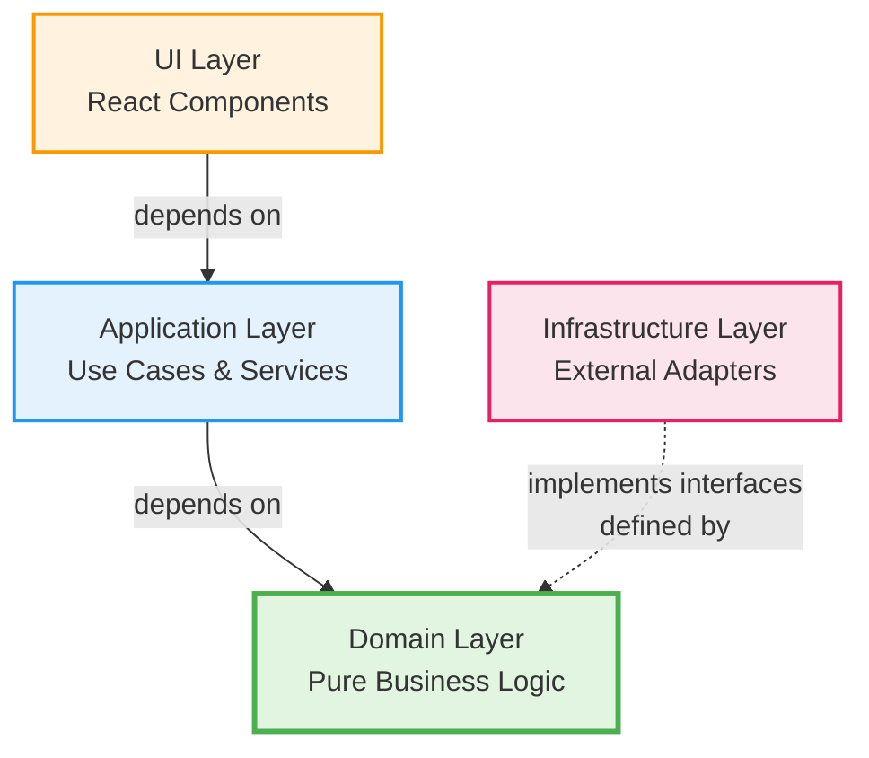
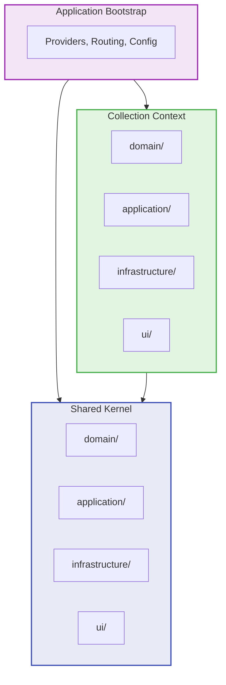
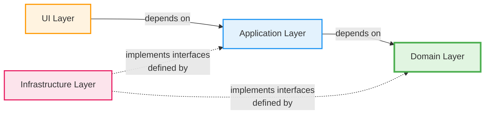

# Architecture Overview

## Architectural Philosophy

### Clean Architecture + DDD Bounded Contexts (Hybrid Approach)

Our approach combines:

- **Vertical slicing** via Bounded Contexts (DDD)
- **Horizontal layering** via Clean Architecture layers
- **Strict separation** of concerns and dependencies

### Architecture Diagram

**Layered Architecture (Horizontal):**



**Vertical Organization (Bounded Contexts):**



## Folder Structure

```
src/
├── app/                    # Application foundation layer
├── shared/                 # Shared kernel (cross-context)
│   ├── domain/             # Shared domain primitives
│   ├── application/        # Shared application logic
│   ├── infrastructure/     # Shared infrastructure
│   └── ui/                 # Shared UI components
└── collection/             # Collection bounded context
    ├── domain/             # Collection entities & business logic
    ├── application/        # Collection use cases
    ├── infrastructure/     # Collection data access & adapters
    └── ui/                 # Collection React components
```

## Planned Bounded Contexts

### 1. Collection (Implemented)

Video game collection management.

- **Responsibilities:** Game CRUD, organization by consoles
- **Main Entities:** Game, Console, CollectionItem

### 2. Wishlist (Coming)

Wishlist tracking.

- **Responsibilities:** Track desired games, priorities
- **Main Entities:** WishlistItem, WishPriority

### 3. Maintenance (Coming)

Console maintenance management.

- **Responsibilities:** Repair history, console condition tracking
- **Main Entities:** MaintenanceRecord, ConsoleCondition

## Fundamental Dependency Rule

**Dependencies flow INWARD toward the Domain layer:**



**Allowed Dependencies:**

- ✅ **UI** can depend on → Application, Domain (DTOs only)
- ✅ **Application** can depend on → Domain
- ✅ **Infrastructure** implements interfaces from → Domain, Application (Dependency Inversion)
- ✅ **Domain** depends on → NOTHING (pure TypeScript)

**Forbidden Dependencies:**

- ❌ **Domain** can NEVER depend on → Application, UI, Infrastructure
- ❌ **Application** can NEVER depend on → UI, Infrastructure
- ❌ **Infrastructure** can NEVER depend on → UI
- ❌ **UI** can NEVER depend on → Infrastructure (must go through Application layer)

**Summary:** All dependencies point **inward** toward the Domain (the core business logic).

## Related Documents

- [Folder Structure](./folder-structure.md) - Detailed organization
- [Dependency Rules](./dependency-rules.md) - Strict rules to follow
- [Domain Layer](../layers/domain-layer.md) - Domain purity rules

## Learning Objectives

By working on this project, you will learn:

1. ✅ How to organize a React application following Clean Architecture
2. ✅ How to identify and isolate bounded contexts (DDD)
3. ✅ How to maintain strict dependency rules
4. ✅ How to test each layer independently
5. ✅ How to avoid tight coupling between business modules

## Next Steps

To start developing in this architecture:

1. Read [Dependency Rules](./dependency-rules.md)
2. Read [Domain Layer](../layers/domain-layer.md)
3. Consult `project-context.md` for technical details
