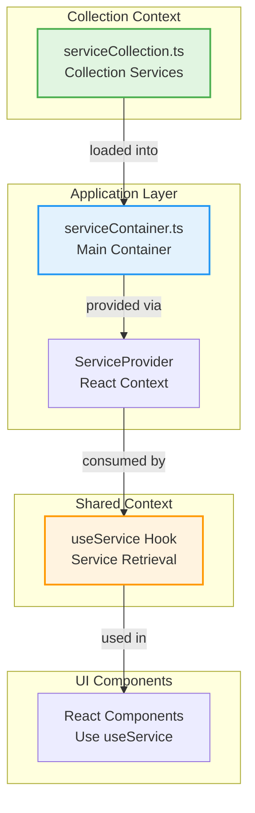

# Dependency Injection with InversifyJS

## Overview

This project uses **InversifyJS** for dependency injection following Clean Architecture principles. The DI system ensures loose coupling between layers while maintaining strict dependency rules.

## Philosophy

- **NO decorators** - Manual registration only (domain layer must stay pure)
- **NO reflect-metadata** - Not needed for manual binding
- **Container per context** - Each bounded context has its own service collection
- **Composition root** - All containers are composed in `src/app/config/serviceContainer.ts`

## Architecture



## File Organization

### Service Container (Application Layer)

**Location:** `src/app/config/serviceContainer.ts`

```typescript
import { serviceCollection } from '@Front/collection/serviceCollection';
import { Container } from 'inversify';

export const serviceContainer = new Container();

serviceContainer.loadSync(serviceCollection);
```

This is the **composition root** where all context-specific containers are aggregated.

### Context Service Collections

**Location:** `src/<context>/serviceCollection.ts`

Example for Collection context:

```typescript
// src/collection/serviceCollection.ts
import { ContainerModule } from 'inversify';

export const serviceCollection: ContainerModule = new ContainerModule(bind => {
  // Collection services bindings go here
  // Example:
  // bind<IGameRepository>(TYPES.GameRepository).to(GameRepository);
});
```

### Service Provider (UI Layer)

**Location:** `src/app/providers/ServiceProvider/`

```typescript
// ServiceContext.ts
import type { Container } from 'inversify';
import { createContext } from 'react';

type ServiceContextProps = {
  container: Container;
};

export const ServiceContext = createContext<ServiceContextProps | null>(null);
```

```typescript
// ServiceProvider.tsx
import type { Container } from 'inversify';
import { type PropsWithChildren, useRef } from 'react';
import { ServiceContext } from './ServiceContext';

export type ContainerProviderProps = {
  container: Container;
};

export const ServiceProvider = ({
  container,
  children
}: PropsWithChildren<ContainerProviderProps>) => {
  const containerRef = useRef({ container });

  return <ServiceContext value={containerRef.current}>{children}</ServiceContext>;
};
```

### useService Hook (Shared UI Layer)

**Location:** `src/shared/ui/hooks/useService/useService.ts`

```typescript
import { ServiceContext } from '@Front/app/providers/ServiceProvider/ServiceContext';
import type { ServiceIdentifier } from 'inversify';
import { useContext } from 'react';

export const useService = <T = unknown>(serviceIdentifier: ServiceIdentifier<T>): T => {
  const context = useContext(ServiceContext);

  if (!context) {
    throw new Error('useService must be used within a ServiceProvider');
  }

  return context.container.get<T>(serviceIdentifier);
};
```

**Purpose:** Allows React components to retrieve services without importing the container directly.

## Usage Examples

### 1. Define Service Identifiers

Create a `types.ts` file for your context:

```typescript
// src/collection/types.ts
export const TYPES = {
  GameRepository: Symbol.for('GameRepository'),
  Logger: Symbol.for('Logger'),
};
```

### 2. Register Services in Context Container

#### Basic Pattern

```typescript
// src/collection/serviceCollection.ts
import { ContainerModule } from 'inversify';
import { TYPES } from './types';
import { GameRepository } from './infrastructure/GameRepository';

export const serviceCollection: ContainerModule = new ContainerModule(bind => {
  bind<IGameRepository>(TYPES.GameRepository).to(GameRepository);
});
```

#### Real-World Example: Collection Context

Here's the actual implementation from the Collection bounded context:

```typescript
// src/collection/serviceCollection.ts
import { IndexedDB } from '@Shared/infrastructure/persistence/IndexedDB';
import { ContainerModule } from 'inversify';
import { IndexedDBGameRepository } from './infrastructure/persistence/IndexedDBGameRepository';

export const serviceCollection: ContainerModule = new ContainerModule(options => {
  // Register IndexedDB service with configuration
  options
    .bind(IndexedDB)
    .toDynamicValue(() => new IndexedDB('GameCollectionDB', 1, 'games'))
    .inSingletonScope();

  // Register Game Repository with dependency injection
  options
    .bind(IndexedDBGameRepository)
    .toDynamicValue(service => new IndexedDBGameRepository(service.get(IndexedDB)))
    .inSingletonScope();
});
```

**Key Points:**

1. **No Symbol Identifiers**: Services are bound directly to their classes
2. **`toDynamicValue`**: Allows custom instantiation logic with dependencies
3. **`inSingletonScope()`**: Ensures only one instance exists (shared state)
4. **Dependency Resolution**: `service.get(IndexedDB)` retrieves the IndexedDB dependency
5. **Configuration on Creation**: IndexedDB is configured with database name, version, and store name

#### Service Binding Strategies

InversifyJS offers multiple binding strategies:

##### a) `to()` - Simple Class Binding

Use when the class has no constructor parameters or uses `@inject` decorators:

```typescript
options.bind<GameRepositoryInterface>(TYPES.GameRepository).to(GameRepository);
```

**Note:** We avoid this pattern since we don't use decorators.

##### b) `toDynamicValue()` - Factory Function

Use for custom instantiation logic, dependency resolution, or configuration:

```typescript
// Simple factory
options
  .bind(Logger)
  .toDynamicValue(() => new Logger('Collection'))
  .inSingletonScope();

// With dependency injection
options
  .bind(GameRepository)
  .toDynamicValue(ctx => new GameRepository(ctx.container.get(IndexedDB), ctx.container.get(Logger)))
  .inSingletonScope();

// With configuration
options
  .bind(IndexedDB)
  .toDynamicValue(() => new IndexedDB('GameCollectionDB', 1, 'games'))
  .inSingletonScope();
```

**Advantages:**

- Full control over instantiation
- Can pass configuration values
- Can resolve dependencies manually
- No need for decorators

##### c) `toConstantValue()` - Pre-Instantiated Objects

Use for singletons or pre-configured instances:

```typescript
const logger = new Logger('Collection');
options.bind(Logger).toConstantValue(logger);

// Or with configuration
const config = {
  dbName: 'GameCollectionDB',
  version: 1,
  storeName: 'games',
};
options.bind(TYPES.Config).toConstantValue(config);
```

**Use when:**

- You need to initialize the service before container setup
- Sharing an instance across multiple containers
- Wrapping external libraries

##### d) `toSelf()` - Bind to Own Class

Bind a class to itself (useful for concrete classes without interfaces):

```typescript
options.bind(IndexedDB).toSelf().inSingletonScope();
```

#### Lifecycle Scopes

Control the lifetime of your services:

##### `inSingletonScope()` - One Instance Per Container

```typescript
options
  .bind(IndexedDB)
  .toDynamicValue(() => new IndexedDB('GameCollectionDB', 1, 'games'))
  .inSingletonScope(); // ✅ Single shared instance
```

**Use for:**

- Database connections
- Caches
- Configuration objects
- Stateful services

##### `inTransientScope()` - New Instance Each Time (Default)

```typescript
options
  .bind(GameService)
  .toDynamicValue(ctx => new GameService(ctx.container.get(GameRepository)))
  .inTransientScope(); // New instance every time
```

**Use for:**

- Stateless services
- Request handlers
- Short-lived objects

##### `inRequestScope()` - One Instance Per Request

```typescript
options.bind(RequestContext).to(RequestContext).inRequestScope(); // One per request (requires middleware)
```

**Note:** Rarely used in frontend applications.

#### Complex Example: Multiple Dependencies

```typescript
export const serviceCollection: ContainerModule = new ContainerModule(options => {
  // Infrastructure - IndexedDB
  options
    .bind(IndexedDB)
    .toDynamicValue(() => new IndexedDB('GameCollectionDB', 1, 'games'))
    .inSingletonScope();

  // Infrastructure - Logger
  options
    .bind(Logger)
    .toDynamicValue(() => new Logger('Collection'))
    .inSingletonScope();

  // Repository - Game Repository
  options
    .bind(GameRepository)
    .toDynamicValue(ctx => new GameRepository(ctx.container.get(IndexedDB), ctx.container.get(Logger)))
    .inSingletonScope();

  // Application - Use Cases
  options
    .bind(AddGameUseCase)
    .toDynamicValue(ctx => new AddGameUseCase(ctx.container.get(GameRepository), ctx.container.get(Logger)))
    .inTransientScope(); // New instance per call

  options
    .bind(GetGameUseCase)
    .toDynamicValue(ctx => new GetGameUseCase(ctx.container.get(GameRepository)))
    .inTransientScope();
});
```

#### Service Registration Checklist

When adding a new service:

- [ ] Import the service class and its dependencies
- [ ] Choose the appropriate binding strategy (`toDynamicValue`, `toConstantValue`, etc.)
- [ ] Decide on lifecycle scope (singleton vs transient)
- [ ] Resolve dependencies via `ctx.container.get()` or pass configuration
- [ ] Keep services in logical groups (infrastructure, repositories, use cases)
- [ ] Test service resolution in integration tests

### 3. Use Services in React Components

```typescript
// src/collection/ui/pages/GameList.tsx
import { useService } from '@Front/shared/ui/hooks/useService/useService';
import { TYPES } from '@Front/collection/types';
import type { IGameRepository } from '@Front/collection/domain/IGameRepository';

export const GameList = () => {
  const gameRepo = useService<IGameRepository>(TYPES.GameRepository);

  // Use gameRepo...
};
```

## Layer-Specific Rules

### Domain Layer

- ✅ **Define interfaces** for dependencies (e.g., `IGameRepository`)
- ❌ **NO InversifyJS imports** - domain must stay pure
- ❌ **NO decorators** (`@injectable()`)
- ❌ **NO container references**

```typescript
// ✅ GOOD: Pure interface in domain
export interface IGameRepository {
  findById(id: string): Promise<Game | null>;
  save(game: Game): Promise<void>;
}
```

### Infrastructure Layer

- ✅ **Implement domain/application interfaces**
- ✅ **Can use InversifyJS types** for type hints (optional)
- ❌ **NO decorators** - use manual binding

```typescript
// ✅ GOOD: Implementation without decorators
import type { IGameRepository } from '@Front/collection/domain/IGameRepository';
import { Game } from '@Front/collection/domain/Game';

export class GameRepository implements IGameRepository {
  async findById(id: string): Promise<Game | null> {
    // Implementation...
  }

  async save(game: Game): Promise<void> {
    // Implementation...
  }
}
```

### Application Layer

- ✅ **Use cases receive dependencies via constructor**
- ❌ **NO InversifyJS imports**
- ❌ **NO decorators**

```typescript
// ✅ GOOD: Use case with constructor injection
export class GetGameUseCase {
  constructor(private readonly gameRepository: IGameRepository) {}

  async execute(id: string): Promise<Game | null> {
    return this.gameRepository.findById(id);
  }
}
```

### UI Layer

- ✅ **Use `useService` hook** to retrieve dependencies
- ✅ **Import service identifiers** (symbols)
- ❌ **NO direct container imports**

```typescript
// ✅ GOOD: Using useService hook
const gameRepo = useService<IGameRepository>(TYPES.GameRepository);

// ❌ BAD: Direct container import
import { serviceContainer } from '@Front/app/config/serviceContainer';
const gameRepo = serviceContainer.get(TYPES.GameRepository);
```

## Testing

### Unit Tests for Service Resolution

```typescript
// tests/unit/shared/hooks/useService/useService.test.tsx
import { ServiceContext } from '@Front/app/providers/ServiceProvider/ServiceContext';
import { useService } from '@Front/shared/ui/hooks/useService/useService';
import { renderHook } from '@testing-library/react';
import { Container } from 'inversify';
import { describe, expect, it } from 'vitest';

describe('useService', () => {
  it('should retrieve service from container', () => {
    const container = new Container();
    const testSymbol = Symbol.for('TestService');
    const testValue = { test: 'value' };

    container.bind(testSymbol).toConstantValue(testValue);

    const wrapper = ({ children }: { children: React.ReactNode }) => (
      <ServiceContext value={{ container }}>{children}</ServiceContext>
    );

    const { result } = renderHook(() => useService(testSymbol), { wrapper });

    expect(result.current).toBe(testValue);
  });

  it('should throw error when used outside ServiceProvider', () => {
    expect(() => {
      renderHook(() => useService(Symbol.for('Test')));
    }).toThrow('useService must be used within a ServiceProvider');
  });
});
```

## Best Practices

### ✅ DO

- Define service identifiers as symbols in `<context>/types.ts`
- Use manual binding with `bind<Interface>(symbol).to(ConcreteClass)`
- Create one `serviceCollection.ts` per bounded context
- Use `useService` hook in React components
- Keep domain layer free of DI framework code

### ❌ DON'T

- Use `@injectable()` decorators (violates domain purity)
- Install `reflect-metadata` (not needed for manual DI)
- Import container directly in components
- Mix service registration logic in multiple files
- Put DI logic in domain or application layers

## Related Documentation

- [Architecture Overview](./README.md)
- [Dependency Rules](./dependency-rules.md)
- [Folder Structure](./folder-structure.md)
- [Domain Layer](../layers/domain-layer.md)
