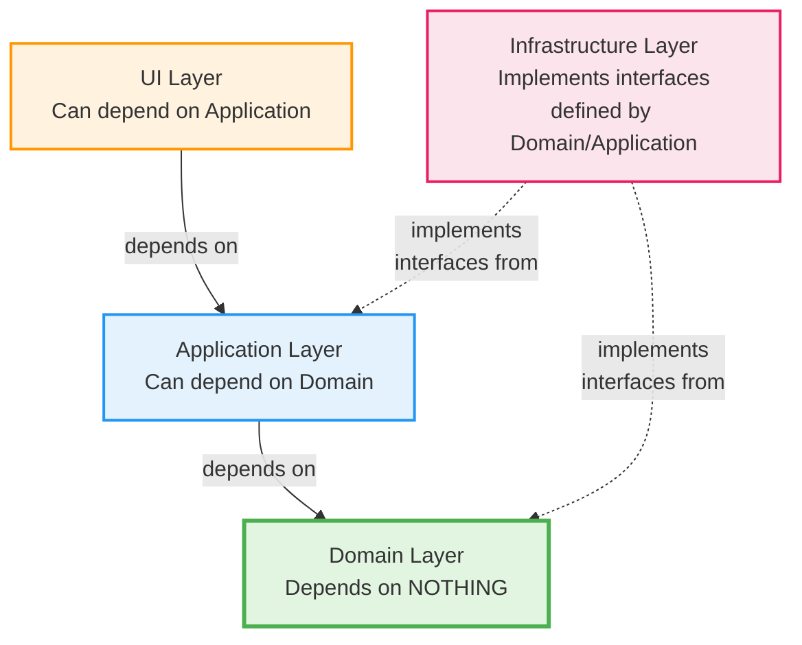
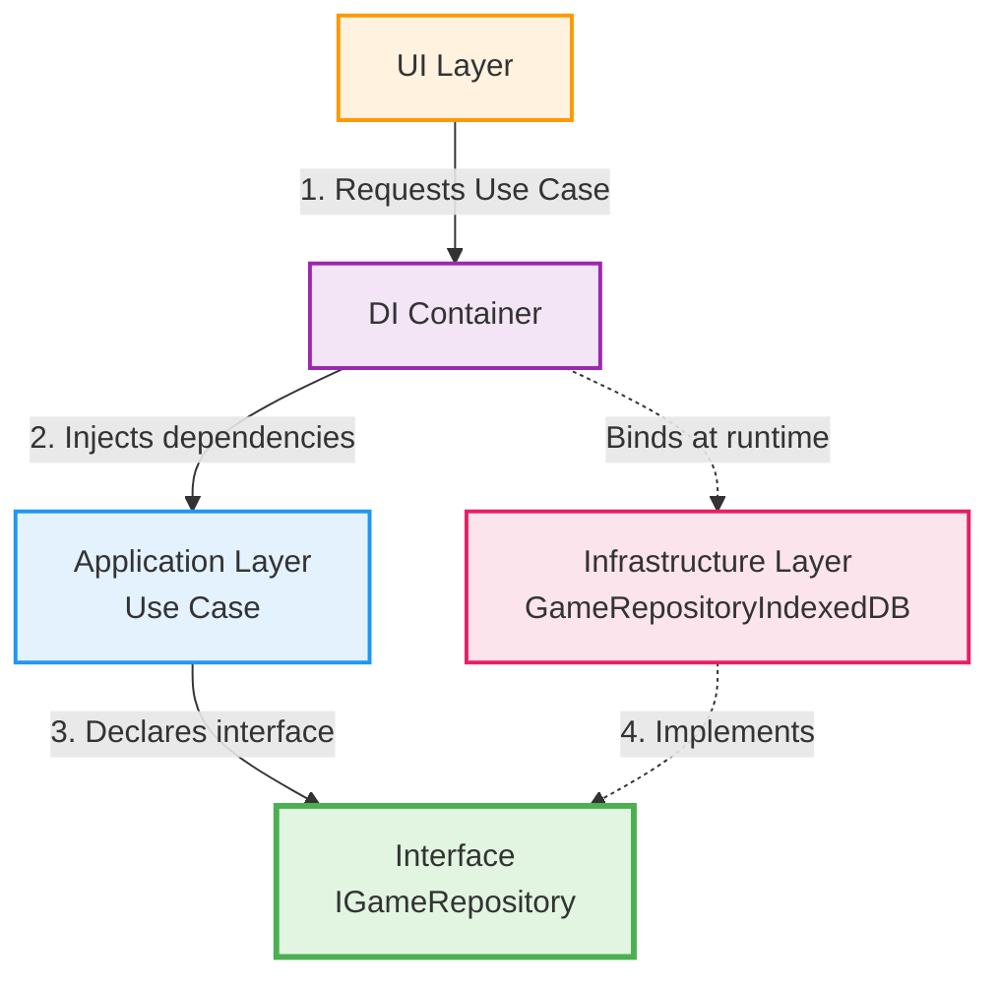

# Dependency Rules

## The Golden Rule of Clean Architecture

**Dependencies point INWARD, never OUTWARD.**



## Layer Dependency Matrix

| Layer              | Can Depend On                  | CANNOT Depend On          |
| ------------------ | ------------------------------ | ------------------------- |
| **Domain**         | Nothing (pure TypeScript)      | Application, UI, Infra    |
| **Application**    | Domain                         | UI, Infrastructure        |
| **Infrastructure** | Domain, Application interfaces | UI                        |
| **UI**             | Application, Domain (DTOs)     | Infrastructure (directly) |

---

## Domain Layer Rules (STRICTEST)

### ✅ Allowed Dependencies

- **TypeScript primitives:** `string`, `number`, `boolean`, `Date`
- **TypeScript utilities:** `Record`, `Partial`, `Pick`, etc.
- **Other Domain entities** within the same bounded context
- **Shared Domain primitives** from `shared/domain/`

### ❌ Forbidden Dependencies

- ❌ **No React** (`import React from 'react'`)
- ❌ **No external libraries** (`axios`, `lodash`, `date-fns`)
- ❌ **No framework dependencies** (`InversifyJS`, `class-validator`)
- ❌ **No infrastructure code** (repositories, HTTP clients)
- ❌ **No UI hooks** (`useState`, `useEffect`)

### Example: Valid Domain Entity

```typescript
// ✅ GOOD: Pure TypeScript, no dependencies
// src/collection/domain/Game.ts

export class Game {
  constructor(
    private readonly id: string,
    private readonly title: string,
    private readonly releaseDate: Date,
  ) {
    this.validateTitle(title);
  }

  private validateTitle(title: string): void {
    if (title.trim().length === 0) {
      throw new Error('Game title cannot be empty');
    }
  }

  getTitle(): string {
    return this.title;
  }

  isReleasedAfter(date: Date): boolean {
    return this.releaseDate > date;
  }
}
```

### Example: Invalid Domain Entity

```typescript
// ❌ BAD: Dependencies on external libraries
// src/collection/domain/Game.ts

import axios from 'axios'; // ❌ External HTTP library
import { IsNotEmpty } from 'class-validator'; // ❌ Decorator library
import { format } from 'date-fns'; // ❌ Date utility library

export class Game {
  @IsNotEmpty() // ❌ Using decorators from external library
  private readonly title: string;

  async save(): Promise<void> {
    // ❌ Domain should not know about HTTP or persistence
    await axios.post('/api/games', this);
  }

  getFormattedDate(): string {
    // ❌ Using external date library
    return format(this.releaseDate, 'yyyy-MM-dd');
  }
}
```

---

## Application Layer Rules

### ✅ Allowed Dependencies

- **Domain layer:** Import entities, value objects, interfaces
- **Application DTOs:** Define and use Data Transfer Objects
- **Service interfaces:** Define contracts for infrastructure

### ❌ Forbidden Dependencies

- ❌ **No Infrastructure implementations** (repositories, HTTP clients)
- ❌ **No UI components** (React components, hooks)
- ❌ **No direct database access** (Prisma, TypeORM)
- ❌ **No direct HTTP calls** (axios, fetch directly)

### Example: Valid Use Case

```typescript
// ✅ GOOD: Depends only on Domain and interfaces
// src/collection/application/AddGameToCollection.ts

import { Game } from '../domain/Game';
import { IGameRepository } from '../domain/IGameRepository'; // Interface

export class AddGameToCollection {
  constructor(private readonly gameRepository: IGameRepository) {}

  async execute(title: string, releaseDate: Date): Promise<void> {
    const game = new Game(crypto.randomUUID(), title, releaseDate);
    await this.gameRepository.save(game);
  }
}
```

### Example: Invalid Use Case

```typescript
// ❌ BAD: Direct dependency on infrastructure
// src/collection/application/AddGameToCollection.ts

import { Game } from '../domain/Game';
import { GameRepositoryIndexedDB } from '../infrastructure/GameRepositoryIndexedDB'; // ❌ Concrete implementation
import axios from 'axios'; // ❌ Direct HTTP dependency

export class AddGameToCollection {
  // ❌ Use Case depends on concrete infrastructure
  constructor(private readonly gameRepository: GameRepositoryIndexedDB) {}

  async execute(title: string, releaseDate: Date): Promise<void> {
    const game = new Game(crypto.randomUUID(), title, releaseDate);

    // ❌ Direct HTTP call in use case
    await axios.post('/api/games', game);

    await this.gameRepository.save(game);
  }
}
```

---

## Infrastructure Layer Rules

### ✅ Allowed Dependencies

- **Domain interfaces:** Implement repository contracts
- **Application interfaces:** Implement service contracts
- **External libraries:** axios, idb, InversifyJS, etc.
- **Framework utilities:** Dependency injection containers

### ❌ Forbidden Dependencies

- ❌ **No UI components** (React components)
- ❌ **No direct UI state** (useState, Zustand stores)

### Example: Valid Repository

```typescript
// ✅ GOOD: Implements domain interface, uses external library
// src/collection/infrastructure/GameRepositoryIndexedDB.ts

import { openDB, IDBPDatabase } from 'idb'; // ✅ External library allowed
import { Game } from '../domain/Game';
import { IGameRepository } from '../domain/IGameRepository';

export class GameRepositoryIndexedDB implements IGameRepository {
  private db: IDBPDatabase | null = null;

  async save(game: Game): Promise<void> {
    if (!this.db) await this.connect();
    await this.db!.put('games', {
      id: game.getId(),
      title: game.getTitle(),
    });
  }

  private async connect(): Promise<void> {
    this.db = await openDB('GameCollectionDB', 1);
  }
}
```

---

## UI Layer Rules

### ✅ Allowed Dependencies

- **Application Use Cases:** Invoke business logic
- **Domain DTOs:** Display data structures
- **Shared UI components:** Reuse from `shared/ui/`
- **React and hooks:** `useState`, `useEffect`, etc.
- **UI libraries:** shelter-ui, React Router

### ❌ Forbidden Dependencies

- ❌ **No direct Infrastructure access** (repositories, HTTP clients)
- ❌ **No direct database calls**
- ❌ **No business logic** (should be in Use Cases)

### Example: Valid React Component

```typescript
// ✅ GOOD: Uses Use Case, no direct infrastructure
// src/collection/ui/pages/AddGamePage.tsx

import { useState } from 'react';
import { AddGameToCollection } from '../../application/AddGameToCollection';
import { container } from '../../infrastructure/collection.container';

export const AddGamePage = () => {
  const [title, setTitle] = useState('');
  const addGameUseCase = container.get(AddGameToCollection);

  const handleSubmit = async () => {
    await addGameUseCase.execute(title, new Date());
  };

  return (
    <form onSubmit={handleSubmit}>
      <input value={title} onChange={(e) => setTitle(e.target.value)} />
      <button type="submit">Add Game</button>
    </form>
  );
};
```

### Example: Invalid React Component

```typescript
// ❌ BAD: Direct infrastructure dependency
// src/collection/ui/pages/AddGamePage.tsx

import { useState } from 'react';
import { GameRepositoryIndexedDB } from '../../infrastructure/GameRepositoryIndexedDB'; // ❌ Direct infra
import { Game } from '../../domain/Game';

export const AddGamePage = () => {
  const [title, setTitle] = useState('');
  const repository = new GameRepositoryIndexedDB(); // ❌ UI instantiates infra

  const handleSubmit = async () => {
    // ❌ Business logic in UI component
    const game = new Game(crypto.randomUUID(), title, new Date());
    await repository.save(game); // ❌ Direct repository call
  };

  return (
    <form onSubmit={handleSubmit}>
      <input value={title} onChange={(e) => setTitle(e.target.value)} />
      <button type="submit">Add Game</button>
    </form>
  );
};
```

---

## Dependency Injection Pattern

### Why Dependency Injection?

Dependency Injection (DI) allows **Infrastructure** implementations to be injected into **Application** Use Cases without violating dependency rules.



**Flow:** DI Container binds interface → implementation at runtime.

### Example: Dependency Injection Setup

```typescript
// src/collection/infrastructure/collection.container.ts
import { Container } from 'inversify';
import { IGameRepository } from '../domain/IGameRepository';
import { GameRepositoryIndexedDB } from './GameRepositoryIndexedDB';
import { AddGameToCollection } from '../application/AddGameToCollection';

export const container = new Container();

// Bind interface to implementation
container.bind<IGameRepository>('IGameRepository').to(GameRepositoryIndexedDB);

// Bind Use Case with injected dependency
container.bind(AddGameToCollection).toSelf();
```

---

## Validation and Enforcement

### Manual Review Checklist

- [ ] Domain layer has ZERO external imports
- [ ] Application layer only imports from Domain
- [ ] Infrastructure implements interfaces (not referenced directly)
- [ ] UI only calls Use Cases, never repositories

### Automated Tools (Future)

Consider using:

- **ESLint** with [`eslint-plugin-import`](https://github.com/import-js/eslint-plugin-import)
- **dependency-cruiser** for dependency graph validation
- **ts-morph** for custom AST-based validation

### Example ESLint Rule (Future)

```json
{
  "rules": {
    "import/no-restricted-paths": [
      "error",
      {
        "zones": [
          {
            "target": "./src/**/domain",
            "from": "./src/**/application"
          },
          {
            "target": "./src/**/domain",
            "from": "./src/**/infrastructure"
          }
        ]
      }
    ]
  }
}
```

---

## Common Violations and Fixes

### Violation 1: Domain using external library

```typescript
// ❌ BAD
import axios from 'axios';
export class Game {
  async fetchDetails() {
    return await axios.get(`/api/games/${this.id}`);
  }
}

// ✅ GOOD: Define interface in Domain, implement in Infrastructure
// Domain
export interface IGameDetailsService {
  fetchDetails(gameId: string): Promise<GameDetails>;
}

// Infrastructure
export class GameDetailsServiceHTTP implements IGameDetailsService {
  async fetchDetails(gameId: string): Promise<GameDetails> {
    return await axios.get(`/api/games/${gameId}`);
  }
}
```

### Violation 2: UI directly calling repository

```typescript
// ❌ BAD
const repository = new GameRepositoryIndexedDB();
await repository.save(game);

// ✅ GOOD: UI calls Use Case
const addGameUseCase = container.get(AddGameToCollection);
await addGameUseCase.execute(title, releaseDate);
```

### Violation 3: Use Case instantiating infrastructure

```typescript
// ❌ BAD
export class AddGameToCollection {
  execute() {
    const repo = new GameRepositoryIndexedDB(); // ❌ Direct instantiation
  }
}

// ✅ GOOD: Use Case receives interface via DI
export class AddGameToCollection {
  constructor(private readonly repo: IGameRepository) {} // ✅ Interface injected
}
```

---

## Summary

**The Dependency Rule is the foundation of Clean Architecture.**

- **Domain** = Pure business logic, zero dependencies
- **Application** = Orchestrates Domain, defines infrastructure contracts
- **Infrastructure** = Implements contracts, uses external libraries
- **UI** = Presents data, invokes Use Cases

**Always ask:** "Does this import point inward toward Domain?"

If yes ✅, proceed. If no ❌, refactor.

---

## References

- [Clean Architecture (Robert C. Martin)](https://blog.cleancoder.com/uncle-bob/2012/08/13/the-clean-architecture.html)
- [Dependency Inversion Principle (SOLID)](https://en.wikipedia.org/wiki/Dependency_inversion_principle)
- [Domain Layer](../layers/domain-layer.md) - Detailed domain rules
