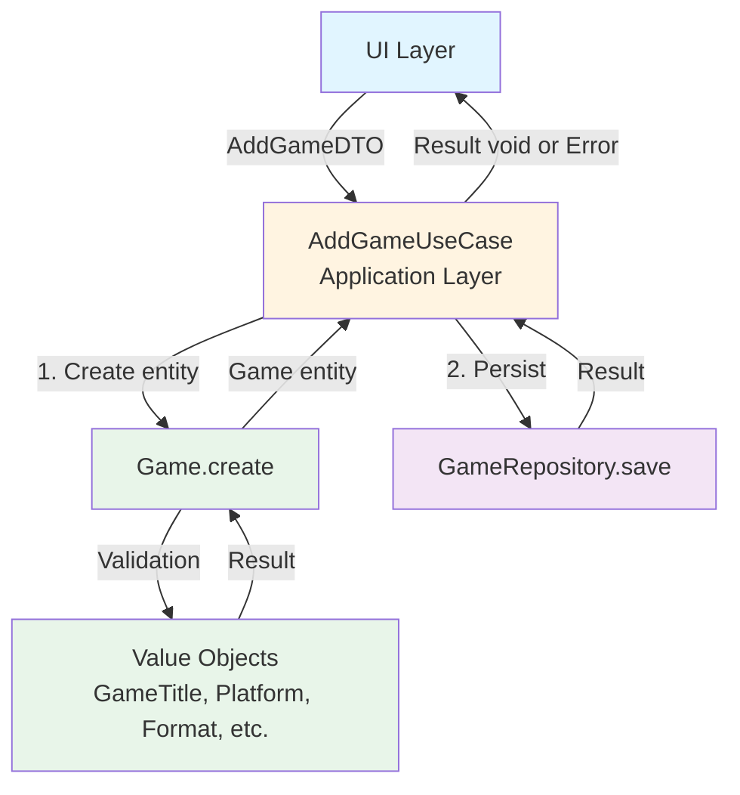

# AddGame Use Case

## Overview

The `AddGameUseCase` is an application-layer component responsible for orchestrating the business logic required to add a game to the user's collection. It follows Clean Architecture principles by keeping the business logic independent of frameworks and UI concerns.

## Purpose

This use case:

1. **Creates a Game entity** from the provided data transfer object (DTO)
2. **Delegates validation** to the domain layer (value objects)
3. **Persists the game** via the repository abstraction

## Location

- **Interface**: `src/collection/application/use-cases/AddGameUseCaseInterface.d.ts`
- **Implementation**: `src/collection/application/use-cases/AddGameUseCase.ts`
- **Tests**: `tests/unit/collection/application/use-cases/AddGameUseCase.test.ts`

## Dependencies

- **GameRepositoryInterface**: Repository abstraction for persisting games
- **Game**: Domain entity representing a game
- **AddGameDTO**: Data transfer object for input data
- **Result Pattern**: For functional error handling

## Flow Diagram



## Validation Strategy

The use case follows a **single-level validation** approach:

### Domain-Level Validation (via Value Objects)

All validation is handled by the domain layer when creating the Game entity:

- **GameTitle**: Max 200 characters, not empty
- **GameDescription**: Max 1000 characters
- **Platform**: Max 100 characters, not empty
- **Format**: Max 50 characters, not empty
- **GameStatus**: Must be a valid enum value (Owned, Wishlist, etc.)

### Why No Application-Level Validation?

The application layer does **not** duplicate validation logic because:

1. **Domain is the single source of truth** for business rules
2. **UI validation** handles user experience (required fields, format hints)
3. **Avoiding redundancy** prevents inconsistencies between layers

If additional data arrives empty or invalid from the UI, the domain validation will catch it and return a clear error.

## Usage Example

### Basic Usage

```typescript
import { serviceContainer } from '@App/config/serviceContainer';
import { COLLECTION_SERVICES } from '@Collection/serviceIdentifiers';
import { AddGameDTO } from '@Collection/application/dtos/AddGameDTO';
import type { AddGameUseCaseInterface } from '@Collection/application/use-cases/AddGameUseCaseInterface';

// Get the use case from DI container
const addGameUseCase = serviceContainer.get<AddGameUseCaseInterface>(COLLECTION_SERVICES.AddGameUseCase);

// Create DTO from user input
const dto = new AddGameDTO(
  'game-123',
  'The Legend of Zelda: Breath of the Wild',
  'Open-world action-adventure game',
  'Nintendo Switch',
  'Physical',
  new Date('2023-05-12'),
  'Owned',
);

// Execute the use case
const result = await addGameUseCase.execute(dto);

if (result.isOk()) {
  console.log('Game added successfully!');
} else {
  const error = result.getError();
  console.error(`Failed to add game: ${error.message}`);
}
```

### React Integration

The actual integration pattern in this project uses `useService` to resolve the use case from the DI container, combined with **React Hook Form** for form state management and **Value Objects** for validation:

```typescript
import { AddGameDTO } from '@Collection/application/dtos/AddGameDTO';
import type { AddGameUseCaseInterface } from '@Collection/application/use-cases/AddGameUseCaseInterface';
import { GameTitle } from '@Collection/domain/value-objects/GameTitle';
import { Platform } from '@Collection/domain/value-objects/Platform';
import { COLLECTION_SERVICES } from '@Collection/serviceIdentifiers';
import { FormInputField } from '@Shared/ui/components/formField/FormInputField/FormInputField';
import { FormSelectField } from '@Shared/ui/components/formField/FormSelectField/FormSelectField';
import { useService } from '@Shared/ui/hooks/useService/useService';
import { FormProvider, useForm } from 'react-hook-form';

export const GameForm = () => {
  const addGameUseCase = useService<AddGameUseCaseInterface>(COLLECTION_SERVICES.AddGameUseCase);
  const methods = useForm({ defaultValues: { title: '', platform: '' } });
  const { handleSubmit } = methods;

  const onSubmit = async (data) => {
    const dto = new AddGameDTO(
      crypto.randomUUID(),
      data.title,
      '',
      data.platform,
      'Physical',
      null,
      'Owned',
    );

    const result = await addGameUseCase.execute(dto);

    if (result.isOk()) {
      // handle success
    } else {
      // handle error: result.getError().message
    }
  };

  return (
    <FormProvider {...methods}>
      <form onSubmit={handleSubmit(onSubmit)} noValidate aria-label="Add game form">
        <FormInputField
          name="title"
          label="Game title"
          required
          rules={{
            validate: value => {
              const result = GameTitle.create(value);
              return result.isOk() || result.getError().message;
            },
          }}
        />
        <FormSelectField
          name="platform"
          label="Platform"
          required
          rules={{
            validate: value => {
              const result = Platform.create(value);
              return result.isOk() || result.getError().message;
            },
          }}
        >
          <option value="">Select a platform</option>
          <option value="PlayStation 5">PlayStation 5</option>
        </FormSelectField>
        <button type="submit">Add game</button>
      </form>
    </FormProvider>
  );
};
```

See the full implementation in [`src/collection/ui/components/GameForm/GameForm.tsx`](../../src/collection/ui/components/GameForm/GameForm.tsx) and [`docs/layers/ui-layer.md`](../layers/ui-layer.md) for the complete UI layer documentation.

## Error Handling

The use case uses the [Result Pattern](../result-pattern.md) for type-safe error handling.

### Error Types

| Error Type          | When It Occurs                                 | Example                                         |
| ------------------- | ---------------------------------------------- | ----------------------------------------------- |
| **ValidationError** | Domain validation fails (value object rules)   | "Title must be between 1 and 200 characters"    |
| **RepositoryError** | Persistence operation fails (storage, network) | "Failed to save game: Database connection lost" |

### Error Response Structure

```typescript
// ValidationError
{
  type: 'Validation',
  message: 'Title must be between 1 and 200 characters',
  field: 'title',  // Optional: which field failed
  metadata: {
    domainError: { /* original domain error */ }
  }
}

// RepositoryError
{
  type: 'Repository',
  message: 'Failed to save game: Storage quota exceeded',
  metadata: {
    repositoryError: { /* original repository error */ }
  }
}
```

## Testing

The use case is thoroughly tested with 8 unit tests covering:

1. ✅ **Success case**: Valid game is created and saved
2. ✅ **Domain validation failures**: Title too long, platform too long, format too long, invalid status
3. ✅ **Repository failures**: Database errors, storage quota exceeded
4. ✅ **Edge cases**: Null purchase dates, date handling

All tests use mocked repositories and do not require actual persistence.

### Running Tests

```bash
# Run all tests for AddGameUseCase
npm run test:unit -- AddGameUseCase

# Run tests in watch mode
npm run test:unit:watch -- AddGameUseCase
```

## Design Decisions

### Why No DTO Validation?

**Decision**: The use case does not validate the DTO for required fields.

**Rationale**:

1. **Domain is authoritative**: Value objects already enforce all business rules
2. **UI handles UX**: Form validation provides immediate feedback to users
3. **Avoid triple validation**: DTO validation would be the 3rd layer (UI → DTO → Domain)
4. **Simpler code**: Less code to maintain, fewer tests, clearer responsibilities

**Trade-off**: If invalid data bypasses UI validation, the domain will catch it. Error messages from domain validation are still user-friendly and include the problematic field.

### Why Use DTOs?

**Decision**: Use a DTO (`AddGameDTO`) instead of accepting raw objects.

**Rationale**:

1. **Type safety**: Clear contract between UI and application layers
2. **Immutability**: DTOs are readonly, preventing accidental mutations
3. **Documentation**: Self-documenting interface for UI developers
4. **Testing**: Easy to construct test data

### Why Dependency Injection?

**Decision**: Use InversifyJS container for dependency management.

**Rationale**:

1. **Testability**: Easy to mock repositories in tests
2. **Flexibility**: Switch implementations (e.g., IndexedDB → API) without changing use case
3. **Single Responsibility**: Use case only knows the interface, not the implementation

## Related Documentation

- [Clean Architecture](../architecture/README.md)
- [Result Pattern](../result-pattern.md)
- [Value Objects](../value-objects.md)
- [Repository Pattern](../persistence-indexeddb.md)
- [Dependency Injection](../architecture/dependency-injection.md)
- [UI Layer](../layers/ui-layer.md) — how the use case is consumed in the form

## See Also

- **Domain Layer**: [Game Entity](../../src/collection/domain/entities/Game.ts)
- **Infrastructure Layer**: [IndexedDBGameRepository](../../src/collection/infrastructure/persistence/IndexedDBGameRepository.ts)
- **Application Errors**: [Error Types](../../src/collection/application/errors/)
