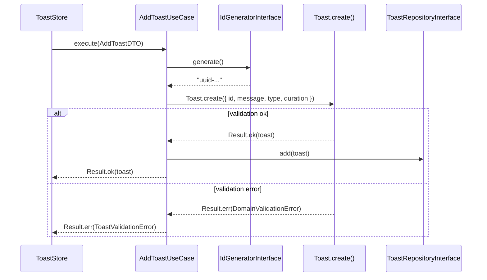

# AddToast Use Case

## Purpose

Creates a new transient notification (toast) and persists it in the in-memory repository.
Delegates ID generation to an injected `IdGeneratorInterface` so the use case remains free of any specific generation strategy.

## Flow



## DTO

```typescript
// src/toast/application/dtos/AddToastDTO.ts
class AddToastDTO {
  constructor(
    readonly message: string,
    readonly type: ToastTypeValue, // 'success' | 'info' | 'warning' | 'error'
    readonly duration: number = 3000,
  ) {}
}
```

| Field      | Type             | Required | Default | Description                             |
| ---------- | ---------------- | -------- | ------- | --------------------------------------- |
| `message`  | `string`         | Yes      | —       | Notification text (non-empty)           |
| `type`     | `ToastTypeValue` | Yes      | —       | Visual severity (`success` etc.)        |
| `duration` | `number`         | No       | `3000`  | Auto-dismiss delay in milliseconds (>0) |

## Validation

Validation is performed inside `Toast.create()` via value objects:

| Field      | Value Object    | Error class           | Rule                                |
| ---------- | --------------- | --------------------- | ----------------------------------- |
| `id`       | `ToastId`       | `NotEmptyError`       | Non-empty string                    |
| `message`  | `ToastMessage`  | `NotEmptyError`       | Non-empty, non-whitespace string    |
| `type`     | `ToastType`     | `AllowedValuesError`  | One of `success/info/warning/error` |
| `duration` | `ToastDuration` | `PositiveNumberError` | Strictly positive integer (>0)      |

Domain errors (`DomainValidationError`) are mapped to `ToastValidationError` at the application boundary.

## Error Handling

| Scenario          | Error class            | Behavior in store               |
| ----------------- | ---------------------- | ------------------------------- |
| Validation failed | `ToastValidationError` | `result.isErr()` — silent no-op |
| Success           | —                      | toast added, timer scheduled    |

## Key Decisions

- **No ID in DTO**: ID is generated inside the use case via `IdGeneratorInterface`. The caller (store) never picks or supplies an ID.
- **`IdGeneratorInterface` from shared**: decouples the use case from `crypto.randomUUID` — any implementation works (e.g. deterministic in tests).
- **Domain ↔ Application error mapping**: `DomainValidationError` (domain concern) is wrapped in `ToastValidationError` (application concern) to keep layer contracts clean.

## References

- [Result Pattern](../result-pattern.md)
- [Value Objects](../value-objects.md)
- [ADR-014: Infrastructure ID Generator](../architecture/adr/ADR-014-infrastructure-id-generator.md)
- [ADR-015: DomainValidationError Hierarchy](../architecture/adr/ADR-015-domain-validation-error-hierarchy.md)
