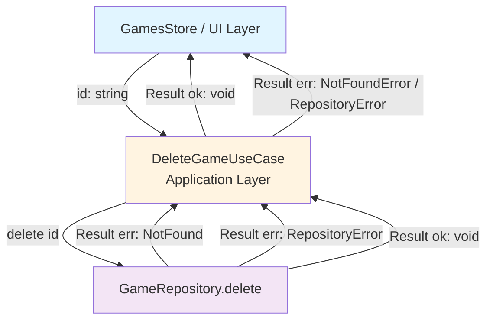

# DeleteGame Use Case

## Overview

The `DeleteGameUseCase` is an application-layer component responsible for permanently removing a game from the collection. It follows Clean Architecture principles by delegating the persistence operation to the repository abstraction and mapping infrastructure errors to typed application errors.

## Purpose

This use case:

1. **Delegates deletion** to the repository via `repository.delete(id)`
2. **Maps infrastructure errors** to typed application errors (`NotFoundError`, `RepositoryError`)
3. **Returns a Result** so the caller (`GamesStore`) can update its state and the component can handle errors imperatively

## Location

- **Interface**: `src/collection/application/use-cases/DeleteGameUseCaseInterface.d.ts`
- **Implementation**: `src/collection/application/use-cases/DeleteGameUseCase.ts`
- **Tests**: `tests/unit/collection/application/use-cases/DeleteGameUseCase.test.ts`

## Dependencies

- **GameRepositoryInterface**: Repository abstraction for deleting games
- **Result Pattern**: For functional error handling

## Flow Diagram



## Usage

The use case is consumed exclusively by `GamesStore.deleteGame(id)`:

```typescript
// In GamesStore.deleteGame (public method)
const result = await this.deleteGameUseCase.execute(id);

if (result.isOk()) {
  this.gamesMap.delete(id);
  this.commit(true); // Notify observers: list has changed
}

return result; // Returned to the component for inline error display
```

> **Note:** Observers are only notified on success, because on failure the store state is unchanged.
> The component handles the error imperatively via the returned `Result`.

## Error Handling

The use case uses the [Result Pattern](../result-pattern.md) for error management.

### Error types

| Error type          | When                                      | Example                                    |
| ------------------- | ----------------------------------------- | ------------------------------------------ |
| **NotFoundError**   | The game does not exist in the repository | `type: 'NotFound'`, `entityId: 'game-123'` |
| **RepositoryError** | Storage failure (IndexedDB error)         | `type: 'Repository'`, technical message    |

### Error → UI convention

Errors are returned via `Promise<Result>` to the calling component (`GameDetail`). They are **not** stored in the `gamesMap` — the store makes no modification on failure.

```typescript
// In GameDetail.tsx
const result = await store.deleteGame(id);

if (result.isErr()) {
  setDeleteError('Unable to delete game. Please try again.'); // Display inline error banner
  return;
}

navigate(appRoutes.home, { state: { successMessage: 'Game deleted successfully' } });
```

## Testing

Unit tests use a mocked repository (`GameRepositoryInterface`). See `tests/unit/collection/application/use-cases/DeleteGameUseCase.test.ts`.

### Test scenarios

| Scenario                     | Expected result                             |
| ---------------------------- | ------------------------------------------- |
| Successful deletion          | `Result.ok(undefined)`                      |
| Game not found in repository | `Result.err(NotFoundError)` with `entityId` |
| Repository storage failure   | `Result.err(RepositoryError)` with message  |

```bash
# Run DeleteGameUseCase tests
npm run test:unit -- DeleteGameUseCase
```

## Design Decisions

### Why does the use case return `void` on success?

A deletion has no meaningful return value. `Result<void, ...>` clearly expresses the intent: the only information of interest is whether the operation succeeded or failed.

### Why does GamesStore not notify observers on failure?

`commit()` signals that the observable state has changed. On failure, nothing in the `gamesMap` was modified, so notifying observers would trigger unnecessary re-renders across all subscribed components. The error is instead propagated imperatively to the caller via the returned `Result`.

## Related Documentation

- [AddGame Use Case](./add-game.md)
- [EditGame Use Case](./edit-game.md)
- [GetGameById Use Case](./get-game-by-id.md)
- [Result Pattern](../result-pattern.md)

## See Also

- **Infrastructure**: `src/collection/infrastructure/persistence/IndexedDBGameRepository.ts` — `delete(id)` method
- **Store**: `src/collection/application/stores/GamesStore.ts` — `deleteGame(id)`
- **UI**: `src/collection/ui/pages/GameDetail.tsx` — delete button + `ConfirmDialog` integration
- **Shared component**: `src/shared/ui/components/ConfirmDialog/ConfirmDialog.tsx` — native `<dialog>` confirmation modal
