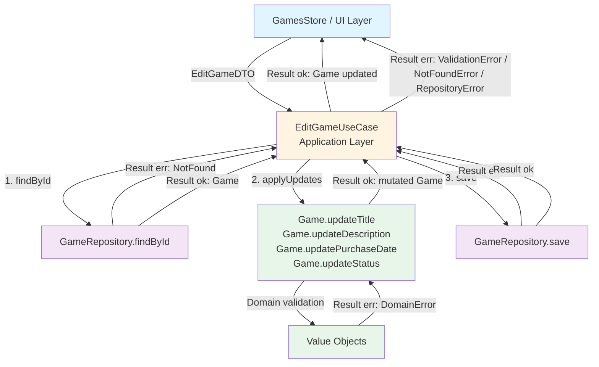

# EditGame Use Case

## Overview

The `EditGameUseCase` is an application-layer component responsible for orchestrating the partial update of an existing game in the collection. It follows Clean Architecture principles by keeping the business logic independent of frameworks and UI concerns.

## Purpose

This use case:

1. **Retrieves the existing entity** via the repository (verifies its existence)
2. **Applies only the provided fields** from the DTO via the entity's update methods
3. **Delegates validation** to the domain layer (value objects + update methods)
4. **Persists the updated entity** via the repository abstraction
5. **Returns the updated entity** so the caller (e.g. `GamesStore`) can update its state directly

## Location

- **Interface**: `src/collection/application/use-cases/EditGameUseCaseInterface.d.ts`
- **Implementation**: `src/collection/application/use-cases/EditGameUseCase.ts`
- **DTO**: `src/collection/application/dtos/EditGameDTO.ts`
- **Tests**: `tests/unit/collection/application/use-cases/EditGameUseCase.test.ts`

## Dependencies

- **GameRepositoryInterface**: Repository abstraction for reading and persisting games
- **Game**: Domain entity with update methods (`updateTitle`, `updateDescription`, `updatePurchaseDate`, `updateStatus`)
- **EditGameDTO**: Partial update DTO (only `id` is required)
- **Result Pattern**: For functional error handling

## Flow Diagram



## EditGameDTO

The update DTO is **fully partial**: only `id` is required. Omitted fields are not applied.

```typescript
export class EditGameDTO {
  constructor(
    public readonly id: string, // Required — identifies the game to update
    public readonly title?: string, // Optional
    public readonly description?: string, // Optional
    public readonly purchaseDate?: Date | null, // Optional (null = remove the date)
    public readonly status?: string, // Optional
  ) {}
}
```

> **Note:** `platform` and `format` are intentionally absent from the DTO — these fields are **immutable** in the domain (the `Game` entity exposes no `updatePlatform` or `updateFormat` method).

## Validation Strategy

### Domain-level validation (via entity update methods)

Each provided field is validated by the entity via its dedicated method:

| Field          | Method                       | Rule                                         |
| -------------- | ---------------------------- | -------------------------------------------- |
| `title`        | `game.updateTitle(v)`        | Max 200 characters, not empty                |
| `description`  | `game.updateDescription(v)`  | Max 1000 characters                          |
| `purchaseDate` | `game.updatePurchaseDate(v)` | `Date` or `null` — no dedicated value object |
| `status`       | `game.updateStatus(v)`       | Valid enum value (Owned, Wishlist…)          |

### Why use entity update methods instead of `Game.create()`?

Recreating the entity via `Game.create()` with all props would produce a new instance that does not preserve the existing entity's identity. The update methods:

- ✅ **Preserve entity identity** (same `GameId`)
- ✅ **Apply only the changes** — omitted fields remain unchanged
- ✅ **Centralise validation in the domain** — the use case duplicates no business rules

## Usage

The use case is consumed exclusively by `GamesStore.editGame(dto)`:

```typescript
// In GamesStore.editGame (public method)
const result = await this.editGameUseCase.execute(dto);

if (result.isOk()) {
  const updatedGame = result.unwrap();
  // Update the map and invalidate the list snapshot
  this.applyEditSuccess(updatedGame);
} else {
  // Roll back to the previous state
  this.rollbackEdit(dto.id, previous);
}

return result; // Returned to the component for inline error display
```

## Error Handling

The use case uses the [Result Pattern](../result-pattern.md) for error management.

### Error types

| Error type          | When                                      | Example                                    |
| ------------------- | ----------------------------------------- | ------------------------------------------ |
| **NotFoundError**   | The game does not exist in the repository | `type: 'NotFound'`, `entityId: 'game-123'` |
| **ValidationError** | Domain validation fails on a field        | `type: 'Validation'`, `field: 'title'`     |
| **RepositoryError** | Read or write failure (network, storage)  | `type: 'Repository'`, technical message    |

### Error → UI convention

Errors are returned via `Promise<Result>` to the calling component (e.g. `EditGame`). They are **not** stored in the `gamesMap` — the store rolls back to the previous game state.

```typescript
// In EditGame.tsx
const result = await store.editGame(dto);

if (result.isErr()) {
  const error = result.getError();
  if (error.type === 'Validation') {
    // Inline display in the form
  } else {
    // Generic error message
  }
}
```

## Testing

Unit tests use a mocked repository (`GameRepositoryInterface`). See `tests/unit/collection/application/use-cases/EditGameUseCase.test.ts`.

### Test scenarios

| Scenario                              | Expected result                            |
| ------------------------------------- | ------------------------------------------ |
| Partial update (title only)           | `Result.ok(game)` — game mutated           |
| Full update (all fields)              | `Result.ok(game)` — all fields applied     |
| Game not found (findById → NotFound)  | `Result.err(NotFoundError)`                |
| Invalid title (too long, empty)       | `Result.err(ValidationError)` with `field` |
| Repository save failure               | `Result.err(RepositoryError)`              |
| DTO with no optional fields (id only) | `Result.ok(game)` — no field modified      |

```bash
# Run EditGameUseCase tests
npm run test:unit -- EditGameUseCase
```

## Design Decisions

### Why does the use case return the updated Game?

So that `GamesStore` can update its `gamesMap` directly with the persisted entity, without triggering a new `fetchGameById`. This avoids an unnecessary round-trip to the repository after a successful edit.

### Why are `platform` and `format` absent from the DTO?

These fields are immutable in the domain. The `Game` entity exposes no `updatePlatform` or `updateFormat` method. This constraint is documented at the DTO level (`EditGameDTO`) and enforced in the UI (fields hidden in edit mode in `GameForm`).

### Why not validate again in the use case?

The entity's value objects and update methods are the single source of truth for business rules. Duplicating validation at the application layer would create an inconsistency risk as rules evolve.

## Related Documentation

- [AddGame Use Case](./add-game.md)
- [GetGameById Use Case](./get-game-by-id.md)
- [Result Pattern](../result-pattern.md)
- [Value Objects](../value-objects.md)
- [GamesStore Observable Pattern](../layers/ui-layer.md#observable-store-pattern-usesyncexternalstore)
- [Dependency Injection](../architecture/dependency-injection.md)

## See Also

- **Domain**: `src/collection/domain/entities/Game.ts` — `updateTitle`, `updateDescription`, etc.
- **Infrastructure**: `src/collection/infrastructure/persistence/IndexedDBGameRepository.ts`
- **Store**: `src/collection/application/stores/GamesStore.ts` — `editGame(dto)` with optimistic update
- **UI**: `src/collection/ui/pages/EditGame.tsx` + `src/collection/ui/components/GameForm/GameForm.tsx`
