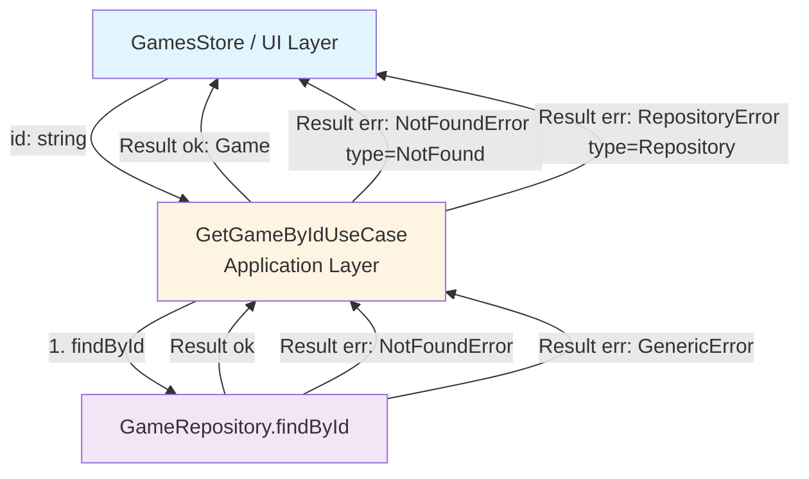

# GetGameById Use Case

## Overview

The `GetGameByIdUseCase` is an application-layer component responsible for retrieving a single game from the collection by its unique identifier. It maps repository-level errors (not found, generic failure) to typed application errors.

## Purpose

This use case:

1. **Calls the repository** to find a game by its ID
2. **Maps not-found errors** to a typed `NotFoundError` (type `'NotFound'`)
3. **Maps generic repository errors** to a typed `RepositoryError`
4. **Returns the game** or a typed application error via the Result pattern

## Location

- **Interface**: `src/collection/application/use-cases/GetGameByIdUseCaseInterface.d.ts`
- **Implementation**: `src/collection/application/use-cases/GetGameByIdUseCase.ts`
- **Tests**: `tests/unit/collection/application/use-cases/GetGameByIdUseCase.test.ts`

## Dependencies

- **GameRepositoryInterface**: Repository abstraction for reading games
- **Game**: Domain entity representing a game
- **NotFoundError**: Application error for missing entities (type `'NotFound'`)
- **RepositoryError**: Application error for generic repository failures
- **Result Pattern**: For functional error handling

## Flow Diagram



## Error Mapping

| Repository Error           | Application Error | Condition                               |
| -------------------------- | ----------------- | --------------------------------------- |
| Any error with `entityId`  | `NotFoundError`   | `'entityId' in repoError` → true        |
| Any other repository error | `RepositoryError` | Generic failure (network, storage, etc) |

## Usage

The use case is consumed exclusively by `GamesStore`, which auto-triggers it when `getGame(id)` is called for an absent or lazy entry:

```typescript
// Inside GamesStore.fetchGameById (private)
const result = await this.getGameByIdUseCase.execute(id);

if (result.isOk()) {
  const game = result.unwrap();
  this.gamesMap.set(game.getId(), {
    data: game,
    isLazy: false,
    isLoading: false,
    hasError: false,
    error: null,
  });
} else {
  const appError = result.getError();
  const errorMessage = appError.type !== 'NotFound' ? 'Unable to load game. Please try again.' : null;

  this.gamesMap.set(id, {
    data: null,
    isLazy: false,
    isLoading: false,
    hasError: true,
    error: errorMessage, // null = 404, string = generic error
  });
}
```

## Error Handling in the UI

Components read the `GameMapEntryState` from `useGamesSelector(s => s.getGame(id))` and distinguish error cases using the `hasError + error` convention:

```typescript
const { data: game, isLoading, hasError, error } = useGamesSelector(s => s.getGame(id));

if (hasError && !error) {
  // 404 — game not found
  return <p role="alert">Game not found.</p>;
}

if (hasError && error) {
  // Generic error
  return <p role="alert">{error}</p>;
}
```

## Testing

Unit tests use a mocked `GameRepositoryInterface` (not `fake-indexeddb`). See [Testing Strategy](#testing-strategy).

### Testing Strategy

| Scenario                          | Expected result                                        |
| --------------------------------- | ------------------------------------------------------ |
| Repository returns game           | `Result.ok(game)`                                      |
| Repository returns NotFound error | `Result.err(NotFoundError)` with `type='NotFound'`     |
| Repository returns generic error  | `Result.err(RepositoryError)` with `type='Repository'` |

```bash
# Run tests for GetGameByIdUseCase
npm run test:unit -- GetGameByIdUseCase
```

## Design Decisions

### Why Not Validate the ID Format?

The use case does not validate whether the ID is a valid UUID or non-empty string. The domain (`GameId` value object) handles this validation when creating a `Game` entity. The repository will return a `NotFoundError` for any unknown ID.

### Why Map Repository Errors to Application Errors?

The application layer must not leak infrastructure concerns into the UI. By mapping repository errors (`FindByIdError`) to application errors (`NotFoundError`, `RepositoryError`), the store and UI remain decoupled from the persistence strategy.

### Why Is This Use Case Called via GamesStore (Not Directly)?

The store manages the cache and state for all game entries. Calling the use case directly from a component would bypass the caching logic and break the single-source-of-truth guarantee.

## Related Documentation

- [AddGame Use Case](./add-game.md)
- [GamesStore Observable Pattern](../layers/ui-layer.md#observable-store-pattern-usesyncexternalstore)
- [Result Pattern](../result-pattern.md)
- [Dependency Injection](../architecture/dependency-injection.md)
