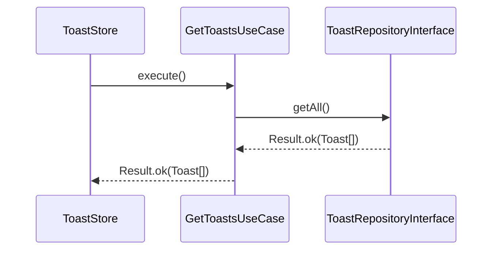

# GetToasts Use Case

## Purpose

Returns all currently active toast notifications. Acts as a thin delegation layer to the repository, inheriting its referential stability guarantee.

## Flow



## Return

```typescript
execute(): Result<Toast[], never>
```

- Returns `Result.ok([])` when no toasts are active.
- `never` as the error type — the operation cannot fail.
- The returned array reference **only changes** after an `add` or `remove` on the repository.

## Referential Stability

`ToastStore.getAllToasts()` calls `execute().unwrap()` and returns the result directly to `useSyncExternalStore`. Because `ImmutableInMemoryToastRepository` only creates a new array on mutation, React does not schedule unnecessary re-renders when the list is unchanged.

```
subscribe fires → getAllToasts() → getAll().unwrap() → same array ref → React bails out
```

## Key Decisions

- **Use case over direct repository access**: the store never calls the repository directly — all access is mediated by use cases for consistency.
- **`Result<Toast[], never>`**: use case returns a `Result` even when it cannot fail, to keep the layer contract uniform and explicit.

## References

- [Result Pattern](../result-pattern.md)
- [ADR-013: In-Memory Repository for Transient Data](../architecture/adr/ADR-013-in-memory-repository-for-transient-data.md)
- [ADR-011: Map-Centric Store with Auto-Triggered Fetches](../architecture/adr/ADR-011-map-centric-store-auto-trigger.md)
