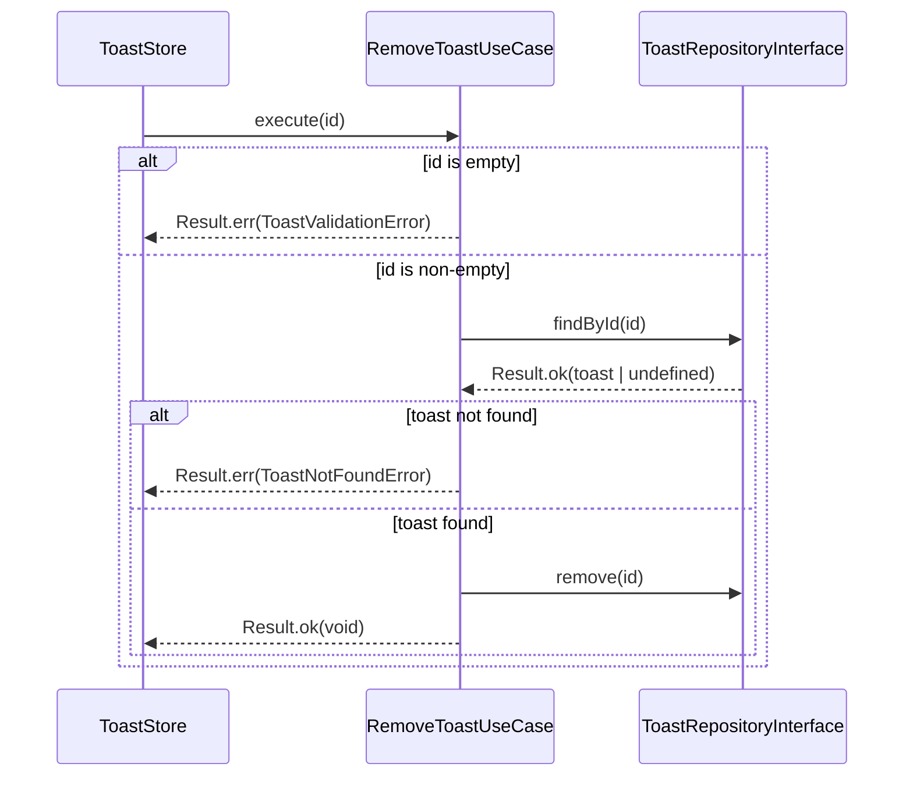

# RemoveToast Use Case

## Purpose

Removes an active toast notification from the in-memory repository. Returns a typed error if the ID is empty or if no toast with that ID exists.

## Flow

## Inputs

| Parameter | Type     | Description               |
| --------- | -------- | ------------------------- |
| `id`      | `string` | ID of the toast to remove |

## Validation

| Check           | Error class            | Condition                |
| --------------- | ---------------------- | ------------------------ |
| Empty ID        | `ToastValidationError` | `id` is empty/whitespace |
| Toast not found | `ToastNotFoundError`   | No toast with that ID    |

## Error Handling

| Scenario  | Error class            | `type` discriminant | Behavior in store              |
| --------- | ---------------------- | ------------------- | ------------------------------ |
| Empty ID  | `ToastValidationError` | `'Validation'`      | Silent no-op                   |
| Not found | `ToastNotFoundError`   | `'NotFound'`        | Silent no-op                   |
| Success   | —                      | —                   | Toast removed, timer cancelled |

Both error types implement `ToastApplicationErrorInterface` and carry a `type` discriminant for exhaustive handling when needed.

## Key Decisions

- **`findById` before `remove`**: the repository's `remove` is a no-op for unknown IDs, so the explicit lookup is what enables the `NotFoundError` to be returned.
- **`Result<void, never>` on repository methods**: the repository itself cannot fail (in-memory) — error semantics belong to the use case, not the storage layer.

## References

- [Result Pattern](../result-pattern.md)
- [ADR-013: In-Memory Repository for Transient Data](../architecture/adr/ADR-013-in-memory-repository-for-transient-data.md)
